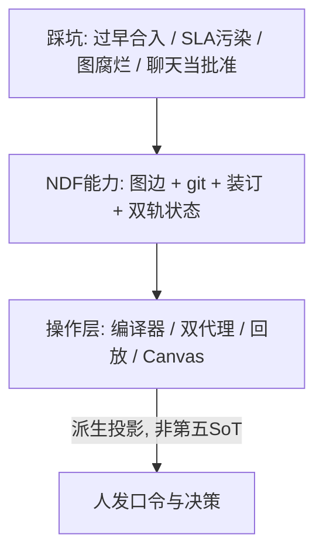
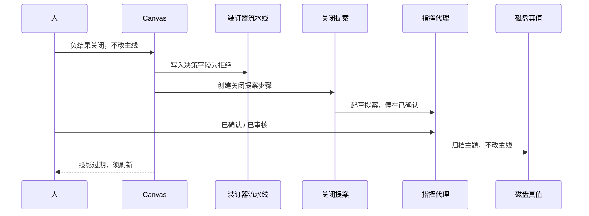

# NDF 工作流与 Canvas：来龙去脉与创新

> **性质**：分享稿，不是规范真值。说法与流程规范正文冲突时，以 `spec/meta/` 为准。
> **日期**：2026-08-18
> **听众**：混合——先听清「为什么必须这样」，再看本仓怎样把规范做成可指挥的工作流。
> **本项目**：挂在任意业务仓之上的 **NDF META 流程内核** 与 **Canvas 可视化面板**（外加指挥代理与实现代理两条通道）。下文不讨论具体业务产品该怎样检索。

图用 mermaid。条款号、ADR、DEC 只作出处。附录才是口令表和源码地图。

---

## 0. 三十秒：这篇在回答什么

Agent 已经快到可以连夜改规范和代码。快本身不是问题。问题是：探索失败之后，主线还干不干净；做完之后，还能不能对上「人说了什么、规范拼了什么、实际发出去什么」。

本仓的答案不是更长的 system prompt，也不是多一个看板。

**发挥 NDF**，意思是：把条款图、内容指纹、装订器读序、双轨状态机当成编译输入。Canvas、上下文编译器、回放账本是派生层——人看得见、Agent 跳不过，但它们不是第五份真值。

全文三句：

1. NDF 先给出可机械执行的规范能力（图边 + git 时间 + 装订器工作副本 + 双轨状态机），不是又一份 markdown 说明书。
2. 双轨是对真实失败的回应：过早合入主线后证伪，规范能回退，代码还挂在 `src/`。
3. Canvas / 编译器 / 回放不替代规范：投影过期就禁写，是发挥派生工作台条款，不是多做了一个状态栏。



---

## 1. 来龙去脉：没有双轨之前发生了什么

优化跑得很快：冷 I/O、诚实基准、多条 I/O 方向并行试。规范树和主线代码却开始各说各话。下面不是寓言，是已经落盘的决策。

### 过早合入主线

Read Coalescing（产品 DEC-061）在 io_uring 路径上相对基线 **-10%～16% QPS**。条款可以标 deprecated，提案可以标 Rejected，**代码当时已经进过 Trunk，只能再 revert**。指挥手册把这件事和「误改头文件、早期 pipelining」并列成反面教材。

io-pipelining 更早还有一次假正结果（DEC-063）：数字建立在错误的清场口径上，还起草过性能下限。后来按标准协议重测，DEC-071 正式拒绝该主题——**这一次 Trunk 无影响**，实现只待在 `poc/io-pipelining/`。同样是负结果，第二次已经隔离；第一次没有。

双轨 ADR（`spec/meta/decisions/adr-poc-track.md`）把漂移写成一句话：

> 方向证伪后会出现：NDF 可回退/废弃，但代码 commit 仍挂在主线，SoT 与实现漂移。

原则也是一句话：**时间仍在 git，承诺态只在晋升闸门之后出现。** 探索 commit 合法。`status=stable` 和 Trunk `src/` 不是探索的义务。

被否决的替代方案：

| 方案 | 为何拒绝 |
| --- | --- |
| 把 POC 放进 `spec/models/` | 污染 L3 金标；Agent 易把草稿当 must 实现 |
| 只靠 feature 分支 | 合并瞬间重新耦合；没有 NDF 状态机 |
| 主线加 env 默认关，继续在 Trunk 里探索 | 仍易提前落地稳定条款和 SLA（RC 路径） |

### 探索数字升成必须达到的下限

没有隔离，一次「看起来更快」就会被写进生产合约。约束很硬：`poc/` 和草案条款下的性能数字，不得自动成为稳定 SLA must（CON-POC-001）。晋升若动了主线源码，必须按标准配置重跑金标，禁止只改合约文档上的观测数字（META-006）。探索自己的比较，只读主题钉死的 PERF 绑定卡和本轮 DELTA，禁止到生产合约或 NOTES 里抄一个数（META-007）。

### 规范树腐烂

卫生 ADR（DEC-HYGIENE-001）记录的是另一类失败：条款 ID 撞车、幽灵决策 `DEC-039`、死链、`open/` 堆满已落地文件。继续在腐化图上叠加条款，精化链将不可审计。对策不是「再写一篇说明」，而是先图后语义、归档不删除、`open/` 变薄。

### 流程条文混进产品树

双轨、装订、卫生一度写在产品 `spec/00–50` 里，和检索/SLA 叙事混排，容易被读成产品行为 must。ADR-META-001 把流程正文迁入 `spec/meta/`，产品树只留 adopted 薄指针。指挥代理改流程走 `spec/meta/open/`；实现代理禁止改 `spec/meta/`。这不是目录洁癖：分层失败时，Agent 会把「怎么开发」执行成「产品必须怎样表现」。

### 装订器不是产品功能

ADR-TOPIC-BINDER-001：`poc/<topic>/ndf/` 是流程能力的工作副本（`sot: false`），不是检索契约。主题说明、设计、基准卡、变化账、接口、门禁回执放在同一处，是为了让编译器有固定读序，不是再造一棵规范树。

### 双轨之后还不够

双轨挡住「探索写进主线」，挡不住另外几件事：

- 一次写满 TOPIC、DESIGN、INTERFACE 然后开码 → 门禁变成事后补材料（需要分段闸）。
- 主题标了 rejected，下周用同一个 `topic_id` 改回 exploring → 负结果不可审计（需要关闭闭环）。
- 只隔离了 `src/`，Agent 仍去改 Trunk `include/` → 头文件污染（需要拷贝再改 + 隔离检查）。
- 每个 Agent 自己决定读哪些文件 → 到 NOTES 里偷数字（需要机械上下文）。
- 人在过期画面上点「委派」→ 批准一个已经被上一跳改过的世界（需要投影新鲜度）。

后文的机制，都是补这些洞，不是给双轨做装饰。

---

## 2. 为什么是 NDF，而不是「更好的文档 + 检查脚本」

markdown 和 git 到处都有。NDF 多出来的是：**语义活在图里，承诺活在条款状态里，工作副本活在装订器里，批准活在绑了内容指纹的口令里。** 这些都能当机器的输入。

没有图边和装订器顺序，上下文编译器就退化成 RAG。没有双轨状态，Canvas 就只是好看的文件浏览器。

| NDF 能力 | 出处 | 操作层如何吃进去 |
| --- | --- | --- |
| 条款图 `depends-on`（正文随口提到不成边） | META-001、META-005 | 编译器按图闭包读条款；稳定性能约束必须钉到 API / `trunk-ref`，禁止只靠 env 散文 |
| git 是时间，条款状态是承诺 | CHR-008、adr-poc-track | 探索 commit 合法；stable 与 `src/` 只在晋升之后 |
| 设计 / 实现 / 测试正交于 L0–L3 | META-008 | Topics 三张卡；晋升是三空间收敛到 Trunk，不是第四棵规范树 |
| 装订器是工作副本，不是第二 SoT | BEH-025、ADR-TOPIC-BINDER | 读序钉死为 TOPIC → DESIGN → PERF_BASELINE → DELTA → INTERFACE → GATES |
| 人口令绑内容 SHA | META-010、META-014 | 文件存在 ≠ 批准；按钮点击 ≠ 口令 |
| Meta 与产品分层 | ADR-META-001 | Control 不吸产品契约；process 提案另树 |

检查脚本只能回答「文档合不合法」。合法不等于「现在该派谁、写哪、依据哪一份已经对过指纹的任务清单」。那一层必须另建，但输入必须是 NDF，不能是聊天记忆。

---

## 3. 设计演进：每一代补上一代跳不过的洞


### 第一代：文件态检查器

给条款建索引与图、检查图是否自洽、检查主题装订器是否齐（`ndf_index` / `ndf_graphcheck` / `ndf_bindcheck`）。

**洞**：合法 ≠ 该派谁。Agent 仍可能偷读、跳过闸门、把探索写进主线。

**创新**：流程图和产品图分检。meta 条款不得 `depends-on` 产品 ID；`--meta` 必须在不依赖产品树的前提下自洽。否则产品条款一多，流程 DAG 就被淹死，指挥层会漏读双轨和装订规则。

### 第二代：上下文编译器 + 同一份清单指纹

`ndf_context.py`：先按装订器顺序收根文件，再沿图闭包展开条款，再纳入 git / 证据 / 门禁，最后套角色写入根。Canvas、指挥代理、实现代理必须引用同一份 Task Manifest SHA，角色计划可以不同，清单不能各写各的。

**洞**：每个模型自己 @ 文件，就会去 SLA 或 NOTES 里偷观测数字。

**创新**：人口令是单独字段，默认空着，不得当任务正文。关闭提案会带上默认种子职责，不是模型现场点名。编译对项目真值只读。

### 第三代：Episode 账本 + 客户机证明

可写委派必须进入内容寻址的事件链（META-013）。对照三栏：人话、规范组装、实际发出。压缩只创建 checkpoint，不得用一段摘要覆盖父事件。

**洞**：在正在工作的仓库里「再执行一遍」，既污染现场，也无法证明隔离。

**创新**：主机只启动客户机。禁止把当前仓库挂进客户机。没有隔离环境就报环境阻塞，提示词输出不得冒充已回放（META-015）。

### 第四代：Canvas 五平面 + 新鲜度闸门

磁盘状态投影成五个标签：产品、主题、流程内核、代理身份、回放柜台。关闭不是第六个标签，而是主题工作台上的一段连续步骤。

**洞**：人盯着过期画面点委派，等于批准上一跳已经改过的世界。工作台若把流程条款数当成产品健康度，人会修错平面。

**创新**：

- 只有核验通过的 `fresh` 允许新提案、委派、关闭。动作后投影过期（`stale_after_action`），写按钮禁用，必须先刷新。
- Canvas 禁止改 `.openclaw/state.json`。那是仓库绑定，不是门禁真值。
- 投影有体积预算：主题目录行 + **一份**聚焦工作台，回放目录 + **一页**账。超过 120KB 失败，而不是把 N 份工作台塞进同一份 JSON。这是投影卫生，不是「少显示一点」。

### 对照：常见 Agent 工作流 vs 本仓

| 常见做法 | 本仓 |
| --- | --- |
| 一份 spec 文档 + 一个 PR | 探索轨 / 主线轨；晋升才稳定 + `src/` |
| 聊天里 LGTM | 口令绑人、时间、内容 SHA；文件存在不得推断批准 |
| 单 Agent 又写规范又写代码 | 指挥代理不写 `src/`；实现代理不改 `spec/meta/` |
| 模型自己挑上下文 | 机械读序 + 图闭包 + 同一份清单指纹 |
| 看板即真值 | 派生投影；过期禁写 |
| 在当前仓库重跑脚本叫回放 | 客户机证明；live cwd 不算 |
| 失败了删文件夹 | DEC + deprecated + 归档；禁复活同一主题号 |

---

## 4. 双轨以外：工作机制怎么改、创新在哪

每条同一骨架：问题 → 取舍 → 创新 → 发挥了哪条 NDF 能力。双轨是地基，下面这些才让地基可指挥。

### 分段装订闸

**问题**：一次写满再开码，审核变成补材料。

**取舍**：不要「ticket → branch → 开码」。三句口令串行：`TOPIC已审核` → `DESIGN已审核` → `可以开始实现`。第二句之后必须先写 PERF 绑定头和 DELTA 骨架，再写 INTERFACE。没听到第三句，不得写主题代码。

**创新**：第三句只许可 `poc/<topic>/`，不是许可合入主线。口令在编译器里是常量：

```47:51:spec/meta/tools/ndf_context.py
GATE_PHRASES = {
    "topic_review": "TOPIC已审核",
    "design_review": "DESIGN已审核",
    "implementation_approval": "可以开始实现",
}
```

**发挥**：BEH-025 的装订器状态机 + META-010 的内容指纹。合同切片被实质改过，旧回执失效，不得改写历史审批。

### 金标与 POC 绑定分离

**问题**：用探索数字改生产下限，或对着过期 Trunk 比 Δ%。

**取舍**：两套绑定，不许混用。晋升后重跑金标矩阵，写入新的 `bl-trunk-golden-<sha>`。探索只读主题 PERF 卡上的 `vs × config_id × measure_script`。

**创新**：测量配置不得标成产品默认值。SLA 正文里的 env 串不成图边。

**发挥**：META-006 / META-007 / META-005。

### 晋升关闭计划

**问题**：CI 绿了就合，忘掉语义核、基线 stale、相交主题。

**取舍**：先跑只读 `ndf_close plan`，再委派合入。禁止跳过计划宣称收口。

**创新**：语义核必须显式选择要 / 不要（写理由）/ 延期。缺 `model=` 不是 graphcheck 失败；把 poc 补丁搬进 `spec/models/` 才是失败。受影响的仍在 exploring 的主题标 `baseline_status=stale`。禁止跨主题默认可加收益。

**发挥**：BEH-019 + META-004 + BEH-025 的表面扫描。

### 负结果闭环

**问题**：删文件夹，或用同一个主题号复活，审计断了。

**取舍**：正式关闭：产品 DEC（含 `Rejects: <topic>`）、条款 deprecated、装订器归档、确认主线从未合入或已 revert。**不改写已推送历史来对齐文档。**

**创新**：已拒绝或已全量晋升，不得改回 exploring。再试必须开平级新主题，并声明依赖旧题。近年 DEC-098 / DEC-099 / DEC-100（bfs-cluster、cluster-gbdt、page-packer）都是这条轨在工作：证伪、归档、Trunk 不动。

**发挥**：BEH-020、CHR-008。

### 三工作空间

**问题**：把「在试什么」「已经写了什么代码」「测到了什么」挤进同一段散文。

**取舍**：设计 / 实现 / 测试是罩在 NDF 分层上的正交视角，不是平行规范树。交互只编排读写，不替代磁盘真值。

**创新**：DELTA 是设计↔测试的账，不是第四空间。三闸未齐仍可提前拒绝，但晋升和实现委派保持禁用——提前关闭 ≠ 三闸都已审过。

**发挥**：META-008。

### 项目初始化轨

**问题**：把日常探索规则套到「仓里还没有流程内核」的绿地上，或在已经运作的项目上重跑一遍 Genesis。

**取舍**：一次性 bootstrap。口令从构想审过串行到可以建立初始主线，最后确认初始化完成。已 accepted 不得重跑。既有健康棕地可标 `operational_legacy`，不阻断日常 POC。

**创新**：初始化绑定的是 IDEA 来源、NDF 树 SHA、Trunk SHA、验收引用——项目章程金标不是性能金标。New Genesis 只出现在流程内核平面。

**发挥**：META-009。

### 门禁流水线 vs 装订器流水线

**问题**：一个「修理」按钮既写回执又改假设，两个代理互相代劳。

**取舍**：拆成两条。门禁只写 `GATES.md`。装订器一次只写当前那一面。缺面就交接，不代写。测量数字不走装订器修订。

**创新**：卡片状态必须能区分「等待人口令」和「阻塞」。指挥代理不得伪造 Numbers；数字类修复走实现代理。

**发挥**：META-011 的控制/实现分流 + META-010。

### 指挥代理 / 实现代理

**问题**：单 Agent 既写稳定流程正文又写 `src/`，边界会在同一次对话里被冲掉。

**取舍**：OpenClaw 指挥：提案、装订器、门禁草稿、`.openclaw/state.json`。Claude Code 实现：探索代码、测量、COMMITS；晋升时才写 Trunk。每份委派包钉死 `repo_root` 和允许写入的根。缺握手项 = 不安全，不得派发。

**创新**：角色权限来自清单，不是来自模型「我觉得我是实现者」。Canvas 禁止改工作区绑定文件。

**发挥**：CHR-008 的写入边界被编译进 pack。

### 托管流程提案生命周期

**问题**：流程改进被按钮一键落地，或把产品检查结果写进 `spec/meta/`。

**取舍**：人主动要改流程，与检查器发现流程不健康，是两种来源，不得在界面上合并。起草 / 确认落地 / 审核走不同的子事件。推进按钮只打开审阅。

**创新**：必须等到人把「已确认」或「已审核」原文发出去。历史无绑定回执的 Implemented 提案只读展示，不自动生成可写 hop。

**发挥**：META-014。

### 投影新鲜度

**问题**：人在过期画面上指挥。

**取舍**：任何可能改本地证据的动作：开始记账 → 执行 → 结束记账 → 标题栏刷新整份投影。只有吸收了最新成功动作、且来源指纹一致的投影算 `fresh`。

```2091:2102:spec/meta/tools/ndf_workflow_status.py
    if in_progress:
        state = "refresh_in_progress"
    elif latest_finished:
        absorbed = (
            projection
            and projection.get("result") == "passed"
            and projection.get("source_generation_sha") == generation_sha
            and projection.get("absorbed_action_id") == latest_finished.get("action_id")
        )
        state = "fresh" if absorbed else "stale_after_action"
    else:
        state = "unknown"
```

**创新**：过期约束的是人，不是产品「再也不能提案」。按钮灰了，优先刷新。

**发挥**：META-011。派生投影可以禁写，因为它不是 SoT——真值在磁盘，画面必须追上磁盘。

### Replay 柜台

**问题**：把每一次 hop 的 Prompt 全文塞进 Canvas，投影会炸；只给摘要，又无法对账。

**取舍**：目录 + 当前打开的一页。未聚焦的 hop 显示「查这条账」，不要用图节点伪造 Prompt。

**创新**：三栏对账是主路径。有序读取必须来自当时的 Context Plan。规范组装从已记录的 Manifest + Plan 重建，不从现行工作区现编。

**发挥**：META-013。账本在 `.ndf/replay`，也不是规范 SoT。

### Per-project workspace

**问题**：全局 `~/.openclaw/` 被当成项目状态，切仓时写错树。

**取舍**：每个仓库自己的 `{repo_root}/.openclaw/state.json`。gateway session 与项目 workspace 分离。所有 pack 必须带 `workspace.repo_root`。

**创新**：Canvas 只读投影这份绑定，不改写它。

**发挥**：把「规范挂在哪棵树上」变成机器可检查的锚，而不是会话记忆。

---

## 5. 一条完整故事线：负结果关闭（以及晋升会多出来的 hop）

目的只有一句：**下达的不是人话原文，而是编译器按装订器读序、从图和主题文件拼出来的任务清单。** 下面是一次真实关闭的结构，主题名、指纹和业务身份已去掉。

人的意图是：这个方向已经没有继续价值，拒绝它，并且不要改主线代码。这句话写在决策记录里，是意图，不是 Agent 的主指令。

同一条关闭提案步骤上，人话字段是空的。真正发给指挥代理的，是「起草关闭提案，停在已确认」。更早一步的装订器修订，只写「把决策字段写成拒绝」。

**1. 人话（意图）**

「本方向已无继续价值，走负结果关闭，不改主线代码。」它说明结局，不充当读哪些文件、写哪个目录的指令。

**2. 任务清单（编译器拼出）**

读序来自写死的装订器名字列表，不是模型临时删减。当时磁盘上没有设计、变化账和接口，所以清单里只出现已经存在的主题说明和性能基准。

```39:46:spec/meta/tools/ndf_context.py
BINDER_NAMES = (
    "TOPIC.md",
    "DESIGN.md",
    "PERF_BASELINE.md",
    "DELTA.md",
    "INTERFACE.md",
    "GATES.md",
)
```

示意结构（字段真实，身份已洗掉）：

```json
{
  "task": "control_proposal",
  "track": "poc",
  "topic": "<主题>",
  "intent": "control_proposal",
  "seeds": ["工作流投影", "任务上下文"],
  "ordered_reads": [
    {"order": 0, "path": "poc/<主题>/ndf/TOPIC.md"},
    {"order": 1, "path": "poc/<主题>/ndf/PERF_BASELINE.md"}
  ],
  "write_roots": ["spec/open/", "spec/meta/open/"]
}
```

指挥代理可写提案目录，禁写主线源码、头文件、测试和已稳定的流程正文。实现代理本步并未派发。禁写根来自轨道，不是模型「这次小心一点」。

**3. 规范组装 对 实际发出**

规范组装应当来自清单加角色计划。一次真实账本里，角色计划没有带上读序字段，组装出来的提示词读序是空的——这是账本缺口，要回到清单里的有序读取，而不是把空数组补圆。

实际发出的指挥消息是：起草关闭提案，停在「已确认」。人话没有出现在实发正文里。

**落地顺序**

人选定拒绝，并写入决策字段。装订器先落盘。接着同一聊天里开关闭提案。人发出「已确认」「已审核」之后，才写下负结果决策、主题标为已拒绝、装订器归档、主线代码不动。落地之后投影过期，必须先刷新才能再点写按钮。



这就是发挥 NDF 的现场：读序来自装订器常量，禁写根来自双轨，批准来自绑指纹的口令，画面必须追上磁盘。

**若是正结果晋升**，同一套骨架会多出几跳，不是另一套哲学：只读 close plan（语义核、基线 stale、表面冲突）→ 实现代理干净合入 `src/`（commit 带 `Promotes: <topic>`）→ 编译与性能验证 → 重跑金标并更新索引。任一跳失败，主题不得改成已晋升。跳过计划宣称收口，等于没用 NDF。

---

## 6. 其他团队可以带走什么；明确不做什么

可带走的最小核：条款图画得出边、双轨状态分得出探索/主线、上下文按装订器读序编译、人口令绑内容 SHA。编译器和回放可以搬走，但种子职责、写入根、口令短语必须跟**本地**流程规范一致。

必须本地化：meta 种子列表、产品树形状、谁算指挥谁算实现。不要用一份可移植包装来反推或纠正本地 `spec/meta/`。

明确不做什么：

- 不自动改生产合约上的数字，也不把探索笔记提升成必须达到的下限。
- 不把 Canvas 当规范真值。
- 不分出嵌套的子探索；分叉必须是平级新主题。
- 不在当前工作区假装完成隔离回放。
- 不让按钮点击代替「已确认」「已审核」或三闸口令。
- 不把 `spec/models/` 当实验沙箱。

人可以否决一条探索，主线保持干净；事后仍能对上：当时按装订器读了主题说明和性能基准，发出去的是起草关闭提案并停在已确认——而不是把人话原文直接当作指令。这就是 NDF 被发挥出来的样子。

---

## 附录 A. 默认规范速览

没有面板时，规范已经规定了这些。面板不是前提。

**条款怎样才合法。** 稳定锚点、元数据、强制语气。依赖必须是图边。流程条文不得依赖某条产品功能。散文活在文件树，语义活在图，时间活在 git。

**三个工作视角。** 设计（契约与方案）、实现（代码与切片）、测试（绑定与证据）。对话只编排读写。

**双轨。** 探索允许试错，代码待在主题目录，数字不得升成生产下限。主线才是稳定契约、可发布实现、对外承诺的性能下限。不确定时默认先探索。

**探索。** 有主题、有表面、有装订器。分段口令，禁止一次写满开码。比性能只读主题基准卡和 DELTA。

**晋升。** 草案改稳定、干净合入、语义核决策、旋钮钉到 `trunk-ref`、重跑金标。

**负结果。** DEC、归档、禁复活同一主题号。提前关闭通常只开放拒绝。

**文件态检查器。** 管文档合法性。合法 ≠ 已经批准，更 ≠ 现在该派谁。

---

## 附录 B. 十二条约束与口令表

每条同一句式：人可以做什么，Agent 禁止做什么，闸门在哪。

1. **先判定轨道再说话。** 不确定就先探索。Agent 不得未提案就改主线或改稳定契约。
2. **提案之后，两句口令才是法律行为。** 「推进：已确认」只打开审阅。点击不是批准。
3. **装订器口令与产品口令分开。** 没听到口令，不得写下一阶段正文，也不得写主题代码。
4. **文件存在不等于批准。** 回执必须有人、时间、内容指纹。切片改过，旧回执失效。
5. **角色决定能写哪。** 指挥代理禁止写主线源码和已稳定流程正文。实现代理探索期只写该主题目录。Canvas 禁止改工作区绑定。
6. **上下文必须机械组装，禁止偷读。** 三方引用同一份清单指纹。
7. **可写委派必须记进事件链。** 压缩只打检查点。
8. **人话不是下达。** 实际发出若仍是人话原文，那是下达漂移。
9. **决策是落盘字段。** 空文本不得派发，也不得默认成继续探索。不得从负面叙述推断关闭。
10. **过期投影约束的是人。** 先刷新。
11. **两条流水线不得互代。** 门禁不代写装订器；装订器不批准口令；测量走实现代理。
12. **关闭后不得复活旧题。** 再试开平级新主题，并声明依赖。

| 场合 | 人说的精确口令 | 允许的下一跳 | 口令前禁止 |
| --- | --- | --- | --- |
| 探索第一闸 | `TOPIC已审核` | 写设计说明 | 写设计正文或主题代码 |
| 探索第二闸 | `DESIGN已审核` | 写性能绑定头、变化账骨架、接口 | 写接口或主题代码 |
| 探索第三闸 | `可以开始实现` | 在该主题探索目录里实现 | 写主题代码、合入主线 |
| 产品或流程提案 | `已确认` | 指挥代理落地提案正文 | 把按钮点击当批准 |
| 产品或流程提案 | `已审核` | 按轨道继续 | 宣称已经收口 |
| 项目初始化 | 从构想审过一直到可以建立初始主线，最后确认初始化完成 | 串行打好基础，再进入日常运作 | 跳段；已经完成后重跑初始化 |
| 关闭链 | 人选定拒绝 / 晋升 / 部分晋升，并写入决策字段 | 同一聊天里：提案 → 已确认 → 已审核 → 落地 | 从散文推断关闭；拒绝落地时改主线 |

---

## 附录 C. 人怎么用（薄表）

主线已经讲过为什么。这里只留「去哪点、源码在哪」。

| 机制 | 人怎么用 | 源码 |
| --- | --- | --- |
| 五个平面 | 看产品目标与金标去 Product；修流程内核去 Control；开题/决策/关闭去 Topics；对账去 Replay。不要在 Product 找 New Genesis | `.cursor/skills/ndf-workflow-canvas/layout.md` |
| 投影新鲜度 | 关题或落地之后先刷新。按钮灰了优先怀疑过期 | `ndf_workflow_status.py` 新鲜度状态 |
| Genesis | 只在 Control；已 accepted 不得重跑 | `layout.md` 控制平面第一块 |
| 三空间三闸 | 按口令表推进。提前关闭 ≠ 三闸都已审过 | `layout.md` Topics；`BINDER_NAMES` |
| 双流水线 | 看卡片是等待人口令还是阻塞。不要让指挥代理代填测量数字 | `layout.md`；`actions.md` |
| 上下文编译 | 委派前看机械上下文是否指向同一份清单指纹 | `ndf_context.py` |
| 委派包 | 探索只允许实现代理写该主题目录；晋升才动主线 | `AGENTS.md` 分流；pack 角色权限 |
| 流程提案 | Control 上的改进入口只起草 `spec/meta/open/`。空输入不派发 | `actions.md` 提交流程改进 / 推进 |
| 磁盘账本 | 选一步查看三栏。压缩只打检查点 | `ndf_replay.py` |
| 客户机回放 | 回放柜台选沙箱回放。提示词输出 ≠ 已执行 | `guest_run` |
| 主题内关闭 | 写清决策并选定模式 | Topics 底部决策卡 |
| 无活跃主题 | Control 应显示主线图检，而不是叫人去空的 Topics | `active_poc_topic_ids` / `binder_health` |

---

## 附录 D. 源码地图

| 路径 | 角色 |
| --- | --- |
| 指挥手册 `AGENTS.md` | 轨道、口令、写入边界、双代理分流 |
| `spec/meta/language.md` | 规范怎么写才合法；SLA↔旋钮图边 |
| `spec/meta/process.md` | 双轨、装订、晋升、初始化、门禁、编译、回放 |
| `spec/meta/decisions/` | 分层、命名空间、POC 轨、装订器、卫生——「为什么」的 ADR |
| 索引 / 图检查 / 装订检查 | 文件态合法性，不是工作台 |
| `spec/meta/tools/ndf_context.py` | 任务清单、读序、角色权限 |
| `spec/meta/tools/ndf_replay.py` | 磁盘账本与客户机回放 |
| `spec/meta/tools/ndf_workflow_status.py` | 投影、新鲜度、有没有活跃探索 |
| `spec/meta/tools/ndf_close.py` | 晋升/拒绝关闭计划 |
| `.cursor/skills/ndf-workflow-canvas/` | 五个平面、按钮、快照契约 |
| 托管 Canvas | 派生画面；写按钮绑定投影是否已核验 |

规范真值在流程树里。面板和快照都是派生。
