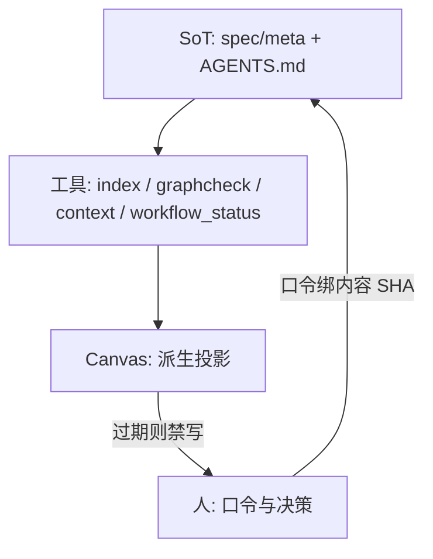

# NDF 工作流指挥交接手册

> **性质**：指挥交接手册，**不是**规范真值（SoT）。正文与 `spec/meta/` 或根目录 `AGENTS.md` 冲突时，以条款与指挥手册为准。
> **读者**：在 Cursor 里指挥 NDF 工作流的人与指挥代理。不要求理解被挂载仓的产品实现。
> **范围**：NDF 语言、Meta 流程、治理工具、Workflow Canvas 的设计与 hop。不描述任何业务产品、检索行为或性能数字。
> **占位**：主题一律写 `<topic>`，目录一律写 `poc/<topic>/`。

---

## 0. 三十秒：你在指挥什么

NDF 不是又一份 markdown 说明书，也不是看板。它把条款图、内容指纹、装订器读序和双轨状态机当成**可机械执行的输入**。Cursor Canvas 是派生指挥台：人看得见 hop、Agent 跳不过闸，但画面不是第五份真值。

指挥者日常只做四件事：

1. **Refresh snapshot**，只在投影 `verified_at_generation` 时派发。
2. 用**人口令**完成法律行为（`已确认`、`已审核`、`TOPIC已审核`、`可以开始实现` 等）。按钮只打开对话，不等于批准。
3. 按 **track** 走提案 → 确认落地 → 审核 → 委派；写根来自 pack / Context Plan，不来自按钮文案。
4. 把被挂载仓的产品树当成绑定投影。指挥 hop 不依赖读懂产品模块。



---

## 1. 权威顺序与禁止

### 1.1 本地优先

| 优先级 | 来源 | 角色 |
| :--- | :--- | :--- |
| 1 | `spec/meta/`（`language.md` / `process.md` / `architecture.md` / `constraints.md` / `glossary.md` / `decisions/` / `open/`） | 流程 SoT |
| 2 | 根目录 `AGENTS.md` | 指挥操作手册 |
| 3 | `spec/meta/tools/` | 索引、图检、装订、回合、投影、上下文、回放 |
| 4 | `MEMORY.md` | 会话速览；冲突以 spec 为准 |
| 派生 | Canvas、pack、Episode 账本 | 投影与证据，不是条款正文 |
| 可选输出 | `packages/ndf-harness/` | 从本地蒸馏的可移植包；**可能滞后** |

产品契约树（`spec/00–50`）属于被挂载仓的业务 SoT。指挥 NDF 工作流时可以把它当作「绑定项目存在」的事实，不必把它读成产品手册。

### 1.2 禁止

- 用 Harness 的 `norms/`、`workflow/AGENTS.md` 或远程包结构**纠正、反推**本地 `spec/meta/`。
- 把 Canvas 自洽、exemplar、graphcheck 在包内的结果，当成本地 graphcheck 失败的修复依据。
- 把 Canvas、聊天摘要或 NOTES 叙述当成条款或观测数字的 SoT。
- 指挥会话去写 `{repo_root}/.openclaw/state.json` 以外的「全局 OpenClaw 家目录」当作项目 state；gateway session 与项目 workspace 分离。
- Canvas 改写 `.openclaw/state.json`（[[META-011]]）。

正确流向：本地真实迭代验证有效 → 可选再同步到可移植包。

---

## 2. NDF 是什么（语言层）

一句话：**散文活在树里，语义活在图里，时间活在 git 里；稳定条款 ID 是铆钉。** 出处：[[META-001]]…[[META-005]]、[[META-008]]、[[ADR-META-001]]、[[ADR-META-002]]。

### 2.1 条款骨架 [[META-001]]

条款必须同时有标题锚点 `{#ID}` 和紧随其后的 `<!-- ndf: … -->` 元数据。强制语气词 `MUST` / `SHOULD` / `MAY` 大写。

常见元数据：`kind`、`level`、`layer`、`status`（`draft` / `stable` / `deprecated`）、`scope`。流程条款 `scope=ndf-process`，正文在 `spec/meta/`。性能 SLA / 旋钮 API 另用 `trunk-ref` 钉 git 对象（推荐完整 SHA；tag 须可 `rev-parse`）。`trunk-ref` 不是图边。

全仓 ID 必须唯一。

### 2.2 图边与引用 [[META-002]]

只有写在 `<!-- ndf: -->` 里的结构键才构成条款图：

`refines` · `depends-on` · `verifies` · `conflicts-with` · `affects` · `superseded-by` · `couples-with` · `model`

正文里的 `[[ID]]` 是交叉引用，**不自动成边**。meta 条款不得用结构边指向产品树节点；`graphcheck --meta` 必须在不依赖产品树的前提下自洽（`hard_errors=0`）。

### 2.3 分层与语气 [[META-003]]

| 层 | 含义 | 指挥时怎么用 |
| --- | --- | --- |
| L0 | 意图 / 原则 | 不直接当实现清单 |
| L1 | 可验证契约 | 指挥写 L0/L1；实现代理不改 L0/L1 |
| L2 | 设计/算法说明 | promote 路径可由实现写入 |
| L3 | 验证与参考模型 | 金标与 VER；禁止把 POC 补丁塞进 `spec/models/` |

`must` / `should` / `may` 与分层正交。树承载散文，图承载可组合约束，git 承载时间与证据。

### 2.4 工作空间视角 [[META-008]]

Design / Implementation / Test 是罩在分层上的**正交视角**，不是第四棵规范树，也不是 L0–L3 的一一映射。

| 空间 | 回答 | 常见载体 |
| --- | --- | --- |
| Design | 做什么、模块/数据流、调用契约、假设 | L0/L1、draft 提案、DESIGN / INTERFACE、DELTA Feature |
| Implementation | 代码落点、改写边界、实现切片 | L2/L3、`poc/<topic>/` 或 Trunk 源码、COMMITS / git |
| Test | 对照、测量、数字、证据、热点结论 | VER、cfg/bl、PERF_BASELINE、evidence、DELTA Hotspot |

比较/决策 SoT 是 PERF Numbers（或卡上显式 `vs:` 金标）。原始 evidence、脚本与 git SHA 是审计/复现证据。DELTA / NOTES 是解释。三者冲突必须标出来复测或由 DEC/提案裁决，禁止静默覆盖。

交互（Canvas、口令、读序）只编排三空间，不替代真值。

### 2.5 语义核与 SLA 图边

- [[META-004]]：`model=` 指向独立于生产路径的行为预言机，默认 `spec/models/`。promote 必须声明蒸馏决策：**要** / **不要 + 理由** / **延期**。缺 `model=` 不是 graphcheck 失败。
- [[META-005]]：稳定性能 SLA 必须 `depends-on` 声明其旋钮的 `API-*`（及必要行为条款），并带 `trunk-ref`。禁止只靠正文里的 env 散文。默认值必须对齐该 `trunk-ref` 所指 Trunk 树；测量配置另列，不得标成默认。

### 2.6 分层与取号

[[ADR-META-001]]：流程正文在 `spec/meta/`；产品树只留 adopted 薄指针。禁止把元条款长文写回产品 `20-behavior/`。

[[ADR-META-002]] / [[DEF-META-ID-NS]]：

- 新建一般 process 条款：`META-nnn`（自 `META-001`）
- 语义前缀：`DEF-NDF-*`、`CON-POC-*`、`ADR-META-*` / `ADR-TOPIC-*`、`DEC-HYGIENE-*`
- 冻结不换号：`CHR-008`、`BEH-018`…`BEH-026`、`ARCH-008`、`DEF-020`…`DEF-023`
- 禁止再续产品 `CHR` / `BEH` / `ARCH` / `DEF` / `CON-SLA` 数字号

### 2.7 术语（指挥常用）

| ID | 含义 |
| --- | --- |
| [[DEF-020]] POC | 可丢弃的探索实现与测量；目标是证据，不是扩展生产 API |
| [[DEF-021]] 晋升 | 已证实切片写入 stable 契约并干净合入 Trunk |
| [[DEF-022]] 主题装订器 | `poc/<topic>/ndf/`，工作副本，`sot: false` |
| [[DEF-023]] Commit Ledger | `COMMITS.md`：code commit ↔ 提案/条款/验证 |

---

## 3. Meta 工作流（指挥状态机）

指挥代理只做 L0/L1 引导。可执行实现委托实现代理（Claude Code）：bootstrap 隔离分支、`poc/` 探索、或 Trunk 集成路径。

### 3.1 每次需求先判定 track

提案头部必须标明：

```text
> track: bootstrap | poc | promote | process | bug | refactor | rollback
```

| 关键词（人话） | track | 提案落点 |
| --- | --- | --- |
| 初始化 / Genesis / 接管已有代码 | bootstrap | `spec/open/proposal-project-genesis.md` |
| 探索 / 试验 / 深入验证 | poc | `spec/open/proposal-*.md` |
| 晋升 / 合入主线 / 有效果了 | promote | `spec/open/proposal-*.md` |
| 流程 / AGENTS / 规范卫生 / 双轨 | process | `spec/meta/open/proposal-meta-*.md` |
| 修复 / Bug | bug | 产品 `spec/open/`（通常同 promote 动 Trunk） |
| 重构（Trunk） | refactor | 同 promote |
| 回退 + 版本 | rollback | 同 promote |
| 负结果 / 证伪 / 终止方向 | 负结果闭环 | 产品 DEC + 弃条款；不强制 perf |

不确定时：**默认先 poc**，除非人明确要求合入主线或已有达标证据。

### 3.2 共同闸门：提案 → 已确认 → 落地 → 已审核


1. 收到需求，输出：`收到需求。track=<…>。开始生成提案。`
2. 写提案（L0/L1 或流程/负结果说明；poc 条款默认 `status=draft`）。
3. 请人回复 **「已确认」**。没有这句不得落地。
4. 校验 `refines` / `deprecates` / `depends-on` 指向的 ID 真实存在（或本提案同时新增）。通过则写入对应目录，提案顶记 `Status: Implemented on YYYY-MM-DD`。
5. 请人回复 **「已审核」**。产品/process 提案收口后才进入委派或结束。

口令在可视化/自动委派路径必须追加到 `GATES.md`（或 Genesis `GATES.md`），绑定人、时间与内容 SHA（[[META-010]]）。**文件存在不得推断审批。**

### 3.3 双轨 [[CHR-008]]

- **探索轨**：允许失败；产物不得默认当 Trunk SoT。
- **主线轨**：已证明有效的产品行为与 SLA 实现。

禁止「静默删条款却留主线代码」或「删代码却留 stable must」。时间仍在 git；承诺态（`status=stable` 与 Trunk `src/`）只在晋升闸门之后出现。

### 3.4 探索纪律 [[BEH-018]] [[CON-POC-001]] [[ARCH-008]]

探索期必须：

- 契约留 draft / `spec/open` / `poc/<topic>/ndf/proposals/`；流程提案走 `spec/meta/open/`。
- 不得把探索数字写入 stable 性能 SLA must；不得把探索行为标成生产默认开启。
- 可执行试错只在 `poc/<topic>/`。**禁止改** Trunk `src/**`、`include/**`、`tests/**`。要改头/源：先拷进主题目录再改。可以只读链接未改的 Trunk 作对照。
- 探索中发现的 Trunk bug：默认在当前主题修测取证；合入另开 `bug` / `promote`。禁止为「顺便修 bug」直改 Trunk。
- 开题扫描活跃 exploring 的 `explore_surface`：相交则 `depends_on_topics` 或 `conflicts_with_topics`，禁止默认可并行。

`poc/` 与 `spec/archive/` 均为 `sot: false`。禁止把生产实验补丁写入 `spec/models/` 冒充 L3 金标。

### 3.5 装订器与分段闸 [[BEH-025]]

每个活跃主题 `poc/<topic>/ndf/` 是唯一规范性呈现面，推荐读序：

```text
TOPIC → DESIGN → PERF_BASELINE → DELTA → INTERFACE → GATES → proposals → evidence → COMMITS
```

新开题 / 平级重启必须走**装订器分段审核**（与产品提案「已确认 / 已审核」分开）：

| 顺序 | 指挥写出 | 等人回复 | 此前禁止 |
| --- | --- | --- | --- |
| 1 | 可审的 `TOPIC.md` | `TOPIC已审核` | DESIGN 正文、主题代码 |
| 2 | `DESIGN.md` | `DESIGN已审核` | INTERFACE 正文、主题代码 |
| 3 | PERF 绑定头 + DELTA 骨架 + `INTERFACE.md` | `可以开始实现` | 委派或编写主题代码 |

第三闸口令是 **「可以开始实现」**。没听到这句，禁止写主题代码。

首次 R0 后钉死 `baseline_trunk_sha` + `baseline_status=current`。比 Δ% / 压测只读 TOPIC → PERF_BASELINE（绑定 + Numbers）与 DELTA，禁止从 SLA 或 NOTES 抄观测表（[[META-007]]）。

探索延长：同假设留同主题（amend / partial）；分叉开**平级**新 topic + `depends_on_topics`。禁止嵌套子 POC / promote-to-parent。

关闭后重启：`rejected` / 全量 `promoted` 禁止同 `topic_id` 改回 exploring。再试必须平级新 topic，`depends_on_topics` 含旧题。

### 3.6 晋升 [[BEH-019]] [[META-004]] [[META-005]] [[META-006]]

已审核后：

1. 只读 `python3 spec/meta/tools/ndf_close.py plan --topic <topic> --mode promote`（子集用 `partial`）。
2. 看 plan 的语义核决策、基线 stale 清单、表面冲突。禁止跳过 plan 宣称收口完成。
3. 委派实现代理干净合入 `src/`，commit 含 `Promotes: <topic>`。
4. 跑 index / graphcheck、编译、性能；金标按 [[META-006]] 重跑并写新 baseline 文件，禁止只改 SLA 观测数字。
5. 全部通过后才把 TOPIC 标 `promoted`（partial 保持 exploring），并同步 NOTES 头 status。

稳定性能 SLA 收口还要求 SLA↔API 图边与 `trunk-ref`。缺任一项不得宣称性能 SLA 收口完成。

### 3.7 负结果 [[BEH-020]]

1. 产品 DEC：根因、废弃 ID 列表、`Rejects: <topic>`。
2. 条款 deprecated；提案 Rejected/Superseded；TOPIC=`rejected`；NOTES 头同步。
3. 确认 Trunk 从未合并或已 revert。
4. 默认将 `poc/<topic>/ndf/` 迁入 `spec/archive/YYYY-MM/poc-<topic>/`。live 树若仍留代码供复现，TOPIC / NOTES 头必须已是 `rejected`，不得继续显示为 exploring。
5. 禁止改写已推送历史来「对齐文档」。
6. 禁止把已关闭产品提案放进 `spec/open/archive/`（用 `spec/archive/`）。

### 3.8 Project Genesis [[META-009]]

已有 accepted Genesis 的 operational 项目禁止重跑。既有健康棕地可标 `operational_legacy`，不阻断日常 POC。

串行口令：`IDEA已审核` → `CHARTER已审核` → `ARCHITECTURE已审核` → `VERIFICATION已审核` → `可以建立初始主线` → 隔离 Trunk candidate → `GENESIS已审核`。无证据的性能值保持 draft/TBD。

### 3.9 门禁回执 [[META-010]]

批准是「人口令 + 内容 SHA + 人 + 时间」写进 `GATES.md`。历史装订器无回执显示 `legacy_unknown`，不得当成已批准。闸 SHA 与当前切片不一致则为 `invalidated`，需要审计/重审，不能靠按钮补一笔。

### 3.10 机械上下文 [[META-012]]

可写委派前必须由 `ndf_context.py` 走 `manifest-create` → `role-plan` → `context-expand` → `context-verify`。Canvas、指挥代理、实现代理引用**同一 Manifest SHA**；各角色 plan SHA 可以不同。禁止各代理自己拼接读序，禁止从 SLA/NOTES 偷观测数字。

### 3.11 Episode 与回放 [[META-013]] [[META-015]]

可写委派创建或续接显式 Episode。上下文压缩只创建 checkpoint，不得用 summary 覆盖父事件。回放分级：

| 级 | 含义 | 指挥时 |
| --- | --- | --- |
| R0 | 存储对象/事件校验 | CLI / 指令；Canvas 主路径不当成「已回放」 |
| R1 | 已记录观测 | CLI / 指令；无副作用 |
| R2 | 沙盒按档案重放 | 须 `bwrap` 或 `vm` adapter；Canvas「已回放」只认 [[META-015]] Lvm guest-proof |
| R3 | 反事实分叉 | 新历史；**不得**出现在 Canvas Replay 页 |

缺失的平台事件流报 coverage gap，禁止用编造的 transcript 补齐。提示词、同机 worktree、仅 `bwrap` 观测不得标为已回放。

### 3.11b Process 提案生命周期 [[META-014]]

NDF Control 托管 process proposal 走 `pending_confirmation → confirmed_pending_land → implemented_pending_review → reviewed`。`draft` / `confirm_land` / `review` 用各自 child Episode。按钮点击、文件存在、Agent acknowledged 不得推进。历史无绑定提案只读展示。

### 3.12 指挥写入边界 vs 实现写入边界

| 角色 | 可写 | 不可写 |
| --- | --- | --- |
| 指挥（OpenClaw / Cursor 指挥会话） | `spec/meta/**`（process track）、产品 L0/L1 与薄指针、`spec/open/`、`spec/meta/open/`、`poc/<topic>/ndf/` 装订、`AGENTS.md`、项目 `.openclaw/state.json` | Trunk `src/` `include/` `tests/`、字段级接口、`50-verification/`、把 POC 补丁写入 `spec/models/` |
| 实现（Claude Code） | 按 track：poc 仅 `poc/<topic>/`；promote/bug/refactor 可写 Trunk 与 L2/L3/VER | `spec/meta/` 正文、L0/L1、charter/architecture、静默写 `GATES.md` 的 `approved_by` |

Canvas 本身：只派 `openFile` / `newComposerChat`，不直接跑 shell，不改项目 state 文件。

### 3.13 验证闭环（仅 Trunk 路径）

poc / process **默认不**跑 Trunk 编译与性能，也不得假装主线任务完成。

promote / bug / refactor / rollback 之后：编译验证 →（适用时）性能验证对照 stable SLA + 金标。失败最多 3 轮。分类：代码缺陷走 bug；规范缺陷走增量/重构或退回 poc；性能不够走优化或降级 poc；环境问题交人。

---

## 4. 治理工具（指挥者会点到的命令）

工具在 `spec/meta/tools/`。默认报告进 `tmp/`（gitignore）。它们检查流程与装订，不是产品业务代码。

| 工具 | 回答什么 | 何时跑 | 禁止 |
| --- | --- | --- | --- |
| `ndf_index.py` | 条款索引、影响面、diff、poc-topics | 晋升收口、改条款后 | 把 `INDEX.md` / `graph.json` 当 must 正文 |
| `ndf_graphcheck.py` | 环、stable→draft、冲突不对称、meta 悬空 | 日常；改 meta 后必须 `--meta` | 用产品图结果「修」meta |
| `ndf_bindcheck.py` | trailer/ledger、装订双头、观测粒度 | 主题健康、close | 不加 `--meta`（装订属 POC 面） |
| `ndf_advise.py` | 图或绑定手术单 | Control「Diagnose with Advisor」 | **只读**；禁止 apply、禁止静默写 SoT |
| `ndf_close.py plan` | promote / partial / reject 回合清单 | 晋升已审核之后、关题前 | 把 plan 当成已经 apply |
| `ndf_poc_isolation.py` | 主题是否写了 Trunk 禁区 | 开题/委派前后 SHOULD | 用它代替 promote |
| `ndf_perf_baseline.py` | TOPIC→PERF 卡是否钉死 `vs`×`config_id`×`measure` | R0 / 比 Δ% 前 | 从 SLA 抄数字填卡 |
| `ndf_context.py` | Manifest / role plan / expand / verify | 任何可写委派前 | 角色各自拼上下文 |
| `ndf_workflow_status.py` | Canvas 投影、pack、topic-health、spec-health | Refresh、委派、诊断 | 用过期 SNAPSHOT 派发；Canvas 本身不跑此命令 |
| `ndf_replay.py` | Episode 对象、R0–R3、fsck | Replay 页 | 把「打开指令」当成已执行 |

`ndf_workflow_status.py` 指挥者会碰到的子命令：

| 子命令 | 回答什么 | 何时 |
| --- | --- | --- |
| `snapshot --update-embedded` | 原子替换 Canvas `SNAPSHOT` | 每次 Refresh；全表刷新不要 `--topic` |
| `snapshot --topic <topic>` | 只编译一题工作台进 `focusedTopic` | Topics「打开工作台」/ Refresh topic |
| `topic-health` | 结构化 D/I/T finding 与修理路由 | Diagnose topic |
| `spec-health` | 项目级 meta/product 图、index、装订、提案卫生 | NDF Control 检查 |
| `pack` / `repair-pack` | Claude Code 委派信封 + 写根 | Delegate POC / 隔离 / 测量 / 准备基线 |
| `control-pack` / `project-control-pack` | OpenClaw 信封 + 写根 | 门禁/装订/流程提案 |
| `close-plan` | 包装 `ndf_close plan` 为 JSON | 关题；仍只读 |
| `genesis-status` / `genesis-pack` | Genesis 阶段与 bootstrap 委派 | 无 Charter 或初始化 |
| `action-begin` / `action-finish` | 本地操作回执链 | 任何可能改证据的动作前后 |

Meta 自洽最小集：

```bash
python3 spec/meta/tools/ndf_index.py index --meta
python3 spec/meta/tools/ndf_graphcheck.py --meta   # hard_errors 必须为 0
```

---

## 5. Workflow Canvas：总设计

权威技能：[`.cursor/skills/ndf-workflow-canvas/`](../.cursor/skills/ndf-workflow-canvas/)。投影实现：`spec/meta/tools/ndf_workflow_status.py`。托管画面是 Cursor 管理的 `ndf-workflow.canvas.tsx`（路径随工作区，不写进条款）。

Canvas 把**当前绑定仓**投影成指挥台。指挥者看的是工作流状态，不是产品实现课。

### 5.1 派生投影，不是真值

官方刷新：

```bash
python3 spec/meta/tools/ndf_workflow_status.py snapshot \
  --update-embedded <managed-canvas> --json
```

要求 `updated=true` 和投影回执。命令原子替换完整 `SNAPSHOT`，校验 payload / source / action 绑定。禁止手写一套 snake_case ↔ camelCase 变换。

页眉应能看到：仓库 SHA、snapshot 时间、payload SHA、已吸收 action、投影新鲜度、最近操作的 result / blockers。

| 投影状态 | 含义 | 指挥 |
| --- | --- | --- |
| `verified_at_generation` | 画面与当前生成代一致 | 允许修理 / 委派 / 关闭 |
| `pending_refresh` / `refresh_in_progress` / `unknown` | 未核验或刷新中 | **禁写**；先 Refresh |

本地「刷新中」键绑 `absorbedActionId` 或 `payloadSha`，不要绑 `snapshotSha`。只有新的 `verified_at_generation` 才解除安全锁。

### 5.2 动作信封

任何可能改变本地证据的动作：

```text
action-begin → 操作 → action-finish(success|failed, blockers)
→ snapshot --update-embedded → 校验 + 投影回执
```

按钮只派 `openFile` 或 `newComposerChat`。空文本不得派发。按钮点击 ≠ 人口令。

### 5.3 导航

持久页签只有五个：**Product · Topics · NDF Control · Agents · Replay**。

**没有 Close 页。** 关闭是 Topics 工作台页底的 hop（选 `promote` / `partial` / `reject` 之后）。画面不要写「请打开 Close 页」。`layout.md` 若仍写六页签，以托管 Canvas 与 `.cursor/skills/ndf-workflow-canvas/close-console.md` 为准。

无产品 Charter 时，默认进 NDF Control / Genesis。有 Charter 时 Product 可以作首页，指挥主路径仍是 Topics + Control。

### 5.4 三次刷新怎么用

| 人点的 | 实际命令 | 结果 |
| --- | --- | --- |
| 页眉 **Refresh snapshot** | `snapshot --update-embedded <canvas> --json`（不要 `--probe-runtime`）。若已有聚焦 `business-topic`，带 `--topic` 保留一份工作台；未聚焦则省略 `--topic` | 全表替换；Topics 目录是薄摘要；至多一份 `focusedTopic` |
| Topics **打开工作台** / **Refresh topic** | 同上并加 `--topic <topic>` | 只把这一题编进 `business.focusedTopic` |
| Agents 需要运行时探活 | 仅在诊断管道时加 `--probe-runtime` | 只读 gateway health；不等于 ACP 可写 |

禁止一次把全部 exploring 工作台嵌进 Canvas。未聚焦时不渲染三空间、本轮决策、Context Plan。紧凑 SNAPSHOT 超 120KB 必须失败，不得写巨型对象。

---

## 6. 各页签 hop（看见什么、点哪、禁止什么）

### 6.1 Product（绑定仓仪表）

**看见什么（只读，固定顺序）**

1. 产品目标、阶段、规模覆盖
2. 金标 / SLA 对齐与方差警告
3. 能力组合（映射到 Trunk 模块名即可，指挥者不学实现）
4. 活跃主题摘要表：`Topic | Hypothesis | Surface | Evidence | Baseline | Control blockers`
5. 产品提案与路线积压（只来自 `spec/open/`，不是 `spec/meta/open/`）
6. 业务风险
7. 页眉 Now / Next / Blocked（产品范围）

**下一步点哪**

- 无 Charter：不要在此开产品提案，去 NDF Control → Genesis。
- 有活跃探索：记下 topic id，去 Topics 打开工作台。
- **New Proposal**：人先写下意图；空文本不会让 Agent 编 idea。金标与 HEAD 不对齐时，先处理金标或确认「仅文档超前」，再开产品提案。
- 流程/卫生意图：去 NDF Control「工作流演进」，不要当产品提案。

**禁止**

- 把流程提案、meta 条款计数、Genesis 警告当成产品 KPI。
- 在此 Delegate 实现或批准门禁。
- 把产品树当教材去读模块实现。

### 6.2 Topics（指挥主战场）

**看见什么（未聚焦）**

活跃列表只含 `lifecycle ∈ {exploring, blocked}`。已 `rejected` / `promoted` / `closed` 不得出现。若 `spec/archive/…/poc-<topic>/` 或产品 DEC 已写 `Rejects: <topic>`，即使 live TOPIC 头漏改，投影也不得把它们当活跃题。

列表只嵌**薄摘要**：id、lifecycle、假设、表面、证据计数、基线、阻塞、闸状态。没有三空间、没有本轮决策、没有 Context Plan。

**下一步：打开工作台**

选一题，点 **「打开工作台」**。命令必须带 `--topic <topic>`，不要 `--probe-runtime`。完整工作台只进 `business.focusedTopic`。换题再点一次；禁止一次嵌全部 exploring 工作台。

聚焦后读序（与装订器一致）：

```text
TOPIC → DESIGN → PERF_BASELINE → DELTA → INTERFACE → GATES → proposals
```

工作台从上到下：TOPIC 总览 → Design / Implementation / Test 三卡 → 阻塞与修复 → 可折叠的 NDF 追溯 / Meta 节点 / 机械上下文 → 页底「本轮决策与实现委派」。

闸状态只认有效 `GATES.md` 回执。文件存在是完备性，不是批准。无回执显示 `legacy_unknown`，SHA 漂移显示 `invalidated`。

#### Design 卡

**看见什么**：DESIGN / INTERFACE 是否存在；前两闸是否 `valid`；门禁流水线是否在等装订器交接。

**下一步点哪**

| 缺口 | 点 | 之后等人说 |
| --- | --- | --- |
| 缺 TOPIC / DESIGN / INTERFACE 面 | **启动装订器流水线**（OpenClaw `binder_pipeline`） | 分段审核口令 |
| 装订器已有、闸无回执或需人口令 | **启动门禁流水线**（OpenClaw `gate_pipeline`） | `TOPIC已审核` → `DESIGN已审核` → `可以开始实现` |
| 已选 `amend` | **同假设装订器修订**（`binder_amend`） | 再过对应闸 |

**禁止**：门禁代写装订器。装订器缺面时门禁显示 handoff，必须先补面。第三闸前禁止写主题代码。

#### Implementation 卡（准备基线在这里）

**看见什么**：第三闸状态、`poc/<topic>/` 对照代码列表、隔离 finding。

**下一步点哪**

| 状态 | 点 | 禁止 |
| --- | --- | --- |
| 第三闸未 `valid` | 回到 Design；Callout 写明人口令是「可以开始实现」 | 拷主题代码；把缺口贴进页底决策框 |
| 第三闸 `valid` 且无对照代码 | **准备基线工作区**（`repair-pack --task poc_prepare_baseline`） | 当「生成下一步」；改 Trunk；填 PERF Numbers |
| 隔离失败 | **POC 隔离修复**（`poc_isolation_repair`） | 写出 `poc/<topic>/`；改写 git 历史 |
| 已选 implement / continue_exploring | 页底 **Delegate POC** | 在本卡再开一套决策框 |

准备基线的语义：把 Trunk **对照**代码拷进 `poc/<topic>/`，形成可测工作区。它不是决策 mode，也不是 R0 测量。

#### Test 卡

**看见什么**：PERF 绑定头、Numbers、DELTA Feature → Hotspot → Rounds、最新轮次。

**下一步点哪**

- 绑定头缺口：Control 修 TOPIC / PERF 卡（OpenClaw），不要让实现代理编绑定。
- Numbers pending 或要补测：点 **补测 / 写 DELTA**（`poc_measurement`）。要求第三闸 valid + 有效 perf bind + 基线工作区已在。
- 基线工作区未就绪：按钮不出现；文案指向 Implementation。

**禁止**：Numbers pending 时显示绿灯。从 SLA / NOTES 抄观测表填卡。基线未拷就开测。

#### 阻塞与修复（Inspect / Repair 分流）

- **Refresh topic**：带 `--topic` 的官方 snapshot。
- **Diagnose topic**：`topic-health --topic <topic> --json`，渲染结构化 finding。
- Repair 只来自 `health.next_actions` / 三卡上的去重按钮。Control finding → OpenClaw `control-pack`；代码 / Numbers / 基线工作区 → Claude Code `repair-pack`。
- 不展示通用「Delegate to OpenClaw」、独立 perf/isolation 大按钮、或用户可见的 prepare-pack。

闸按钮只打开「请人审阅」的对话，**不得**在人发出原句口令前写 `approved_by`。

#### 机械上下文

展开后看见：role、plan SHA、装订器读序、clause seeds、图 hop / truncation、`allowed_write_roots` / 禁写路径、实现表面。Order 是委派前读序，不是文件生成顺序。缺 Context Plan 时不得 Delegate。

#### 页底「本轮决策与实现委派」——只记录决策

三空间卡只表达完备性与本空间 hop。全主题指挥在页底。

**决策 vs 基线（必须分开）**

```text
准备基线工作区  →  Implementation 卡  →  repair-pack poc_prepare_baseline
生成下一步      →  页底决策框        →  落盘 selected_decision
Delegate POC    →  页底实现委派      →  pack（须已选 implement 或 continue_exploring）
关闭 hop        →  页底关闭按钮      →  同一对话里走 close-apply chain
```

只记录 `selected_decision`：

| 路径 | 何时出现 | 下一跳 |
| --- | --- | --- |
| `implement` / `continue_exploring` | 三闸已过，等人选题 | Delegate POC |
| 早关 `reject` / `amend` / `new_poc` | 三闸未齐，或投影缺 `decision` 且闸未齐 | 负结果关闭 / 同假设修订 / 平级新题 |
| `promote` / `partial` / `reject`（关题） | 已选关闭类决策 | Topics 页底 Close hop（没有 Close 页） |

规则：

- 预填芯片只填文本，不提交。人必须用自己的话写路径。
- 空文本不得派发。投影未核验不得派发。
- 缺 `decision` 且三闸未齐：**仍允许早关**。
- **reject / 早关不得被「缺少基线」禁用。** 基线 hop 只挡住实现路径的「生成下一步」。
- 不要把 Implementation 缺口说明复制进决策框。
- 三闸未齐时不可 promote / partial / Delegate。

Delegate POC 还要求：Context Plan 核验、`static_preflight_passed`、`runtime_dispatch_ready`、完整握手。未选实现路径前 Delegate 保持禁用。`runtime_unavailable` 时只 **Prepare ACP lease**。

### 6.3 NDF Control（流程与卫生）

**看见什么**：Genesis 轨、NDF 内核地图（process 种子覆盖）、项目级 spec-health（meta/product 图、index、装订、闸摘要、提案卫生）、只读 Advisor、工作流演进。

**产品实现永不从这里委派。** 无活跃 exploring/blocked POC 时 `binder_health=not_applicable`，不算失败，也不渲染「去 Topics」。

#### Genesis

```text
G0 IDEA → G1 Foundation → G2 Trunk Candidate → G3 Freeze
```

| 阶段 | 看见什么 | 下一步 | 禁止 |
| --- | --- | --- | --- |
| 无 Charter / greenfield | 展开 G0–G3 | **New Genesis**（`track=bootstrap`） | 当日常 POC 工作台 |
| G0 | IDEA 原文 vs 推导 | 等人 `IDEA已审核` | 改写 idea_verbatim |
| G1 | Charter / Arch / Ver 闸 | `CHARTER已审核` → … → `可以建立初始主线` | 无证据性能值写成 stable |
| G2 | `genesis-pack` | `safe_to_dispatch=true` 才派隔离 Trunk candidate | 实现代理改 L0/L1/meta |
| G3 | 绑定 NDF SHA / Trunk SHA | 等人 `GENESIS已审核` | 改写 Genesis 历史 |
| `operational` 已 accepted | 折叠为「内核已绑定」 | 日常去 Product / Topics | 重跑 Genesis |
| `operational_legacy` | 同样折叠；日常可继续 | adopt 可选 | 把缺历史 Genesis 当成阻断 |

项目目标金标与性能 Golden Baseline 分开显示。New Genesis **只在本页**，不在 Product。

#### spec-health 与 Advisor

- **Run NDF Control check**：`spec-health --json`。finding 按平面分流：meta → process 提案；product_graph → Product；binder → Topics（仅有活跃 POC 时）。
- **Diagnose with Advisor**：只读 `ndf_advise.py plan --surface graph|bind`。**禁止 apply、禁止静默写 SoT。**

#### 流程改进 hop [[META-014]]

人在「工作流演进」用自然语言提交。指挥用 `project-control-pack --task ndf_improvement_proposal` 起草 `spec/meta/open/proposal-meta-*.md`，停在「已确认」：

```text
提交流程改进 → waiting_confirm（人: 已确认）→ waiting_review（人: 已审核）
```

推进按钮只打开审阅；必须等人发出原句 `已确认` / `已审核`。`Implemented` 但尚未「已审核」的托管提案必须留在列表。起草写根只 `spec/meta/open/`；确认后的 land 才可写 `spec/meta/` 正文。历史无绑定提案只读，不得自动生成可写 hop。

### 6.4 Agents（身份与运行时）

**看见什么**：OpenClaw / Claude Code / Canvas / context-compiler 身份卡；`pipelineReachable`、session/run、worktree、允许写根、lease。`stateExists` 与 workspace `match` 分开：仅有 `.openclaw/state.json` 不等于已绑定。每张身份卡「用该身份查看 Replay」只换 Replay 透镜，不在本页复制时间线。

**下一步点哪**

- 静态预检已过、运行时未就绪：只 **Prepare ACP lease**（context-verify、完整握手、`lease-record`），不要开始写代码。
- 同 topic 已有活跃写 lease：必须停止，不得并行第二写 run。

**禁止**：握手缺任一项（`run_id` / `session_id` / `base_sha` / `repo_root` / `worktree` / `allowed_write_root`）仍派发。缺任一项 = `unsafe`（[[META-011]]）。Canvas 不写项目 state 文件。

### 6.5 Replay（账本柜台，不是恢复控制台）

**看见什么**：hop 目录 + 当前一页账。三栏：人话 / 规范组装 / 实际发出。coverage 与 join 缺口、事件链、闸证据。不展示隐藏推理，不把每条 Prompt 全文塞进 SNAPSHOT。

**下一步点哪**

- 目录行 **查这条账**：只聚焦一页 ledger（同 Topics「打开工作台」）。
- Canvas 主路径 **不得**放 R0/R1/R2/R3 按钮。R3 禁止出现。真正「已回放」走宿主 `guest-run` + [[META-015]] guest-proof，不得在现仓 cwd 执行 reconstruct。
- 打开 Composer 只生成指令，不等于已审计 / 已回放。

`historicalIntegrity` / `historicalSemantics` 与 `currentRestoreReady` / `currentDispatchReady` 分开：仓库前进或 worktree 清理可以挡住当前 restore，不得把合法历史标红。压缩只建 checkpoint；summary-only 不能 dispatch。写回当前工作区是 CLI 危险选项，不在 Replay 页。

### 6.6 Close（Topics 页底 hop，不是页签）

选 `promote` / `partial` / `reject` 并「生成下一步」落盘后，页底出现关闭步骤表与下一跳按钮。**没有 Close 页。** 禁止把人打发去「打开 Close 页」。

三轨：

- **promote**：干净合入 Trunk + 全量关闭；TOPIC 最终 `promoted`
- **reject**：DEC `Rejects:`、deprecated、归档；不进 promote 集成；默认 `trunk_src_writes=none`
- **partial**：子集合入；主题保持 `exploring`

步骤按平面前缀（状态只来自投影 `control.close`）：

1. 业务：证据就绪
2. Control：提案已审核
3. Control：只读 close plan（`ndf_close.py plan`，无 apply）
4. Runtime：实现合入（仅 `trunk_src_writes=required`；否则标 N/A，不索要 integrate 回执）
5. Control：index / graphcheck
6. 业务：构建 / 性能 / 金标（reject 跳过性能/金标）
7. Control：装订器最终关闭

任一项未绿，终态禁用。`legacy_unbound` / `missing` / unknown 是阻塞。本地提交史只标 `dispatched`，从不标 `completed`。显示 `closing` 直到后检全过。

**同一对话收口**：记录 `selected_decision` 后，在**同一 Composer 对话**执行第一条合法 hop。提案未审则先 `control_proposal`，停在「已确认」；「已审核」后继续 close-apply chain，中间不要把人踢回 Topics。Topics「继续关闭收口」只是对话中断或 ACP/blocker 停下后的恢复按钮。

合法 promote 序列：

```text
promote 提案 已确认 → 落地 → 已审核
→ close-plan
→ 实现合入（若需要写 src）
→ index/graphcheck
→ 构建/性能/金标
→ TOPIC / COMMITS / NOTES / archive 终态
```

人口令暂停点只有「已确认」「已审核」。ACP 暂停只在必须写 Trunk `src/` / `include/` / `tests/` 时。Canvas 不是实时 Agent 运行时；Agent 回复只在 Composer。

---

## 7. Pack 与写根

写根只认 pack 与 Context Plan 的 `allowed_write_roots`，不认按钮上的字。

| Pack | 代理 | 典型 task | 写根（概念） |
| --- | --- | --- | --- |
| `control-pack` | OpenClaw | `legacy_gate_audit`、`gate_sha_audit`、`gate_receipt_draft`、`binder_amend`、`control_proposal`、`gate_pipeline`、`binder_pipeline` | 审计类空写根；回执/装订 `poc/<topic>/ndf/`；提案 `spec/open/` 与 `spec/meta/open/` |
| `project-control-pack` | OpenClaw | `ndf_improvement_proposal`（起草停在「已确认」） | 起草：`spec/meta/open/`；确认落地后才可写 `spec/meta/` 正文 |
| `genesis-pack` | Claude Code | 隔离 Trunk candidate | bootstrap worktree；禁止改 L0/L1、charter、architecture、`spec/meta/`、decisions |
| `pack` | Claude Code | `poc_implementation` 等 | `poc/<topic>/`（poc track）；promote 路径另按 close plan 写 Trunk |
| `repair-pack` | Claude Code | `poc_isolation_repair` · `poc_measurement` · `poc_prepare_baseline` | 仅 `poc/<topic>/`；禁 Trunk `src/` `include/` `tests/`、`spec/meta/`、stable SLA、改写 git 历史 |

所有 pack 必须含 `workspace.repo_root`。实现 worktree 必须落在该根下。

OpenClaw 与 Claude 的 role plan SHA 不同，但 **Manifest SHA 必须相同**。同一 `episode_id` 贯穿 pack、lease、completion。

隔离修复允许在普通 `pack.safe_to_dispatch=false` 时仍委派，但仍不得出 `poc/<topic>/`。测量与准备基线都要求第三闸 valid；测量另外要求 perf bind。准备基线不填 Numbers。

---

## 8. 指挥口令速查

### 8.1 产品 / 流程提案

| 口令 | 作用 |
| --- | --- |
| `已确认` | 允许指挥把提案写入对应目录 |
| `已审核` | 产品/process 收口；之后才委派实现或结束 process |

### 8.2 POC 装订器

| 口令 | 作用 |
| --- | --- |
| `TOPIC已审核` | 允许写 DESIGN |
| `DESIGN已审核` | 允许写 PERF 绑定头、DELTA 骨架、INTERFACE |
| `可以开始实现` | 允许委派主题代码 / 准备基线 |

### 8.3 Genesis

`IDEA已审核` → `CHARTER已审核` → `ARCHITECTURE已审核` → `VERIFICATION已审核` → `可以建立初始主线` → `GENESIS已审核`

### 8.4 本轮决策（生成下一步映射的路径）

`implement` · `continue_exploring` · `amend` · `new_poc` · `promote` · `partial` · `reject`

预填芯片只填文本，不提交。人必须用自己的话写路径。

---

## 9. 反面纪律（指挥台上最常见的错）

1. **投影不是 fresh 就点修理 / Delegate / 生成下一步。** 先 Refresh。
2. **把 Implementation「缺少基线工作区」复制进本轮决策。** 应点 Implementation 卡「准备基线工作区」。
3. **用「生成下一步」准备基线或当空文本的默认继续探索。** 空文本不得派发；基线不是决策 mode。
4. **第三闸前拷代码或开码。** 没听到「可以开始实现」禁止写主题代码。
5. **探索期改 Trunk `src/` / `include/` / `tests/`。** 先拷进 `poc/<topic>/`。
6. **主题未关闭就宣称 NDF/`src/` 回合完成。**
7. **promote 跳过 `ndf_close plan`、语义核决策、或 `trunk-ref` / SLA↔API 边。**
8. **poc/process 没跑 Trunk 验证却宣告主线完成。**
9. **关闭后把同一 `topic_id` 改回 exploring。** 开平级新题。
10. **用 Harness 或远程包纠正本地 `spec/meta/`。**
11. **闸按钮直接写 `approved_by`。** 必须等人发出原句口令。
12. **把 Canvas 或聊天摘要里的数字写进 SLA。**
13. **一次把全部 exploring 工作台嵌进 SNAPSHOT。** 列表用薄摘要；「打开工作台」才 `--topic`。
14. **告诉人「打开 Close 页」。** 没有 Close 页；关闭在 Topics 页底同一对话里走 apply chain。
15. **从 NDF Control Delegate 产品实现。** Control 只走流程/卫生/Genesis。

---

## 10. 源码地图（改 Canvas / 工具时）

| 路径 | 内容 |
| --- | --- |
| `AGENTS.md` | 指挥工作流、track、写入边界、口令 |
| `spec/meta/README.md` | 读序与分层 |
| `spec/meta/language.md` | [[META-001]]…[[META-005]]、[[META-008]] |
| `spec/meta/process.md` | [[CHR-008]]、[[BEH-018]]…[[BEH-020]]、[[BEH-025]]、[[META-006]]…[[META-015]] |
| `spec/meta/architecture.md` | [[ARCH-008]] 目录边界 |
| `spec/meta/constraints.md` | [[CON-POC-001]] |
| `spec/meta/glossary.md` | DEF-020…、DEF-NDF-* |
| `spec/meta/decisions/` | ADR-META / ADR-TOPIC / DEC-HYGIENE |
| `spec/meta/open/` | process 提案 |
| `spec/meta/tools/ndf_workflow_status.py` | 投影、pack、topic-health、活跃列表过滤、按需 `focusedTopic` |
| `spec/meta/tools/ndf_context.py` | Manifest / role plan / 写根 / context-verify |
| `spec/meta/tools/ndf_close.py` | 只读回合计划 |
| `spec/meta/tools/ndf_replay.py` | Episode 回放 |
| `.cursor/skills/ndf-workflow-canvas/SKILL.md` | Canvas 权威读序 |
| `.cursor/skills/ndf-workflow-canvas/layout.md` | 页眉与页签布局（Close 页以 close-console 与托管画面为准） |
| `.cursor/skills/ndf-workflow-canvas/actions.md` | 按钮 → Composer 命令 |
| `.cursor/skills/ndf-workflow-canvas/close-console.md` | 关闭 hop 合同：无 Close 页、同一对话 apply chain |
| `.cursor/skills/ndf-workflow-canvas/genesis.md` | Genesis 轨 |
| `.cursor/skills/ndf-workflow-canvas/acp-delegate.md` / `openclaw-delegate.md` | 实现 / Control 委派模板 |
| Cursor 托管 `ndf-workflow.canvas.tsx` | 画面；`SNAPSHOT` 由工具原子替换 |

不在本手册展开被挂载仓的 `src/`、产品 `spec/00–50` 细节。

---

## 11. 可移植包（附录，非输入）

`packages/ndf-harness/` 是从本地验证过的流程蒸馏出的分发包，供其他仓 Init。它**可能滞后**。禁止用它的 `norms/` 或 exemplar 指导、纠正本地 `spec/meta/`。本地迭代验证有效后，再可选同步到包。

分享叙事（含设计动机，仍非 SoT）：[`docs/ndf-workflow-canvas-share.md`](ndf-workflow-canvas-share.md)。

---

## 12. 交接检查清单

新指挥者第一天：

1. 读本手册第 0–1、3.2、5、6.2、6.6、8、9 节。
2. 打开 Canvas → Refresh snapshot（不要 `--topic`）→ 确认页眉为 `verified_at_generation`。
3. Topics 只应看到真正 `exploring|blocked` 的短列表；点一题「打开工作台」，确认没有一次加载全部主题。
4. 分清三件事：Implementation「准备基线工作区」、页底「生成下一步」、页底「Delegate POC」。
5. 在 NDF Control 看 spec-health 与流程提案 hop，确认不会从这里 Delegate 产品实现。
6. 确认没有 Close 页；关题在 Topics 页底同一对话里走 hop。
7. 记住：你发的是口令，画面只是投影。
