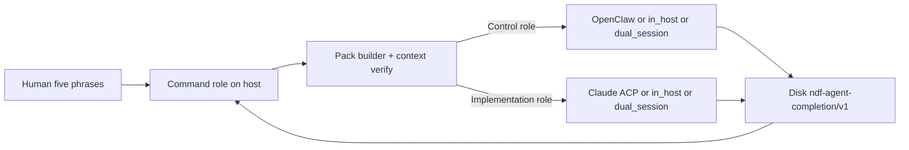
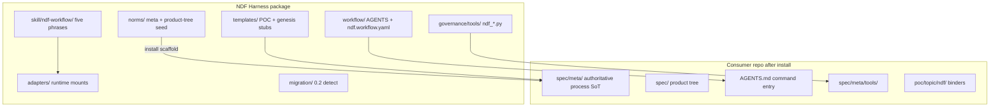
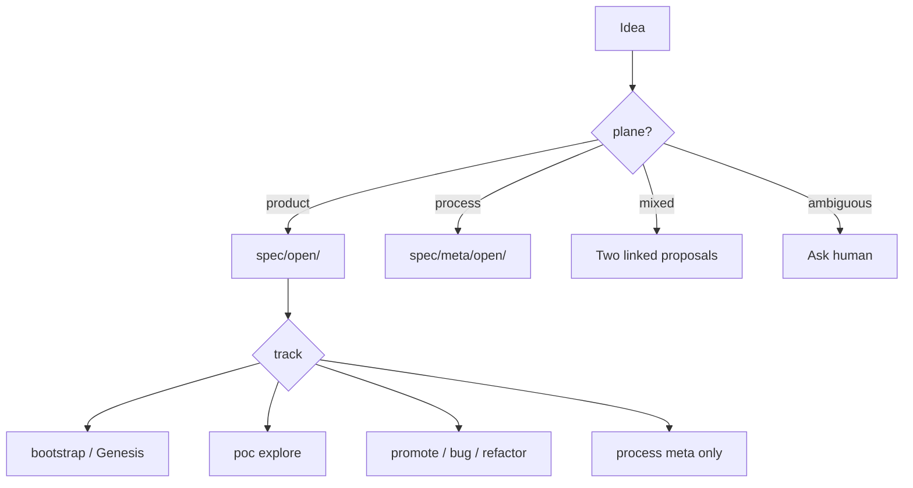
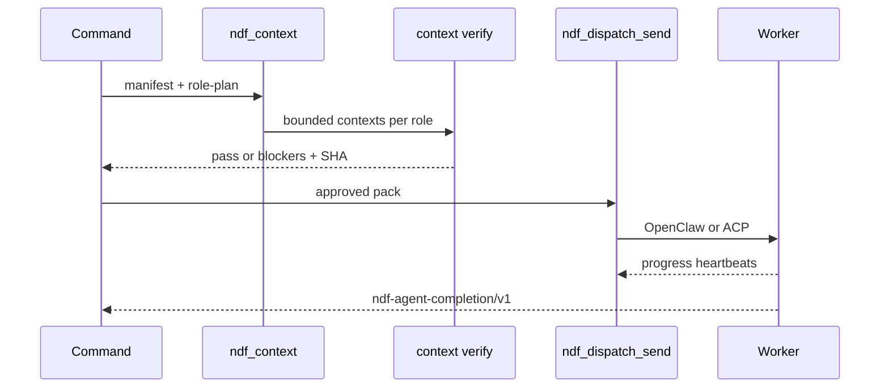
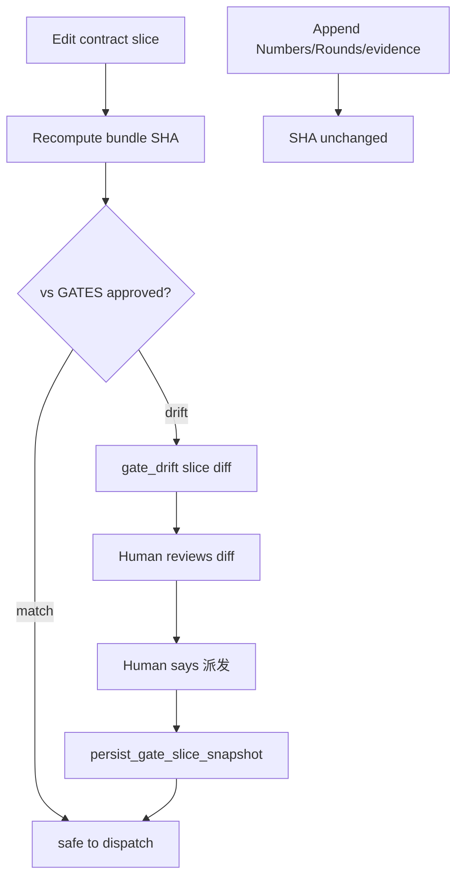
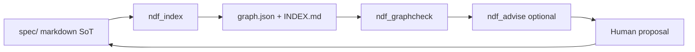

# Architecture

Product-neutral architecture of NDF Harness 1.0 — how command, control, implementation,
and disk completion fit together.

## End-to-end dispatch

**Success** is a durable completion receipt on disk. Transport ACK, stdout, or chat messages
are not success signals.

## Package layers

After install, **consumer `spec/meta/` and `AGENTS.md` are authoritative** for that repo.

## Three agent layers

| Layer | Agent | Writes | Reads |
|-------|-------|--------|-------|
| **Command** | Cursor / generic + `ndf-workflow` | tmp packs, gate append, dispatch triggers | AGENTS, spec/meta, binders |
| **Control** | OpenClaw | `spec/open/`, `spec/meta/open/`, `poc/*/ndf/`, state | Same manifest SHA as implementation |
| **Implementation** | Claude Code | `poc/<topic>/` (POC); `src/` (promote) | allowed_write_root, binders |

Command MUST NOT write worker implementation or call transport directly without pack pipeline.

## Idea plane + tracks

Tracks route write boundaries and verification obligations (compile/perf only on Trunk paths).

## Context pipeline

OpenClaw and Claude Code role plans MUST reference the **same `manifest_sha`**.

## Gate review-slice + drift

Gate identity (META-010) binds **review slices** — contract sections marked with
`ndf:gate-slice` comments — not whole files.

Mutable sections (perf numbers, delta rounds, evidence, commits) stay outside gate SHA churn.

## Graph / index loop

- **`--meta`**: process-profile self-consistency (hard_errors must be 0).
- **`--product`**: adopted product tree semantics.
- Reports default to `tmp/`; MUST NOT write under `spec/`.

## Security boundaries

| Risk | Control |
|------|---------|
| Unapproved dispatch | bundle SHA + human phrase in GATES |
| Context smuggling | `context_verify` fail-closed |
| Path escape | `allowed_write_root`, poc isolation |
| Fake success | completion schema + path verification |
| Concurrent POC writes | lease / run_id checks |
| SoT overwrite | install protected files; advise simulate-only |

See [`SECURITY.md`](SECURITY.md).

## Retired control plane

Commander, Episode, Replay, and ActionSpec (ADR-META-004) are **not** part of 1.0 daily path.
`ndf_replay.py` exists as a tombstone (exit 2). Use `ndf_workflow_status` + disk completion.

## Related docs

- [`WORKFLOW.md`](WORKFLOW.md) — phrases and tracks
- [`TOOLS.md`](TOOLS.md) — CLI reference
- [`INSTALL.md`](INSTALL.md) — what lands where
- [`WORKFLOW-OVERVIEW.md`](WORKFLOW-OVERVIEW.md) — operational closed loops
