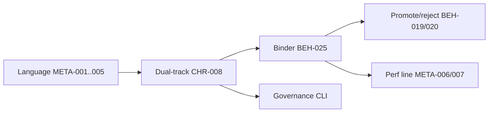

# Workflow Features

Capability catalog distilled from NDF meta/process — **reference only**. Installed
`spec/meta/` wins on conflict.

> **Package:** NDF Harness 1.0.0  
> **Human entry:** five phrases via [`skill/ndf-workflow/`](../skill/ndf-workflow/) — not init/adopt menu  
> **Install:** [`install.py`](../install.py) + [`docs/INSTALL.md`](INSTALL.md)

NDF Workflow is a **dual-track evolution + clause graph + topic binder + agent dispatch**
operating system for engineering process — not product behavior.

## 1. Language layer

| Feature | ID | Summary |
|---------|-----|---------|
| Clause skeleton | META-001 | `{#ID}` + ndf metadata |
| Graph edges | META-002 | Fixed edge keys; wiki links default non-edges |
| Layer tone | META-003 | L0–L3 MUST/SHOULD/MAY |
| Semantic core | META-004 | `model=` oracle; promote distill decision |
| SLA↔API | META-005 | stable SLA depends-on API + trunk-ref |
| ID namespace | ADR-META-002 | process uses META-*; freeze product numbers |

## 2. Dual-track

| Feature | ID | Summary |
|---------|-----|---------|
| Explore vs trunk | CHR-008 | POC draft; trunk is product SoT |
| POC discipline | BEH-018 | no stable SLA; no silent production enable |
| Write isolation | BEH-018 §6 | poc must not edit trunk src/include/tests |
| POC bug handling | BEH-018 §8 | fix in topic; merge via bug/promote |
| explore_surface | BEH-025 | intersecting surfaces → conflict/depends |
| POC ≠ SLA | CON-POC-001 | explore numbers stay out of stable must |

## 3. Topic binder

| Feature | ID | Summary |
|---------|-----|---------|
| Binder layout | BEH-025 | poc/topic/ndf/ presentation |
| Baseline pin | BEH-025 | baseline_trunk_sha, baseline_status |
| Perf card | META-007 | TOPIC → PERF_BASELINE binding |
| Commit ledger | DEF-023 | trailers + COMMITS.md |
| Sibling restart | BEH-025 | new topic id after reject/promote |
| Gate slices | META-010 | review-slice SHA; 派发 hot path |

## 4. Promote / reject / close

| Feature | ID | Summary |
|---------|-----|---------|
| Promote gate | BEH-019 | evidence + clean merge + verify |
| Semantic decision | META-004 | distill model / defer / skip |
| Negative result | BEH-020 | DEC Rejects + archive |
| Close plan | ndf_close | read-only promote/partial/reject plan |
| Stale baseline | close §4c | mark affected exploring stale |

## 5. Performance line

| Feature | ID | Summary |
|---------|-----|---------|
| Golden update | META-006 | trunk merge → rerun golden matrix |
| Perf read order | META-007 | Δ% from TOPIC card only |
| SLA vs observation | CON-POC-001 | SLA is contract floor |

## 6. Agent workflow (1.0)

| Feature | Location | Summary |
|---------|----------|---------|
| Five phrases | ndf-workflow skill | 初始化 / Idea / 派发 / 继续 / 关闭 |
| Tracks | AGENTS.md | poc, promote, process, bug, … |
| Text-first POC | META-011 | bundle_dispatch + disk completion |
| Context compiler | ndf_context | manifest → role plan → verify |
| Retired control | ADR-META-004 | no Commander/Replay daily path |
| Profiles | ndf.profile.yaml | dual-track / minimal / linter-only |

## 7. Governance tools

See [`TOOLS.md`](TOOLS.md) for full CLI list (17 scripts including replay tombstone).

| Tool | Summary |
|------|---------|
| ndf_index | index, validate, impact, poc-topics |
| ndf_graphcheck | semantic linter |
| ndf_bindcheck | provenance linter |
| ndf_advise | simulate-only surgery options |
| ndf_close | close plan |
| ndf_poc_isolation | trunk write guard |
| ndf_perf_baseline | perf card check |
| ndf_workflow_status | packs, health, dispatch |
| ndf_dispatch_send | transport + completion wait |

## 8. Non-goals

- Product domain behavior or SLA thresholds in harness docs
- Silent advise apply or git history rewrite
- Harness overriding consumer spec/meta SoT
- Nested sub-POC or topic resurrection after close

## Read order

1. [`WORKFLOW-FEATURES.md`](WORKFLOW-FEATURES.md) (this file)
2. [`WORKFLOW-OVERVIEW.md`](WORKFLOW-OVERVIEW.md)
3. Installed `spec/meta/language.md` → `process.md`
4. [`WORKFLOW.md`](WORKFLOW.md)
5. [`TOOLS.md`](TOOLS.md)
