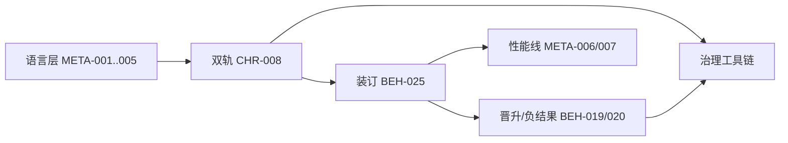

# NDF Workflow — 特性总览（从 Meta 提炼）

> **role:** ndf-process-reference  
> **product_behavior:** false  
> **source:** `spec/meta/{language,process,architecture,constraints,glossary,decisions}` + `tools/`  
> **package:** NDF Portable Harness ≥ 0.2.0  
> **用途:** 一眼看清 Workflow **具备什么能力**；正文仍以 meta 条款为准

一句话：NDF Workflow 是一套 **双轨演进 + 条款图治理 + 主题装订 + Agent 指挥闭环** 的工程操作系统——管「怎么改规范与代码」，不管具体产品行为。

---

## 1. 语言与契约层（怎么写 NDF）

| 特性 | 条款 | 能力摘要 |
|------|------|----------|
| 条款骨架 | [[META-001]] | `{#ID}` + `<!-- ndf: -->`；kind/level/layer/status；强制语气大写 |
| 图边模型 | [[META-002]] | 结构边仅限固定键；wiki `[[ID]]` 默认不成边；meta 不依赖产品节点 |
| 分层语气 | [[META-003]] | L0–L3；MUST/SHOULD/MAY；树/图/git 三栖 |
| 语义核 | [[META-004]] | `model=` → `spec/models/` 预言机；promote 时要/不要/延期决策 |
| SLA↔旋钮绑定 | [[META-005]] | 性能 SLA `depends-on` API；`trunk-ref` 钉 git；默认值对齐该树 |
| ID 命名空间 | [[DEF-META-ID-NS]] / [[ADR-META-002]] | process 用 `META-*` / `DEF-NDF-*`…；冻结旧 BEH/CHR 号；禁续产品数字号 |
| meta↔产品分层 | [[ADR-META-001]] | 流程正文在 `spec/meta/`；产品树仅 thin adopted 指针 |

---

## 2. 双轨演进（探索 / 主线）

| 特性 | 条款 | 能力摘要 |
|------|------|----------|
| 探索 vs Trunk | [[CHR-008]] / [[DEF-020]] / [[DEF-021]] | POC 可失败；Trunk 才是产品 SoT；禁止静默双漂 |
| 探索纪律 | [[BEH-018]] | draft 提案；禁 stable SLA；禁生产默认开启；多轮同主题深入 |
| 写入隔离 | [[BEH-018]] §6 | poc MUST NOT 改 Trunk `src/**` `include/**` `tests/**`；先拷再改；可只读链 |
| 探索期主线 bug | [[BEH-018]] §8 | 默认在当前 topic 修测取证；合入另开 bug/promote |
| 有条件并行 | [[BEH-018]] §9 / [[BEH-025]] | `explore_surface` 相交则串行/声明冲突；禁默认可加 Δ |
| POC≠生产 SLA | [[CON-POC-001]] | 探索数字不得自动升 stable must |
| 目录边界 | [[ARCH-008]] | `poc/` 与 `models/` 非生产 SoT；实验不进 models 冒充金标 |

---

## 3. 主题装订与可复现（POC 操作系统）

| 特性 | 条款 | 能力摘要 |
|------|------|----------|
| Topic Binder | [[BEH-025]] / [[DEF-022]] | `poc/<topic>/ndf/` 唯一呈现面：TOPIC / proposals / evidence / COMMITS |
| 基线钉扎 | [[BEH-025]] | `baseline_trunk_sha` / `baseline_status` / `baseline_protocol` |
| 性能线卡 | [[META-007]] / [[BEH-025]] | `perf_baseline` → `PERF_BASELINE.md`（config × sha × numbers）；比 Δ% 只读该卡 |
| 探索表面 | [[BEH-025]] | `explore_surface`；`depends_on_topics` / `conflicts_with_topics` |
| 基线 stale | [[BEH-025]] | promote/partial 后受影响 exploring 标 stale；重测 R0 或显式 `vs_trunk=` |
| Commit Ledger | [[DEF-023]] | COMMITS 表 + `Topic:`/`Proposals:`/`Clauses:` trailers |
| NOTES 状态镜像 | [[BEH-025]] | 关闭时 NOTES 头 status 对齐 TOPIC |
| 关闭后重启 | [[BEH-025]] / [[BEH-020]] | 禁同 id 复活；平级新 topic + `depends_on_topics` |
| 探索延长 | [[BEH-025]] | 同假设同主题 amend；分叉平级 topic；禁嵌套子 POC |

---

## 4. 晋升 / 负结果 / 回合

| 特性 | 条款 | 能力摘要 |
|------|------|----------|
| 晋升闸门 | [[BEH-019]] | 证据 + 提案 draft→stable + 干净合入 + 验证 + 装订器收口 |
| 语义核决策 | [[META-004]] / [[BEH-019]] | promote MUST 声明要/不要/延期蒸馏 `models/` |
| 基线失效清单 | [[BEH-019]] / close §4c | 兄弟 exploring stale；禁跨主题默认可加 |
| 表面冲突复核 | close §4d | `explore_surface` 相交主题冲突/依赖复核 |
| 负结果闭环 | [[BEH-020]] | DEC `Rejects:` → deprecated → Trunk 确认干净 → 装订器归档 |
| 回合计划 | `ndf_close` | promote/reject/partial 只读 plan；不自动 apply |
| 归档纪律 | 流程惯例 | `spec/archive/`；禁 `spec/open/archive/`；poc/archive sot:false |

---

## 5. 性能线与金标（观测 vs 合约）

| 特性 | 条款 | 能力摘要 |
|------|------|----------|
| 金标更新义务 | [[META-006]] | Trunk 合入后重跑产品金标矩阵；新 `bl-*` + `cfg-*`；禁只刷 SLA 观测数字 |
| 性能线读写 | [[META-007]] | Agent 开题/Δ%/压测前读 TOPIC→卡；配置-only 须换配置身份 |
| 配置/基线空间 | 产品验证树惯例 | `configs/cfg-*` × `baselines/bl-*`；索引 thin 导航 |
| SLA ≠ 观测线 | [[META-007]] / [[CON-POC-001]] | stable SLA 是合约下限；观测线在验证树与主题卡 |

---

## 6. Agent 指挥工作流（操作层）

| 特性 | 落点 | 能力摘要 |
|------|------|----------|
| Track 路由 | `AGENTS.md` | `poc` / `promote` / `process` / `bug` / `refactor` / `rollback` |
| 提案→确认→落地→审核 | `AGENTS.md` | 「已确认」落地；「已审核」后委派；process 无编译/性能 |
| 写入边界 | `AGENTS.md` + boundaries | 指挥写 meta/L0–L1；实现按 track；禁区明确 |
| 验证闭环 | 场景 5/6/7 | Trunk 路径编译+性能；失败 ≤3 轮；反馈分流产品/流程 |
| 跨运行时 | Harness skill | init / adopt / govern / sync；adapters 薄挂载 |
| Profile | `ndf.profile.yaml` | dual-track / minimal / linter-only |

---

## 7. 治理工具链（可机械检查）

| 特性 | 工具 | 能力摘要 |
|------|------|----------|
| 索引检索 | `ndf_index` | INDEX / graph.json；impact / diff / poc-topics |
| 图语义门禁 | `ndf_graphcheck` | cycle / stable_dep / conflict_asym / meta_dangling；`--meta` |
| 绑定溯源 | `ndf_bindcheck` | trailer/ledger、双头、观测粒度；可选 zombie/drift |
| 顾问+沙盒 | `ndf_advise` | 手术单；simulate 只改内存；永不静默写 SoT |
| 回合计划 | `ndf_close` | promote/reject/partial 清单 + 语义核/stale/表面 |
| 写入隔离检查 | `ndf_poc_isolation` | topic/工作区是否触及禁写 Trunk 路径 |
| 性能线装订 | `ndf_perf_baseline` | 解析/校验 TOPIC→PERF_BASELINE（非 SLA 业务） |
| 报告 I/O | `ndf_report_io` | 默认 `tmp/`；`--report -`；禁写 `spec/` |
| 缺陷词典 | [[BEH-026]] / DEF-NDF-* | 先定义 Layer A / 绑定面，再扫描 |
| 主链 | GOVERNANCE | index → lint → advise → simulate → human → recheck |

### 图语义面缺陷（Layer A）

`CYCLE` · `STABLE-DRAFT` · `CONFLICT-ASYM` · `META-DANGLING` · `UNLINKED`(warn)

### 绑定溯源面缺陷

`SPEC-DRIFT` · `ZOMBIE-SPEC` · `REPRO-BIND-GAP` · `OBS-GRAIN` · `BINDER-DUAL-HEAD`

---

## 8. 卫生与防腐化

| 特性 | 落点 | 能力摘要 |
|------|------|----------|
| 先图后语义 | [[DEC-HYGIENE-001]] | ID/死链/幽灵决策优先于堆新条款 |
| 不静默改数字 | 卫生 ADR / META-006/007 | Charter/SLA/金标变更走提案与身份 bump |
| 归档不删史 | 惯例 | 证据进 archive；不 rewrite 已推送历史「对齐文档」 |
| meta 自洽门禁 | `graphcheck --meta` | hard_errors=0；process 无产品结构边 |

---

## 9. 能力地图（按角色）

| 角色 | 主要使用的能力 |
|------|----------------|
| **指挥 Agent** | Track 路由、提案落地、装订字段、promote/close plan、性能线读序 |
| **实现 Agent** | poc 写入隔离、trailers/COMMITS、PERF_BASELINE 更新、Trunk 干净合入 |
| **审核 / 治理** | index→graphcheck/bindcheck→advise；isolation/perf_baseline；报告 tmp/ |
| **人类** | 「已确认」「已审核」；语义核要/不要；SLA 调阈值选型 |

---

## 10. 非目标（Workflow 不管什么）

- 具体产品域行为、模块名、SLA 阈值  
- 自动 apply advise 沙盒到 SoT / 静默改 git 历史  
- 把 Harness 包当作消费仓本地 SoT 的上级（正确流向：本地验证 → 蒸馏进包）  
- 嵌套「子 POC」、同 topic 关闭后原地复活  

---

## 11. 读序建议

1. 本文件（能力索引）  
2. `norms/meta/language.md` → `process.md`  
3. `workflow/AGENTS.md`  
4. `governance/tools/README.md` + `GOVERNANCE.md`  
5. 开题：`templates/poc/{TOPIC,PERF_BASELINE}.md.stub`

条款冲突时：**以安装后的 `spec/meta/` 正文为准**，本文仅归纳。
