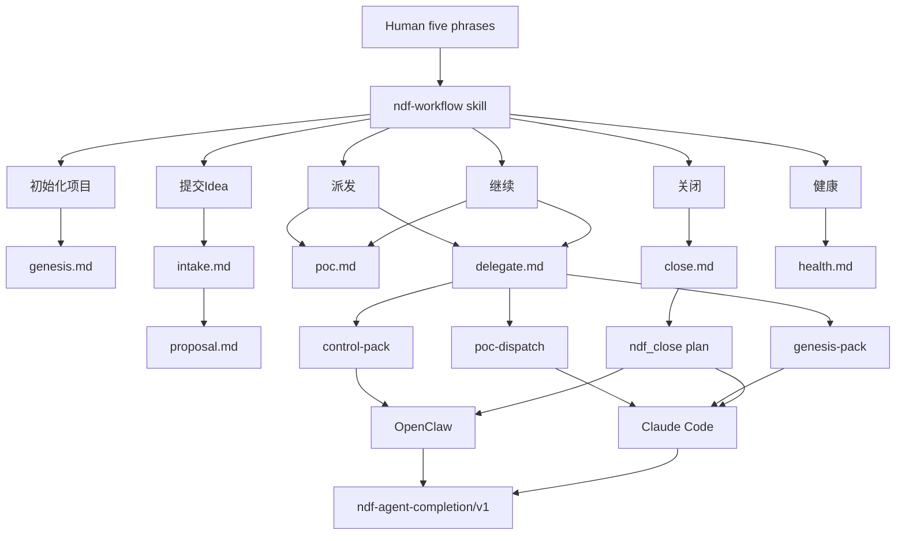
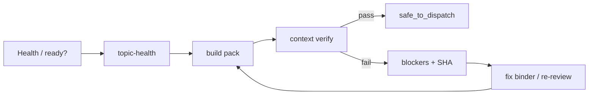
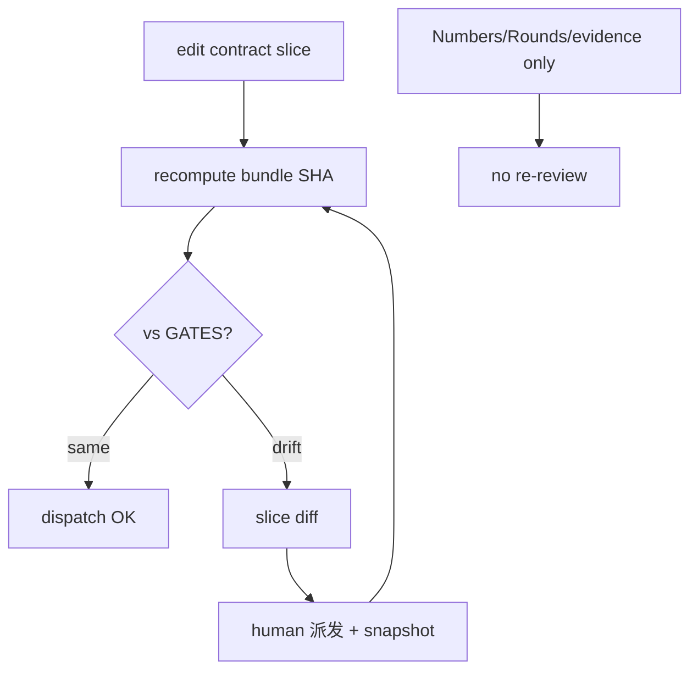
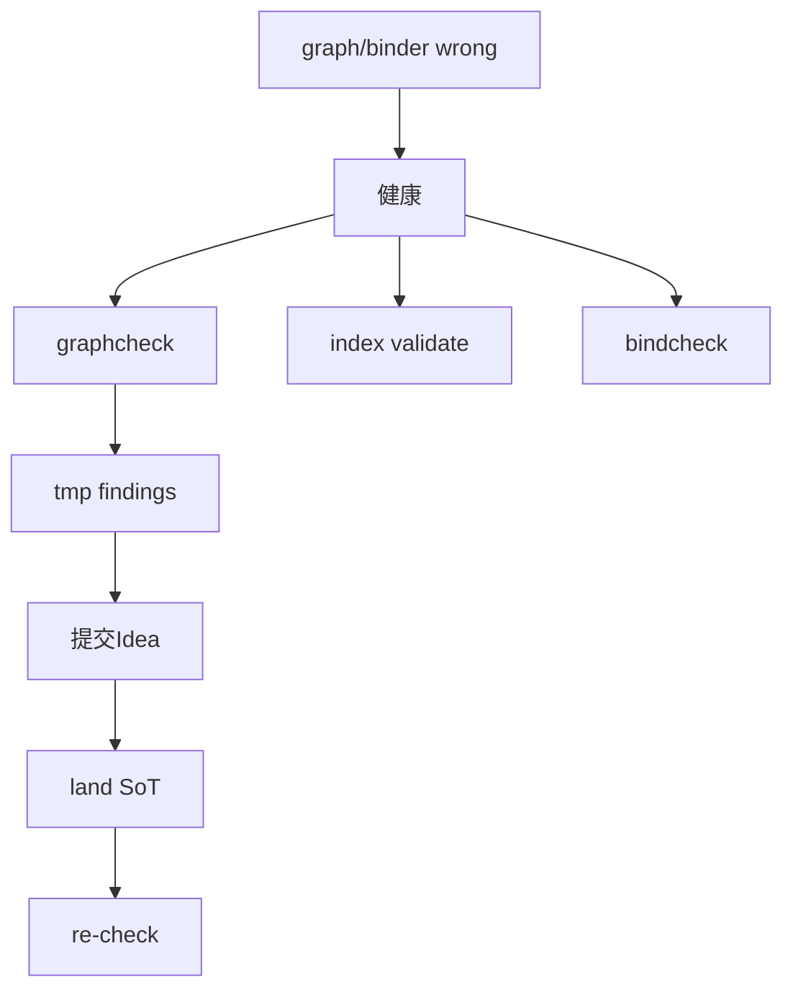

# Workflow Overview

Human-readable overview of NDF Workflow 1.0 — call graph and closed loops.

**Not SoT.** Clause text lives in installed `spec/meta/process.md`. Entry skill:
[`skill/ndf-workflow/SKILL.md`](../skill/ndf-workflow/SKILL.md).

## One sentence

Human speaks five phrases to the **command surface** → internal modules route →
**OpenClaw** (documents) / **Claude Code** (code) → disk `ndf-agent-completion/v1`.
Contract changes are detected by **review-slice SHA + diff**; graph problems loop through
**graphcheck → proposal → re-check**.

| Layer | Who | Role |
|-------|-----|------|
| Command | Command agent + `ndf-workflow` | phrases, wait for human, build pack, report blockers |
| Control | OpenClaw | proposals, binders, gate docs |
| Implementation | Claude Code | POC / genesis / promote code |

Success = disk completion. No panel obligation.

## Skill call graph



Internal modules (`genesis.md`, `poc.md`, …) are **not** a second public skill menu.

## Phrase routing

| Phrase | Modules | Human waits | Delegate |
|--------|---------|-------------|----------|
| 初始化项目 | genesis → delegate | Genesis gate phrases | OpenClaw → Claude |
| 提交Idea | intake → proposal → delegate | 已确认 · 已审核 | OpenClaw |
| 派发 | poc + delegate | 派发 | Claude or OpenClaw |
| 继续 | poc + delegate | 派发 again | OpenClaw → Claude |
| 关闭 | close → delegate | close mode | Claude ± OpenClaw |
| 健康 | health | — | read-only |

## Loop A — Context verify



Humans see blockers and SHA — not full context dumps. Both workers share one `manifest_sha`.

## Loop B — Amend detection



Command MUST show slice diff on drift — not only hex SHAs.

## Loop C — Graph health



| Tool | Checks |
|------|--------|
| graphcheck | cycles, stable deps, meta dangling |
| index | links, indexability |
| bindcheck | ledger, dual-head, grain |
| advise | options only — no SoT writes |

## End-to-end ring

```text
Idea → 已确认 → 已审核
  → binder poc/<topic>/ndf/
  → 派发 (bundle SHA + slice snapshot)
  → pack + context verify
  → worker → disk completion
  → 继续: contract change? → diff → 派发
           measure only? → no SHA churn
  → 健康: graphcheck / bindcheck / index
  → 关闭: ndf_close plan → merge or reject
```

## Hard vs soft gates (daily POC)

**Hard block:** identity, human bundle, write root, isolation, concurrent run, context verify,
ACP budget, disk completion.

**Soft audit (health / close):** full meta graph, bindcheck, projection/Replay (retired).

## Related files

| Path | Role |
|------|------|
| `skill/ndf-workflow/SKILL.md` | human entry |
| `spec/meta/process.md` | META-010/011/012 |
| `docs/WORKFLOW.md` | phrases + tracks |
| `docs/TOOLS.md` | CLI reference |
| `docs/ARCHITECTURE.md` | layer diagram |

## Retired

Commander, Episode, Replay, ActionSpec — see ADR-META-004. Do not document as active paths.
