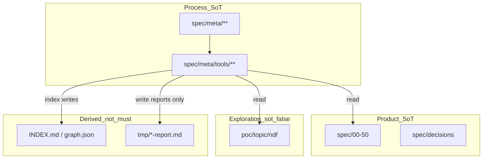
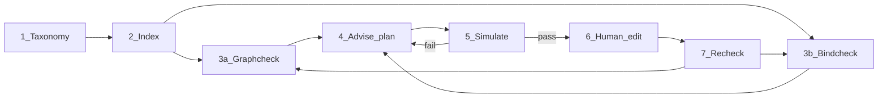
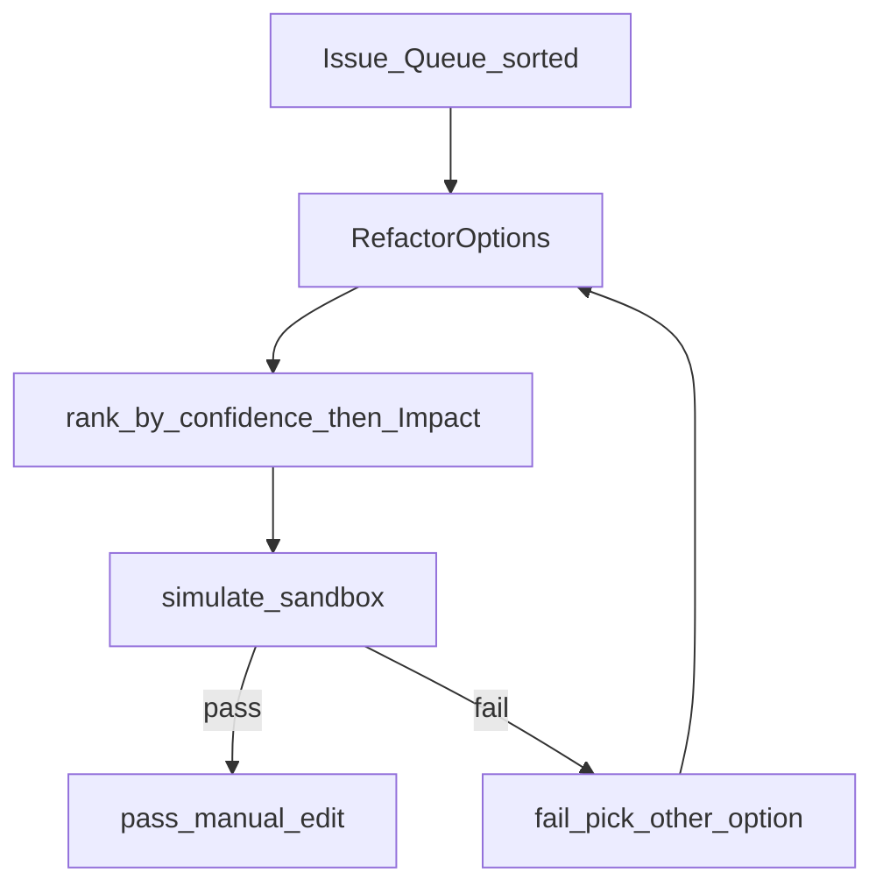

# NDF Harness 治理架构（参考）

> **role:** ndf-process-reference  
> **product_behavior:** false  
> **sot:** true（对本仓 **工具治理纪律** 的说明性参考）；**false**（对消费仓产品行为）  
> **scope:** ndf-process  
> **depends-on:** [[BEH-026]], [[DEF-NDF-GRAPH]], [[CHR-008]], [[BEH-025]], [[DEF-023]]  
> **实现:** [`README.md`](README.md) · [`ndf_*.py`](.)  
> **提案:** [`../open/proposal-meta-ndf-defect-taxonomy.md`](../open/proposal-meta-ndf-defect-taxonomy.md)、
> [`../open/proposal-meta-ndf-graph-advise.md`](../open/proposal-meta-ndf-graph-advise.md)、
> [`../open/proposal-meta-ndf-bind-advise.md`](../open/proposal-meta-ndf-bind-advise.md)、
> [`../open/proposal-meta-ndf-bindcheck.md`](../open/proposal-meta-ndf-bindcheck.md)

本文是 **NDF 审核 harness 的治理参考**：说明「谁查什么、谁建议什么、谁能改什么、
逻辑如何串起来」。它不是产品 SLA，也不替代 [`../process.md`](../process.md) 中的
双轨条款正文。

---

## 0. 一句话

**先定义缺陷词典，再 Linter 举证，再 Advisor 给局部选项，沙盒证明意图，人工改 SoT；
工具永不静默写条款 / git。**

---

## 1. 权威分层（读图前先分清 SoT）



| 层 | 路径 | Agent 可否当 must |
|----|------|-------------------|
| Process SoT | `spec/meta/**` | 流程纪律 yes；产品行为 no |
| Product SoT | `spec/00–50`、产品 DEC | 产品行为 yes |
| 探索 | `poc/<topic>/ndf/` | **no**（draft / 复现入口） |
| 派生物 | `INDEX.md`、`graph.json`、检查报告 | **no** |

纯 process 新 ID（`DEF-NDF-*`、`BEH-026`）MUST NOT 写入产品树 adopted 表。

---

## 2. 端到端逻辑链（主路径）

日常修图 / 卫生 / 装订治理的**主逻辑链**：

```text
[1] 缺陷词典 SoT          taxonomy / glossary DEF-NDF-* / BEH-026
        ↓
[2] 索引面                ndf_index → INDEX + graph.json（检索，非 must）
        ↓
[3] 双 Linter 并行        graphcheck（图） ‖ bindcheck（绑定）
        ↓
[4] 顾问降维              ndf_advise plan --surface graph|bind
        ↓                 Issue Queue → RefactorOptions → Impact_Delta
[5] 沙盒推演              ndf_advise simulate（内存 only）
        ↓                 pass = 意图一致；fail = 换选项
[6] 人工落地              改 meta/产品条款 或 poc 装订器（走提案纪律）
        ↓
[7] 闭环再检              index（若改了条款）+ graphcheck / bindcheck
```



**失败回退：**

| 阶段失败 | 回退 |
|----------|------|
| Linter 海量报错 | `--low-hanging-fruit` / `--kinds` / `--focus` 收窄 |
| simulate fail | 换 `Option`；禁止「强行 apply」 |
| 人工改完仍红 | 场景7：代码/规范/性能/环境分流（见 `AGENTS.md`） |
| 探索方向证伪 | `ndf_close` reject + [[BEH-020]] 负结果闭环 |

---

## 3. 旁路：POC 主题收口

探索结束时**不要**用 advise 代替回合计划：

```text
[A] poc/<topic>/ndf 装订器稳定
[B] ndf_close plan --mode promote|reject|partial
[C] 人工合入 Trunk（产品提案 / draft→stable）
[D] TOPIC=promoted|rejected；COMMITS 记 src/spec commit
[E] MUST：ndf_index index + ndf_graphcheck
[F] 可选：ndf_bindcheck --topic <id>
```

`ndf_close` **只读 plan**；无 `apply`。Promote 后图面再走 §2 主链清洗残留环 / stable_dep。

---

## 4. 工具职责（谁干什么）

| 工具 | 面 | 输入 | 输出 | 写盘？ |
|------|----|------|------|--------|
| `ndf_index.py` | 检索 | `spec/meta`+`00–50` | `INDEX.md`、`graph.json` | 仅派生物 |
| `ndf_graphcheck.py` | 图 Linter | 条款图 | 错误报告 + 子图 | 报告可选 |
| `ndf_bindcheck.py` | 绑定 Linter | TOPIC/COMMITS/git/Trunk | 按 DEF 分类报告 | 报告可选 |
| `ndf_advise.py --surface graph` | 图顾问 | graphcheck issues | 手术单 + simulate | **否**（SoT） |
| `ndf_advise_bind.py`（由 advise 调用） | 绑定顾问实现 | bindcheck findings | 同上 | **否** |
| `ndf_close.py plan` | 回合计划 | TOPIC + Trunk 图 | close plan MD | **否** |

### 4.1 故意不做的事

- 不发明 `mentions` 等非 `EDGE_KEYS` 边  
- 不 `git commit --amend` / 不改写历史清 trailer  
- 不把 POC 数字写入 stable must SLA（[[CON-POC-001]]）  
- 不把 process ID 塞进产品 `00–50` adopted  
- 不写 `.openclaw/state.json`（Cursor NDF 维护）  

---

## 5. 图语义面（Layer A）逻辑链

### 5.1 Linter 判定 → 顾问队列

```text
load_graph()
  → find_cycles / stable_must_deps / conflict_asym / meta_dangling / unlinked
  → Issue Queue 排序：
       stable_dep（依赖方 dep-depth 深者优先）
    → cycle（节点数最少优先）
    → conflict_asym / meta_dangling
    → unlinked
  → 每条生成 RefactorOptions（confidence + Impact_Delta + AtomicPatch）
  → --low-hanging-fruit：只保留 high
```

### 5.2 沙盒契约（graph）

```text
clone(graph)
  → apply(AtomicPatch)
  → 复跑 graphcheck 谓词
  → PASS 当且仅当：
       · 当前 issue 不再出现
       · cycle 计数不增加
       · stable_dep 计数不增加
  → 仍不写 spec/**
```

允许的 patch op：`remove_edge` · `retarget_edge` · `change_rel` · `add_edge` ·
`insert_iface` · `deprecate_node` · `mirror_conflict`。

注意：`couples-with` **不能**用来「消除」`stable_dep`（仍属结构边集）。

### 5.3 推荐命令

```bash
python3 spec/meta/tools/ndf_graphcheck.py --report tmp/ndf-graphcheck.md
python3 spec/meta/tools/ndf_advise.py plan --surface graph --low-hanging-fruit \
  --report tmp/ndf-advise.md
python3 spec/meta/tools/ndf_advise.py simulate --surface graph \
  --issue stable_dep-001 --option O1 --report tmp/ndf-advise-sim.md
```

---

## 6. 绑定溯源面（曾称 Layer B）逻辑链

### 6.1 Linter 判定 → 顾问队列

```text
对每个 poc/<topic>/ndf：
  bind → trailer / ledger sha / COMMITS 存在性
  dual → TOPIC draft 登记 vs Trunk status / topic=
  grain → protocol 多 SHA 且 note 过短等
  （可选）zombie / drift 启发式
  → Issue Queue：
       dual (draft_vs_stable…)
    → bind (missing_trailer / clause_unbound / …)
    → grain
    → zombie / drift
```

### 6.2 沙盒契约（bind）

```text
load 虚拟 TOPIC.md + COMMITS.md 文本
  → apply(BindPatch)   # 只改内存字符串
  → 判定 finding 意图是否被缓解
  → PASS ≠ git 已有 trailer；历史债可用 banner + ledger + --since 管理
  → 永不写 poc/** 、永不 amend
```

允许的 patch op：`update_topic_draft_table` · `append_ledger_row` ·
`add_not_backfilled_banner` · `add_trailers_template` · `lengthen_ledger_note` ·
`fix_path_cite`。

### 6.3 推荐命令

```bash
python3 spec/meta/tools/ndf_bindcheck.py check --all-topics \
  --report tmp/ndf-bindcheck.md
python3 spec/meta/tools/ndf_advise.py plan --surface bind --low-hanging-fruit \
  --report tmp/ndf-advise-bind.md
python3 spec/meta/tools/ndf_advise.py simulate --surface bind \
  --issue dual-001 --option O1 --report tmp/ndf-advise-bind-sim.md
```

---

## 7. 顾问共用漏斗（两面同构）



每条选项 MUST 带：

1. **title** — 人话操作  
2. **confidence** — high / medium / low  
3. **Impact_Delta** — 影响面提示（图：出入边/可达；绑定：topic/severity）  
4. **patch** — 原子 JSON（可审计）  
5. **manual_steps** — 真要改盘时的手改清单  
6. **simulate 命令** — 可复制  

AI 提示块（prompt stub）仅粘贴用；**不**内嵌调 LLM，**不**自动落地。

---

## 8. 与双轨开发流程的衔接

| 开发 track | harness 用法 |
|------------|----------------|
| **poc** | bindcheck + advise bind；close plan；**不**跑 Trunk SLA |
| **promote** | close → 合入 src → index + graphcheck（+ 可选 bindcheck）→ 编译/性能 |
| **process** | 改 `spec/meta/**`；graph/bind 顾问辅助修图；无 Trunk 性能 |
| **bug / refactor** | 同 promote 验证链 |

条款级纪律仍以 [`../process.md`](../process.md) [[CHR-008]] / [[BEH-018]]…[[BEH-025]] 为准。

---

## 9. 读序（给人 / Agent）

1. 本文件（治理全景）  
2. [`README.md`](README.md)（命令速查）  
3. [`../glossary.md`](../glossary.md) DEF-NDF-*（缺陷定义）  
4. [`../process.md`](../process.md)（双轨 must）  
5. 具体提案 `../open/proposal-meta-ndf-*.md`  

指挥层入口仍是仓库根 `AGENTS.md` → [`../README.md`](../README.md)。

---

## 10. 演进边界

| 已落地 | 明确不做 / 后续 |
|--------|-----------------|
| graph + bind 双 Linter | Canvas 工作台 UI |
| advise 双 surface + simulate | 静默 `apply` 写 SoT |
| close 只读 plan | close apply |
| 低垂果实 = high 选项 | 自动修 git history |
| | `provenance_depth_delta` 警示（可选） |

变更本治理结构时：开 `spec/meta/open/proposal-meta-*.md`，确认后再改工具与本文。
