# Architecture - 模块分解与依赖

## 模块依赖图(Mermaid,基于 #include 关系机械提取) {#ARCH-001}

```mermaid
graph TD
    subgraph "Headers (include/)"
        common["common.h<br/>图结构定义 + Varint + fvecs IO"]
        disk_hnsw_h["disk_hnsw.h<br/>DiskHNSW 搜索引擎"]
        block_cache_h["block_cache.h<br/>LRU 块缓存"]
        layout_provider_h["layout_provider.h<br/>BFS/Random 布局"]
        replacement_policy_h["replacement_policy.h<br/>LRU/LFU/LRU-K"]
        block_heat_h["block_heat_evaluator.h<br/>Block 热度追踪"]
        graph_prefetcher_h["graph_prefetcher.h<br/>io_uring 异步预取"]
        io_uring_h["io_uring_wrapper.h<br/>io_uring C++ 封装"]
    end

    subgraph "Core (src/core/)"
        disk_hnsw_cpp["disk_hnsw.cpp<br/>搜索 + PQ + 精排 + 邻接表"]
        block_cache_cpp["block_cache.cpp<br/>Block 加载 + 解析 + FlatCache"]
        graph_prefetcher_cpp["graph_prefetcher.cpp<br/>图引导预取实现"]
    end

    subgraph "Pipeline (src/pipeline/)"
        build_index["build_index.cpp"]
        extract_graph["extract_graph.cpp"]
        bfs_reorder["bfs_reorder.cpp"]
        write_blocks["write_blocks.cpp"]
        write_blocks_veconly["write_blocks_veconly.cpp"]
        write_pq_blocks["write_pq_blocks.cpp"]
        gen_route["gen_route.cpp"]
        verify["verify.cpp"]
        prune_graph["prune_graph.cpp"]
    end

    subgraph "Benchmark (src/benchmark/)"
        bench_diskhnsw["benchmark_diskhnsw.cpp"]
        bench_hnswlib["benchmark_hnswlib_native.cpp"]
    end

    subgraph "Tests (src/test/)"
        test_disk_hnsw["test_disk_hnsw.cpp"]
        test_block_cache["test_block_cache.cpp"]
        test_pq_quality["test_pq_search_quality.cpp"]
    end

    subgraph "Scripts"
        train_pq["train_pq.py"]
        gen_gt["gen_gt.py"]
        build_pipeline["build_pipeline.sh"]
        compare_bench["compare_benchmark.sh"]
    end

    subgraph "External"
        hnswlib["hnswlib/hnswlib.h<br/>HNSW 建图 + 全内存搜索"]
        faiss["faiss (Python)<br/>PQ 训练 + IndexFlatL2"]
    end

    %% Header dependencies
    common --> layout_provider_h
    common --> replacement_policy_h
    common --> block_heat_h
    block_cache_h --> common
    block_cache_h --> layout_provider_h
    block_cache_h --> replacement_policy_h
    block_cache_h --> block_heat_h
    disk_hnsw_h --> common
    disk_hnsw_h --> block_cache_h
    disk_hnsw_h --> block_heat_h
    disk_hnsw_h --> layout_provider_h
    disk_hnsw_h --> replacement_policy_h
    disk_hnsw_h --> graph_prefetcher_h
    disk_hnsw_h --> io_uring_h
    graph_prefetcher_h --> block_cache_h
    graph_prefetcher_h --> io_uring_h
    graph_prefetcher_h --> common

    %% Core impl dependencies
    disk_hnsw_cpp --> disk_hnsw_h
    block_cache_cpp --> block_cache_h
    graph_prefetcher_cpp --> graph_prefetcher_h

    %% Benchmark deps
    bench_diskhnsw --> disk_hnsw_h
    bench_diskhnsw --> hnswlib

    %% Test deps
    test_disk_hnsw --> disk_hnsw_h
    test_disk_hnsw --> hnswlib
    test_block_cache --> block_cache_h
    test_pq_quality --> disk_hnsw_h

    %% Pipeline deps
    build_index --> hnswlib
    extract_graph --> common
    bfs_reorder --> common
    write_blocks --> common
    write_blocks_veconly --> common
    write_pq_blocks --> common
    gen_route --> common
    verify --> common
    prune_graph --> common

    %% Scripts deps
    train_pq --> faiss
    gen_gt --> faiss
    build_pipeline --> build_index
    build_pipeline --> extract_graph
    build_pipeline --> bfs_reorder
    build_pipeline --> write_blocks
    build_pipeline --> write_blocks_veconly
    build_pipeline --> gen_route
    build_pipeline --> train_pq
    build_pipeline --> gen_gt
    compare_bench --> bench_diskhnsw
    compare_bench --> bench_hnswlib
```

<!-- ndf: kind=arch layer=L1 status=stable since=0.1 source=observed -->

## 循环依赖检测 {#ARCH-002}
<!-- ndf: kind=arch layer=L1 status=stable since=0.1 source=observed -->

**检测结果:Header 层面存在以下循环依赖链**

1. `disk_hnsw.h` ← `graph_prefetcher.h` ← `block_cache.h` ← `disk_hnsw.h`
   - **实际路径**: `disk_hnsw.h` includes `graph_prefetcher.h`, which includes `block_cache.h`, which does NOT include `disk_hnsw.h`
   - **决议**: 无真正循环。`BlockCache` 有 `friend class DiskHNSW` 声明 (`block_cache.h:293,389`),通过前向声明实现,不形成 `#include` 环
   - **警告**: `friend class DiskHNSW` 是紧耦合,`BlockCache` 知晓 `DiskHNSW` 存在

2. 无其他 `#include` 环检测到。`#pragma once` 保护所有头文件,保证单次包含。

## 模块分层 {#ARCH-003}
<!-- ndf: kind=arch layer=L1 status=stable since=0.1 source=observed -->

| 层 | 模块 | 职责 | 文件 |
|----|------|------|------|
| L0: 数据格式 | `common.h` | 二进制格式定义、varint、fvecs IO | 1 header |
| L1: 缓存抽象 | `layout_provider.h`, `replacement_policy.h`, `block_heat_evaluator.h` | 可插拔策略接口 | 3 headers |
| L2: 缓存实现 | `block_cache.h/.cpp`, `io_uring_wrapper.h` | BlockCache + io_uring | 3 files |
| L3: 预取 | `graph_prefetcher.h/.cpp` | 图引导异步预取 | 2 files |
| L4: 搜索引擎 | `disk_hnsw.h/.cpp` | 搜索 + PQ + 精排 + 邻接表管理 | 2 files |
| L5: 应用 | benchmark, tests, pipeline tools | 使用层 | 11 files |

## 关键耦合点 {#ARCH-004}
<!-- ndf: kind=arch layer=L1 status=stable since=0.1 source=observed -->

1. **DiskHNSW ↔ BlockCache**: 通过 `std::unique_ptr<BlockCache>` 持有,`friend class` 声明允许访问私有成员(`block_cache.h:293,389`)
2. **DiskHNSW ↔ GraphPrefetcher**: 通过 `std::unique_ptr<GraphPrefetcher>` 持有
3. **BlockCache ↔ LayoutProvider**: 通过 `std::unique_ptr<LayoutProvider>` 持有
4. **BlockCache ↔ ReplacementPolicy**: 通过 `std::unique_ptr<ReplacementPolicy>` 持有
5. **ID 空间**: old_id (hnswlib 内部) ↔ new_id (BFS 重排) 双向映射由 DiskHNSW 管理
6. **双路由表**: `route_table_` (blocks) 和 `vec_route_table_` (vecblocks) 分离,解决 block_id 不一致问题

---

<!-- ════════════════════════════════════════════════════════════════ -->
<!-- INTENT- 条款:基于 DDD/六边形架构的目标模块重设计             -->
<!-- source=deduced 表示条款源自全局架构理解,非从代码机械提取     -->
<!-- ════════════════════════════════════════════════════════════════ -->

## 远期架构方向（探索性） {#ARCH-001}
<!-- ndf: kind=arch level=may layer=L1 status=draft since=0.2 source=deduced -->

> ⚠️ 远期探索方向，当前无任何代码实现。六边形架构（Port/Adapter）
> 是可能的重构方向，但无设计文档或落地计划。详见 INTENT-ARCH-004 技术债务表。

当前代码为传统分层架构（header -> core -> pipeline -> benchmark），
依赖方向自上而下。未来拆分 God Class 时可探索六边形架构方向，
将领域逻辑与 I/O 基础设施分离。

<!-- INTENT-ARCH-002 已删除(裁决:DDD 聚合根拆分方案无代码支撑,纯纸面设计) -->
<!-- 保留技术债务观测见 INTENT-ARCH-004 -->

<!-- INTENT-ARCH-003 已删除(裁决:接口定义在无实现时属于伪规范) -->

## 当前架构的技术债务 {#ARCH-004}
<!-- ndf: kind=arch level=may layer=L1 status=stable since=0.2 source=deduced -->

> ⚠️ 以下为代码规模与耦合的事实观测,不含 DDD 聚合根拆分方案
> (原 DDD 拆分方案 INTENT-ARCH-002 已删除:无代码支撑)

| 债务 | 严重度 | 当前位置 | 说明 |
|------|--------|---------|------|
| God Class: `DiskHNSW` 承担搜索+缓存+I/O+PQ+精排 | 高 | `disk_hnsw.h/.cpp` 4874行 | 单文件过大,建议未来拆分 |
| `friend class DiskHNSW` 破坏封装 | 高 | `block_cache.h:293,389` | 语义上的反向耦合 |
| 双路由表逻辑分散 | 中 | `route_table_` 在 BlockCache,`vec_route_table_` 在 DiskHNSW | 修复 bug 后的补丁,功能正确但结构分散 |
| CSR 解码与搜索逻辑混合 | 中 | `getInMemNeighbors()` 在搜索循环内 | 计算与数据访问耦合 |
| 环境变量配置散落全局 | 中 | 15+ 个 `std::getenv` 调用 | 无集中配置管理 |
| io_uring / pread 分支在搜索内 | 低 | Fine Rerank 代码内分支 | 两条路径并行存在 |
| 硬编码 `4096ull` 未引用常量 | 低 | `disk_hnsw.cpp:1725` | Fine Rerank 偏移计算硬编码 magic number，与 `BLOCKS_FILE_HEADER_SIZE` 值相同但不引用，变更时不自动跟随（详见 [[CONFLICT-002]]） |

> rationale: 这些债务不阻塞当前功能。God Class 4874 行是最大结构性风险,
> P2(10M 规模)演进时建议优先拆分。

## 模块依赖目标状态 {#ARCH-005}
<!-- ndf: kind=arch level=may layer=L1 status=stable since=0.2 source=deduced -->

> ⚠️ 以下为当前依赖关系的事实记录。原六边形架构依赖反转方案已删除
> (Port 接口 IVectorStore/IAsyncIO 等在代码中不存在)。

当前依赖关系现状:

| 依赖关系 | 当前状态 | 说明 |
|---------|---------|------|
| DiskHNSW -> BlockCache | 直接持有 (unique_ptr) | 搜索引擎直接依赖缓存实现 |
| DiskHNSW -> IoUring | 通过 GraphPrefetcher 间接 | 间接依赖,有一层抽象 |
| BlockCache -> DiskHNSW | friend class (反向耦合) | 语义上的反向耦合,但无 #include 循环 |
| 搜索 -> CSR | 内联解码 | 计算与数据访问耦合在搜索循环内 |
| 搜索 -> 环境变量 | 直接 getenv | 15+ 处 std::getenv 散落全局 |

> rationale: [[ARCH-002]] 确认当前无 #include 循环,但 `friend class`
> 是语义上的反向耦合。未来拆分 God Class 时需一并处理。
