```mermaid
graph TD
    subgraph "Headers (include/)"
        common["common.h<br/>图结构定义 + Varint + fvecs IO"]
        disk_hnsw_h["disk_hnsw.h<br/>DiskHNSW 搜索引擎"]
        block_cache_h["block_cache.h<br/>LRU 块缓存"]
        layout_provider_h["layout_provider.h<br/>BFS/Random 布局"]
        replacement_policy_h["replacement_policy.h<br/>LRU/LFU/LRU-K"]
        block_heat_h["block_heat_evaluator.h<br/>Block 热度追踪"]
        graph_prefetcher_h["graph_prefetcher.h<br/>io_uring 异步预取"]
        io_uring_h["io_uring_wrapper.h<br/>io_uring C++ 封装"]
    end

    subgraph "Core (src/core/)"
        disk_hnsw_cpp["disk_hnsw.cpp<br/>搜索 + PQ + 精排 + 邻接表"]
        block_cache_cpp["block_cache.cpp<br/>Block 加载 + 解析 + FlatCache"]
        graph_prefetcher_cpp["graph_prefetcher.cpp<br/>图引导预取实现"]
    end

    subgraph "Pipeline (src/pipeline/)"
        build_index["build_index.cpp"]
        extract_graph["extract_graph.cpp"]
        bfs_reorder["bfs_reorder.cpp"]
        write_blocks["write_blocks.cpp"]
        write_blocks_veconly["write_blocks_veconly.cpp"]
        write_pq_blocks["write_pq_blocks.cpp"]
        gen_route["gen_route.cpp"]
        verify["verify.cpp"]
        prune_graph["prune_graph.cpp"]
    end

    subgraph "Benchmark (src/benchmark/)"
        bench_diskhnsw["benchmark_diskhnsw.cpp"]
        bench_hnswlib["benchmark_hnswlib_native.cpp"]
    end

    subgraph "Tests (src/test/)"
        test_disk_hnsw["test_disk_hnsw.cpp"]
        test_block_cache["test_block_cache.cpp"]
        test_pq_quality["test_pq_search_quality.cpp"]
    end

    subgraph "Scripts"
        train_pq["train_pq.py"]
        gen_gt["gen_gt.py"]
        build_pipeline["build_pipeline.sh"]
        compare_bench["compare_benchmark.sh"]
    end

    subgraph "External"
        hnswlib["hnswlib/hnswlib.h<br/>HNSW 建图 + 全内存搜索"]
        faiss["faiss (Python)<br/>PQ 训练 + IndexFlatL2"]
    end

    %% Header dependencies
    common --> layout_provider_h
    common --> replacement_policy_h
    common --> block_heat_h
    block_cache_h --> common
    block_cache_h --> layout_provider_h
    block_cache_h --> replacement_policy_h
    block_cache_h --> block_heat_h
    disk_hnsw_h --> common
    disk_hnsw_h --> block_cache_h
    disk_hnsw_h --> block_heat_h
    disk_hnsw_h --> layout_provider_h
    disk_hnsw_h --> replacement_policy_h
    disk_hnsw_h --> graph_prefetcher_h
    disk_hnsw_h --> io_uring_h
    graph_prefetcher_h --> block_cache_h
    graph_prefetcher_h --> io_uring_h
    graph_prefetcher_h --> common

    %% Core impl dependencies
    disk_hnsw_cpp --> disk_hnsw_h
    block_cache_cpp --> block_cache_h
    graph_prefetcher_cpp --> graph_prefetcher_h

    %% Benchmark deps
    bench_diskhnsw --> disk_hnsw_h
    bench_diskhnsw --> hnswlib

    %% Test deps
    test_disk_hnsw --> disk_hnsw_h
    test_disk_hnsw --> hnswlib
    test_block_cache --> block_cache_h
    test_pq_quality --> disk_hnsw_h

    %% Pipeline deps
    build_index --> hnswlib
    extract_graph --> common
    bfs_reorder --> common
    write_blocks --> common
    write_blocks_veconly --> common
    write_pq_blocks --> common
    gen_route --> common
    verify --> common
    prune_graph --> common

    %% Scripts deps
    train_pq --> faiss
    gen_gt --> faiss
    build_pipeline --> build_index
    build_pipeline --> extract_graph
    build_pipeline --> bfs_reorder
    build_pipeline --> write_blocks
    build_pipeline --> write_blocks_veconly
    build_pipeline --> gen_route
    build_pipeline --> train_pq
    build_pipeline --> gen_gt
    compare_bench --> bench_diskhnsw
    compare_bench --> bench_hnswlib
```

# Architecture — 模块分解与依赖

## 模块依赖图（Mermaid，基于 #include 关系机械提取） {#OBS-ARCH-001}
<!-- ndf: kind=arch layer=L1 status=stable since=0.1 source=observed -->



## 循环依赖检测 {#OBS-ARCH-002}
<!-- ndf: kind=arch layer=L1 status=stable since=0.1 source=observed -->

**检测结果：Header 层面存在以下循环依赖链**

1. `disk_hnsw.h` ← `graph_prefetcher.h` ← `block_cache.h` ← `disk_hnsw.h`
   - **实际路径**: `disk_hnsw.h` includes `graph_prefetcher.h`, which includes `block_cache.h`, which does NOT include `disk_hnsw.h`
   - **决议**: 无真正循环。`BlockCache` 有 `friend class DiskHNSW` 声明 (`block_cache.h:293,389`)，通过前向声明实现，不形成 `#include` 环
   - **警告**: `friend class DiskHNSW` 是紧耦合，`BlockCache` 知晓 `DiskHNSW` 存在

2. 无其他 `#include` 环检测到。`#pragma once` 保护所有头文件，保证单次包含。

## 模块分层 {#OBS-ARCH-003}
<!-- ndf: kind=arch layer=L1 status=stable since=0.1 source=observed -->

| 层 | 模块 | 职责 | 文件 |
|----|------|------|------|
| L0: 数据格式 | `common.h` | 二进制格式定义、varint、fvecs IO | 1 header |
| L1: 缓存抽象 | `layout_provider.h`, `replacement_policy.h`, `block_heat_evaluator.h` | 可插拔策略接口 | 3 headers |
| L2: 缓存实现 | `block_cache.h/.cpp`, `io_uring_wrapper.h` | BlockCache + io_uring | 3 files |
| L3: 预取 | `graph_prefetcher.h/.cpp` | 图引导异步预取 | 2 files |
| L4: 搜索引擎 | `disk_hnsw.h/.cpp` | 搜索 + PQ + 精排 + 邻接表管理 | 2 files |
| L5: 应用 | benchmark, tests, pipeline tools | 使用层 | 11 files |

## 关键耦合点 {#OBS-ARCH-004}
<!-- ndf: kind=arch layer=L1 status=stable since=0.1 source=observed -->

1. **DiskHNSW ↔ BlockCache**: 通过 `std::unique_ptr<BlockCache>` 持有，`friend class` 声明允许访问私有成员（`block_cache.h:293,389`）
2. **DiskHNSW ↔ GraphPrefetcher**: 通过 `std::unique_ptr<GraphPrefetcher>` 持有
3. **BlockCache ↔ LayoutProvider**: 通过 `std::unique_ptr<LayoutProvider>` 持有
4. **BlockCache ↔ ReplacementPolicy**: 通过 `std::unique_ptr<ReplacementPolicy>` 持有
5. **ID 空间**: old_id (hnswlib 内部) ↔ new_id (BFS 重排) 双向映射由 DiskHNSW 管理
6. **双路由表**: `route_table_` (blocks) 和 `vec_route_table_` (vecblocks) 分离，解决 block_id 不一致问题

---

<!-- ════════════════════════════════════════════════════════════════ -->
<!-- INTENT- 条款：基于 DDD/六边形架构的目标模块重设计             -->
<!-- source=deduced 表示条款源自全局架构理解，非从代码机械提取     -->
<!-- ════════════════════════════════════════════════════════════════ -->

## 目标架构：六边形分层 {#INTENT-ARCH-001}
<!-- ndf: kind=arch level=should layer=L1 status=stable since=0.2 source=deduced -->

基于现有代码结构（[[OBS-ARCH-003]]）的耦合分析，目标架构采用六边形架构（Hexagonal /
Ports & Adapters），将领域逻辑与基础设施分离：

```
┌─────────────────────────────────────────────────────────────────┐
│                    Application Layer (用例编排)                   │
│  ┌──────────────┐  ┌──────────────┐  ┌──────────────────────┐   │
│  │ SearchUseCase │  │ PipelineUseCase│  │ BenchmarkUseCase    │   │
│  │ (searchKnn)  │  │ (build/reorder)│  │ (measure/recall)    │   │
│  └──────┬───────┘  └──────┬───────┘  └──────────┬───────────┘   │
├─────────┼──────────────────┼─────────────────────┼─────────────┤
│         ▼                  ▼                     ▼               │
│  ┌──────────────────────────────────────────────────────────┐   │
│  │              Domain Layer (纯逻辑，零 I/O 依赖)             │   │
│  │  ┌────────────┐ ┌────────────┐ ┌──────────┐ ┌──────────┐ │   │
│  │  │ GraphDomain │ │ PQDomain   │ │ Ranking  │ │ Rerank   │ │   │
│  │  │ (HNSW 遍历) │ │ (ADC 距离) │ │ Domain   │ │ Domain   │ │   │
│  │  │             │ │            │ │ (top-K)  │ │ (4KB L2) │ │   │
│  │  └────────────┘ └────────────┘ └──────────┘ └──────────┘ │   │
│  └───────────────────────┬────────────────────────────────────┘   │
├──────────────────────────┼──────────────────────────────────────┤
│              Ports (接口契约)             │
│  ┌────────────┐ ┌────────────┐ ┌────────────┐ ┌────────────┐   │
│  │ IVectorStore│ │ IBlockCache │ │ IAsyncIO   │ │ IRouteTable│   │
│  │ (向量读取)  │ │ (块缓存)    │ │ (异步 I/O) │ │ (路由映射) │   │
│  └─────┬──────┘ └─────┬──────┘ └─────┬──────┘ └─────┬──────┘   │
├────────┼──────────────┼──────────────┼──────────────┼──────────┤
│        ▼              ▼              ▼              ▼            │
│  ┌──────────────────────────────────────────────────────────┐   │
│  │           Infrastructure Layer (适配器实现)                │   │
│  │  ┌────────────┐ ┌────────────┐ ┌────────────┐           │   │
│  │  │ IoUringAdapter│ │ PreadAdapter│ │ FileVectorStore│      │   │
│  │  │ (io_uring)  │ │ (pread)    │ │ (fvecs/bin)│           │   │
│  │  └────────────┘ └────────────┘ └────────────┘           │   │
│  │  ┌────────────┐ ┌────────────┐ ┌────────────┐           │   │
│  │  │ LRUBlockCache│ │ BFSLayout  │ │ FlatVecCache │          │   │
│  │  │ Adapter     │ │ Adapter    │ │ Adapter     │          │   │
│  │  └────────────┘ └────────────┘ └────────────┘           │   │
│  └──────────────────────────────────────────────────────────┘   │
└─────────────────────────────────────────────────────────────────┘
```

> rationale: 当前代码的 `friend class DiskHNSW` 紧耦合（[[OBS-ARCH-004]]）
> 导致 BlockCache 无法独立测试或替换。六边形架构通过 Ports 接口隔离
> 领域逻辑和 I/O 实现，使 PQ 距离计算、图遍历等核心算法可独立单元测试。

## 领域边界划分 {#INTENT-ARCH-002}
<!-- ndf: kind=arch level=must layer=L1 status=stable since=0.2 source=deduced -->

按领域驱动设计（DDD）原则，DiskHNSW 划分为以下限界上下文（Bounded Contexts）：

### BC-1: 搜索领域 (Search Domain) — 核心

| 聚合根 | 职责 | 当前代码映射 |
|--------|------|-------------|
| `SearchSession` | 一次查询的完整生命周期 | `searchKnn()` 流程 |
| `GraphNavigator` | HNSW 图遍历（贪心下降 + best-first） | `greedyDescent()` + `searchLayer0*()` |
| `PQRanker` | PQ ADC 距离计算 + SIMD 查表 | `pqDistance()` + `buildPqDistTable()` |
| `FineReranker` | 4KB 页粒度精确 L2 重排 | Fine Rerank 代码块 |
| `CandidateHeap` | 候选集最小堆 + top-K 最大堆 | `candidate_set` + `top_candidates` |

### BC-2: 存储领域 (Storage Domain) — 支撑

| 聚合根 | 职责 | 当前代码映射 |
|--------|------|-------------|
| `BlockCache` | LRU 块缓存管理 | `BlockCache` class |
| `FlatVecCache` | 热向量 LRU 缓存 | `flat_vec_cache_` |
| `RouteTable` | node_id -> block_id 映射 | `route_table_` + `vec_route_table_` |
| `CSRAdjacency` | 压缩邻接表存储 | `adj_csr_compact_` + varint |

### BC-3: I/O 领域 (I/O Domain) — 基础设施

| 聚合根 | 职责 | 当前代码映射 |
|--------|------|-------------|
| `AsyncIOEngine` | io_uring / pread 异步 I/O | `IoUring` class + `FINE_PREAD` |
| `GraphPrefetcher` | 图引导投机预取 | `GraphPrefetcher` class |
| `BlockParser` | 块文件解析（标准/VecOnly/压缩）| `parseBlock()` |

### BC-4: 索引构建领域 (Indexing Domain) — 离线

| 聚合根 | 职责 | 当前代码映射 |
|--------|------|-------------|
| `Pipeline` | 7 步索引构建流水线 | `build_pipeline.sh` |
| `GraphBuilder` | HNSW 建图 | `build_index.cpp` (hnswlib) |
| `BFSReorderer` | BFS 重排 | `bfs_reorder.cpp` |
| `BlockWriter` | 块文件写入 | `write_blocks*.cpp` |
| `PQTrainer` | PQ codebook 训练 | `train_pq.py` (faiss) |
| `GraphPruner` | MRNG/DegreeCap 图裁剪 | `prune_graph.cpp` |

### BC 间映射规则

```
Search Domain  --uses-->  Storage Domain  (查缓存/路由)
Search Domain  --uses-->  I/O Domain      (精排读向量)
Storage Domain --uses-->  I/O Domain      (缓存 miss 加载)
Indexing Domain --produces-->  Storage Domain (产出数据文件)
```

> rationale: 当前代码把这四个领域混在 `disk_hnsw.h/.cpp` 一个类里（4874 行），
> 搜索逻辑、缓存管理、I/O 调度、CSR 解码互相交织。按 BC 拆分后，每个领域可独立演化，
> 例如把 I/O Domain 从 io_uring 换成 SPDK 不影响搜索逻辑。

## Port 接口定义（目标） {#INTENT-ARCH-003}
<!-- ndf: kind=arch level=should layer=L2 status=draft since=0.2 source=deduced -->

以下 Port 接口是目标设计，当前代码尚未实现接口抽象，但逻辑职责已存在。

### IVectorStore（向量存储端口）
```cpp
// Port: 向量读取抽象
// 当前实现: FileVectorStore (fvecs/bin), BlockCache (block 文件)
// 未来可能: PMEMVectorStore, SPDKVectorStore
class IVectorStore {
public:
    virtual const float* getVector(uint32_t node_id) = 0;
    virtual bool prefetch(uint32_t node_id) = 0;
    virtual void warmup(const std::vector<uint32_t>& hot_ids) = 0;
};
```

### IAsyncIO（异步 I/O 端口）
```cpp
// Port: 异步 I/O 抽象
// 当前实现: IoUringAdapter (io_uring), PreadAdapter (pread)
// 未来可能: SPDKAdapter, io_uring_cmd
struct IORequest { uint32_t page_id; void* buf; size_t size; off_t offset; };
class IAsyncIO {
public:
    virtual void submit(const std::vector<IORequest>& reqs) = 0;
    virtual size_t waitFor(std::vector<IORequest>& completed) = 0;
    virtual size_t pendingCount() = 0;
};
```

### IRouteTable（路由端口）
```cpp
// Port: 节点路由抽象
// 当前实现: 双路由表 (route_table_ + vec_route_table_)
class IRouteTable {
public:
    virtual uint32_t getBlockId(uint32_t node_id) = 0;
    virtual uint32_t getSlotInBlock(uint32_t node_id) = 0;
    virtual uint64_t getByteOffset(uint32_t node_id, uint32_t dim) = 0;
};
```

### IReplacementPolicy（替换策略端口，已存在）
```cpp
// 当前已实现: LRU, LFU, LRU-K
// 当前定义: replacement_policy.h
class IReplacementPolicy {
    virtual uint32_t selectVictim() = 0;
    virtual void onAccess(uint32_t id) = 0;
    virtual void onInsert(uint32_t id) = 0;
};
```

> rationale: [[OBS-ARCH-004]] 指出 DiskHNSW 与 BlockCache 通过 `friend class`
> 紧耦合。引入 Port 接口后，搜索领域只依赖 `IVectorStore` 和 `IRouteTable`，
> BlockCache 实现 `IVectorStore`，可独立替换为任何向量存储后端。

## 当前架构的技术债务 {#INTENT-ARCH-004}
<!-- ndf: kind=arch level=should layer=L1 status=stable since=0.2 source=deduced -->

从六边形架构视角，当前代码存在以下结构性债务（按优先级排序）：

| 债务 | 严重度 | 当前位置 | 目标重构 |
|------|--------|---------|----------|
| God Class: `DiskHNSW` 承担搜索+缓存+I/O+PQ+精排 | 高 | `disk_hnsw.h/.cpp` 4874行 | 按 BC-1~BC-3 拆分 |
| `friend class DiskHNSW` 破坏封装 | 高 | `block_cache.h:293,389` | 用 Port 接口替代 |
| 双路由表逻辑分散 | 中 | `route_table_` 在 BlockCache，`vec_route_table_` 在 DiskHNSW | 统一到 `IRouteTable` |
| CSR 解码与搜索逻辑混合 | 中 | `getInMemNeighbors()` 在搜索循环内 | 提取 `CSRAdjacency` 聚合 |
| 环境变量配置散落全局 | 中 | 15+ 个 `std::getenv` 调用 | 集中到 `SearchConfig` 值对象 |
| io_uring / pread 分支在搜索内 | 低 | Fine Rerank 代码内 `#ifdef` 式分支 | 提取 `IAsyncIO` 适配器 |

> rationale: 这些债务不阻塞当前功能但阻碍 P2-P5 的演进。例如 P3 的 “CSR 上磁盘”
> 需要 `CSRAdjacency` 独立出来才能加缓存层；P5 的 “SPDK 替换 io_uring”
> 需要 `IAsyncIO` 接口才不侵入搜索逻辑。

## 模块依赖目标状态 {#INTENT-ARCH-005}
<!-- ndf: kind=arch level=should layer=L1 status=stable since=0.2 source=deduced -->

目标依赖方向（六边形架构核心规则：依赖指向内部）：

```
Application Layer ──> Domain Layer <── Ports
                                      ^
                                      │
                        Infrastructure Layer (实现 Port)
```

当前状态 vs 目标状态对比：

| 依赖关系 | 当前 | 目标 | 改变 |
|---------|------|------|------|
| DiskHNSW -> BlockCache | 直接持有 (unique_ptr) | 通过 IVectorStore | 解耦 |
| DiskHNSW -> IoUring | 通过 GraphPrefetcher 间接 | 通过 IAsyncIO | 解耦 |
| BlockCache -> DiskHNSW | friend class (反向耦合) | 无 | 消除 |
| 搜索 -> CSR | 内联解码 | 通过 IAdjacency | 解耦 |
| 搜索 -> 环境变量 | 直接 getenv | 通过 SearchConfig | 集中化 |

> rationale: [[OBS-ARCH-002]] 确认当前无 #include 循环，但 `friend class`
> 是语义上的循环依赖。六边形架构从接口层面消除这种反向耦合。
