# NDF graphcheck report

> Generated by `spec/meta/tools/ndf_graphcheck.py` at 2026-08-05T16:24:09Z

- clauses: 196
- hard_errors: 24
- warnings: 16

## Summary by kind

| kind | count | severity |
|------|------:|----------|
| stable_dep | 24 | error |
| unlinked | 16 | warning |

## Hard errors

**error** `stable_dep`: BEH-014 (stable/must) -[depends-on]-> DEC-017 (status=(empty), level=—)
  loc: `20-behavior/fine-rerank.md:30`

### stable_dep #1

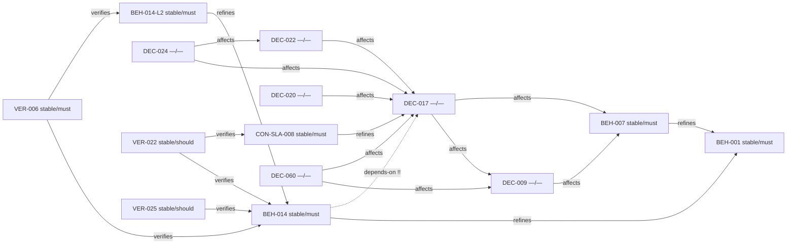


**error** `stable_dep`: BEH-016 (stable/must) -[depends-on]-> DEC-021 (status=(empty), level=—)
  loc: `20-behavior/io-modes.md:67`

### stable_dep #2

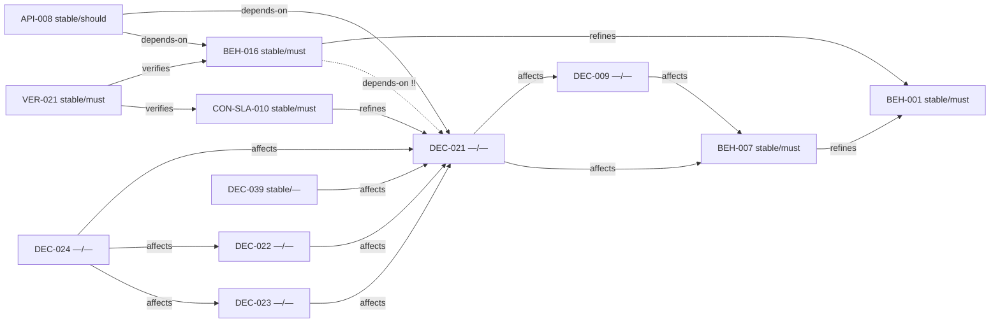


**error** `stable_dep`: BEH-024 (stable/must) -[depends-on]-> DEC-067 (status=(empty), level=—)
  loc: `20-behavior/search.md:156`

### stable_dep #3

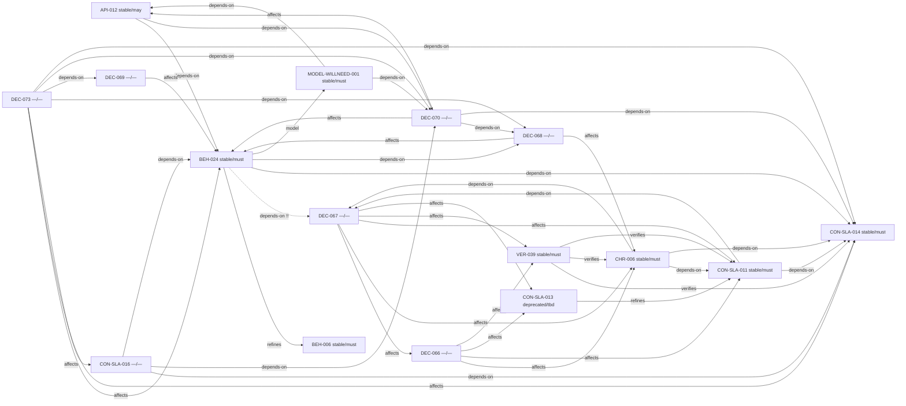


**error** `stable_dep`: BEH-024 (stable/must) -[depends-on]-> DEC-068 (status=(empty), level=—)
  loc: `20-behavior/search.md:156`

### stable_dep #4

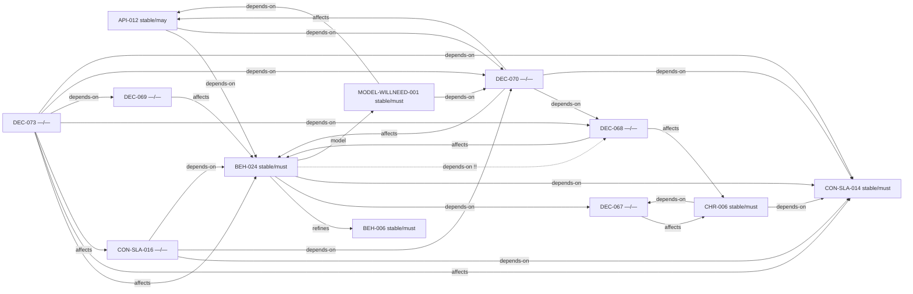


**error** `stable_dep`: CHR-001 (stable/must) -[depends-on]-> DEC-059 (status=(empty), level=—)
  loc: `00-charter/charter.md:3`

### stable_dep #5

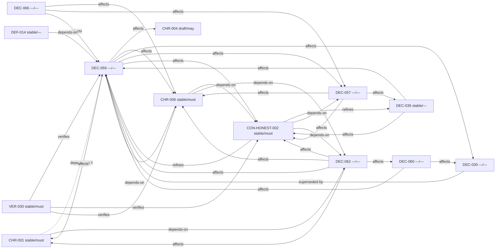


**error** `stable_dep`: CHR-001 (stable/must) -[depends-on]-> DEC-062 (status=(empty), level=—)
  loc: `00-charter/charter.md:3`

### stable_dep #6

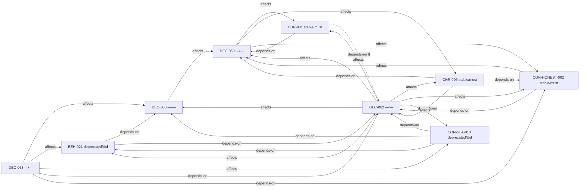


**error** `stable_dep`: CHR-006 (stable/must) -[depends-on]-> DEC-059 (status=(empty), level=—)
  loc: `00-charter/charter.md:56`

### stable_dep #7

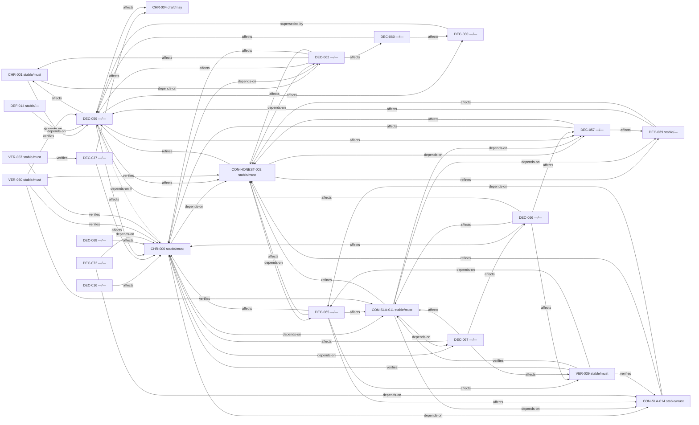


**error** `stable_dep`: CHR-006 (stable/must) -[depends-on]-> DEC-062 (status=(empty), level=—)
  loc: `00-charter/charter.md:56`

### stable_dep #8

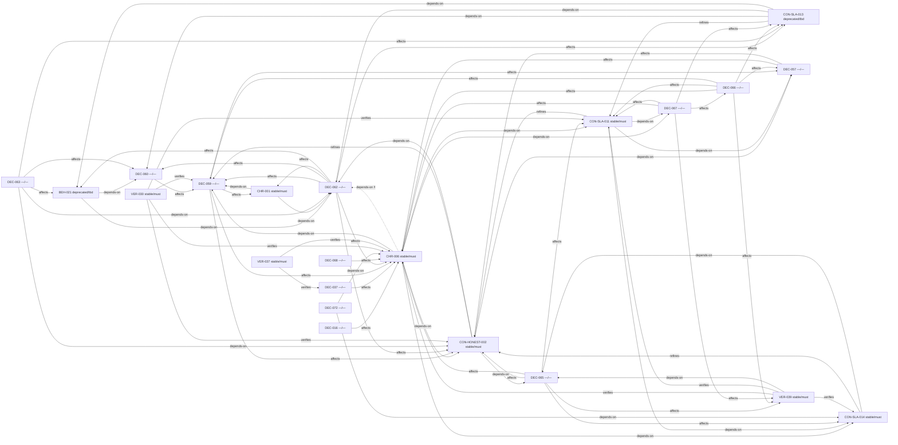


**error** `stable_dep`: CHR-006 (stable/must) -[depends-on]-> DEC-067 (status=(empty), level=—)
  loc: `00-charter/charter.md:56`

### stable_dep #9

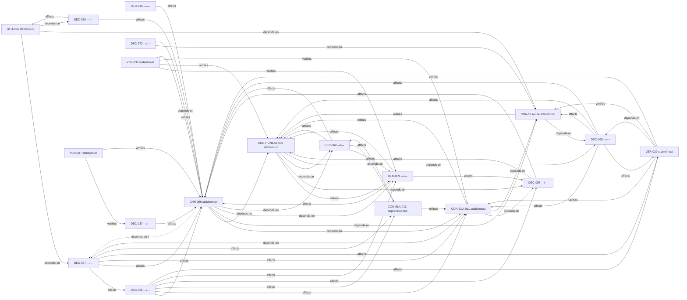


**error** `stable_dep`: CON-HONEST-002 (stable/must) -[refines]-> DEC-059 (status=(empty), level=—)
  loc: `40-constraints/sla.md:49`

### stable_dep #10

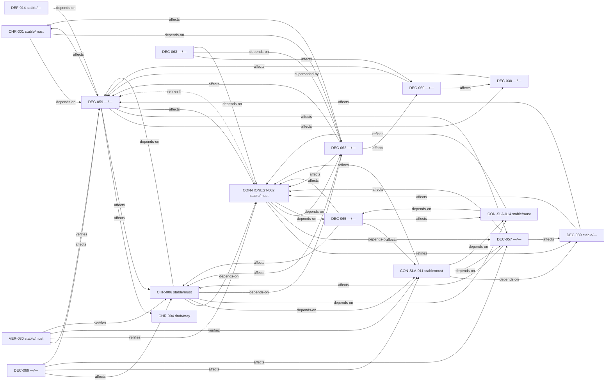


**error** `stable_dep`: CON-HONEST-002 (stable/must) -[depends-on]-> DEC-057 (status=(empty), level=—)
  loc: `40-constraints/sla.md:49`

### stable_dep #11

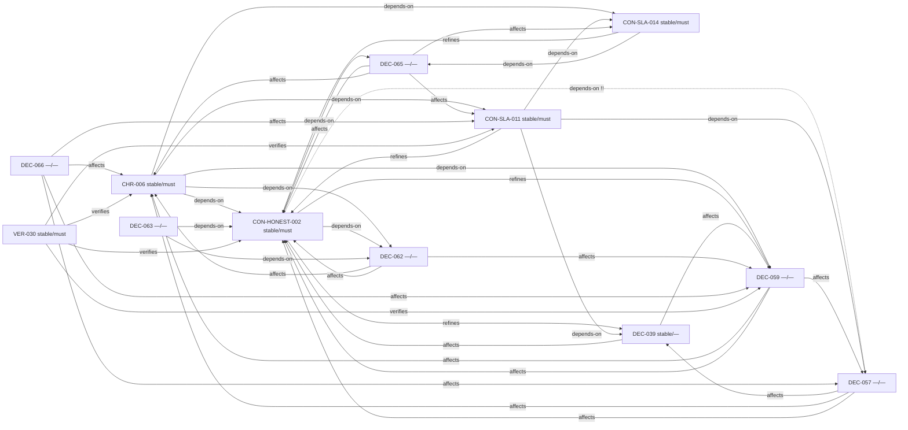


**error** `stable_dep`: CON-HONEST-002 (stable/must) -[depends-on]-> DEC-062 (status=(empty), level=—)
  loc: `40-constraints/sla.md:49`

### stable_dep #12

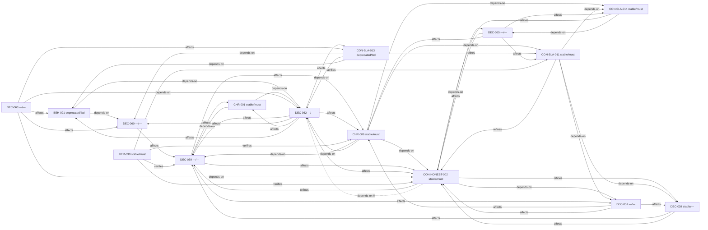


**error** `stable_dep`: CON-HONEST-002 (stable/must) -[depends-on]-> DEC-065 (status=(empty), level=—)
  loc: `40-constraints/sla.md:49`

### stable_dep #13

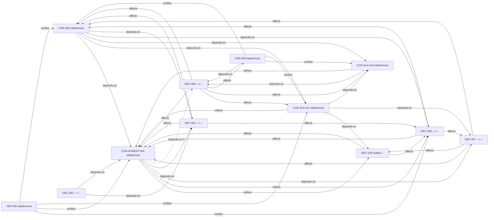


**error** `stable_dep`: CON-SLA-008 (stable/must) -[refines]-> DEC-017 (status=(empty), level=—)
  loc: `40-constraints/sla.md:6`

### stable_dep #14

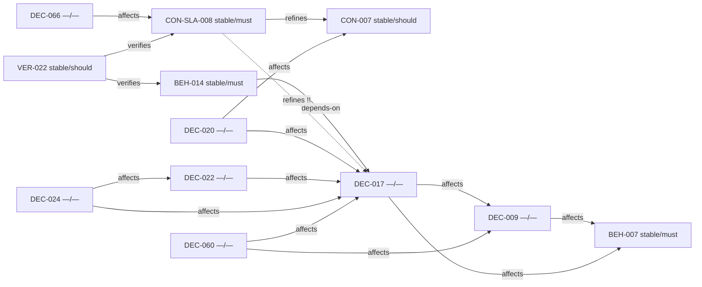


**error** `stable_dep`: CON-SLA-010 (stable/must) -[refines]-> DEC-021 (status=(empty), level=—)
  loc: `40-constraints/sla.md:32`

### stable_dep #15

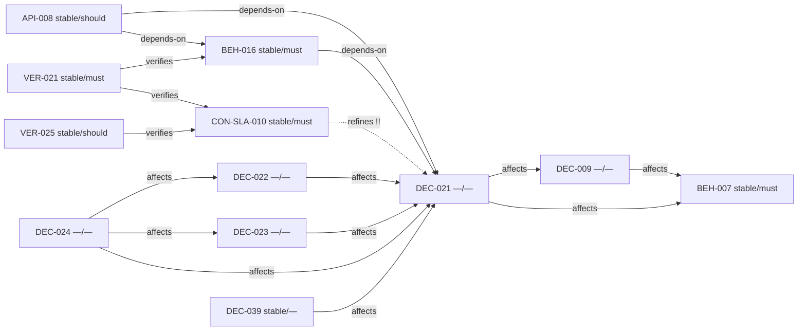


**error** `stable_dep`: CON-SLA-011 (stable/must) -[depends-on]-> DEC-057 (status=(empty), level=—)
  loc: `40-constraints/sla.md:88`

### stable_dep #16

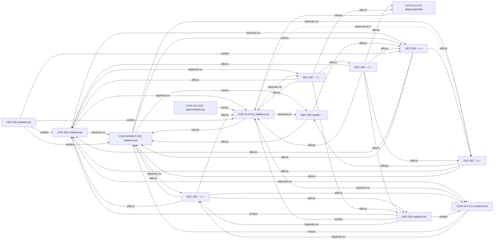


**error** `stable_dep`: CON-SLA-011 (stable/must) -[depends-on]-> DEC-067 (status=(empty), level=—)
  loc: `40-constraints/sla.md:88`

### stable_dep #17

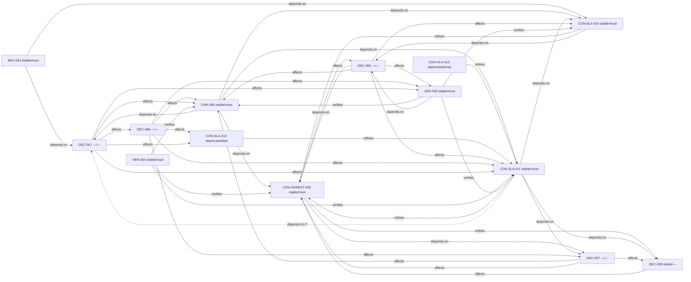


**error** `stable_dep`: CON-SLA-014 (stable/must) -[depends-on]-> DEC-065 (status=(empty), level=—)
  loc: `40-constraints/sla.md:170`

### stable_dep #18

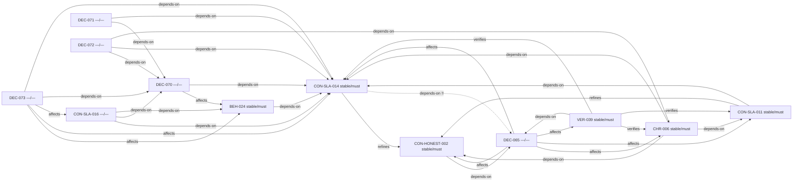


**error** `stable_dep`: MODEL-WILLNEED-001 (stable/must) -[depends-on]-> DEC-070 (status=(empty), level=—)
  loc: `models/willneed-readahead.md:7`

### stable_dep #19

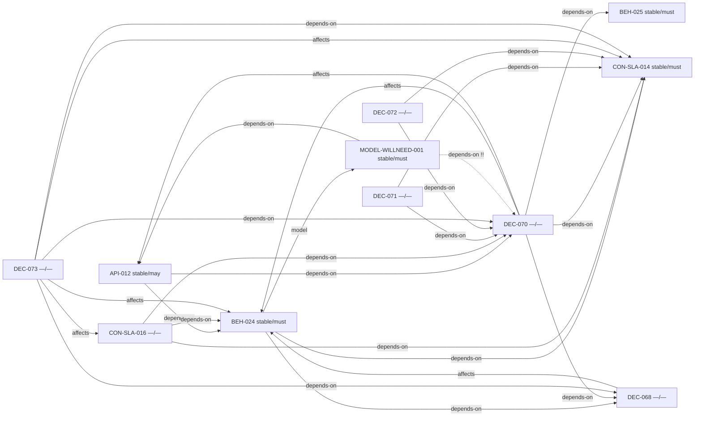


**error** `stable_dep`: VER-030 (stable/must) -[verifies]-> DEC-059 (status=(empty), level=—)
  loc: `50-verification/acceptance.md:214`

### stable_dep #20

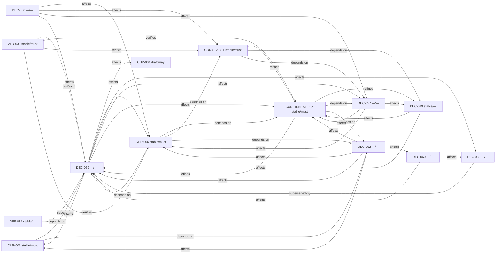


_… +4 more omitted (`--max-issues`)_

## Warnings

**warning** `unlinked`: API-002  30-interfaces/cli.md:64  Data Pipeline CLI
  loc: `30-interfaces/cli.md:64`

### unlinked #1

```mermaid
flowchart LR
  API_002["API-002 stable/must"]
```


**warning** `unlinked`: API-005  30-interfaces/cxx-api.md:5  DiskHNSW Public API
  loc: `30-interfaces/cxx-api.md:5`

### unlinked #2

```mermaid
flowchart LR
  API_005["API-005 stable/must"]
```


**warning** `unlinked`: API-006  30-interfaces/cxx-api.md:32  BlockCache Public API
  loc: `30-interfaces/cxx-api.md:32`

### unlinked #3

```mermaid
flowchart LR
  API_006["API-006 stable/must"]
```


**warning** `unlinked`: API-007  30-interfaces/env.md:5  实验性环境变量 (DEC-017, DEC-019)
  loc: `30-interfaces/env.md:5`

### unlinked #4

```mermaid
flowchart LR
  API_007["API-007 stable/should"]
```


**warning** `unlinked`: CHR-002  00-charter/charter.md:30  Scope
  loc: `00-charter/charter.md:30`

### unlinked #5

```mermaid
flowchart LR
  CHR_002["CHR-002 stable/L0"]
```


**warning** `unlinked`: CHR-003  00-charter/charter.md:40  Non-Goals
  loc: `00-charter/charter.md:40`

### unlinked #6

```mermaid
flowchart LR
  CHR_003["CHR-003 stable/—"]
```


**warning** `unlinked`: CON-001  40-constraints/constants.md:5  文件格式常量
  loc: `40-constraints/constants.md:5`

### unlinked #7

```mermaid
flowchart LR
  CON_001["CON-001 stable/must"]
```


**warning** `unlinked`: CON-003  40-constraints/constants.md:34  搜索参数默认值
  loc: `40-constraints/constants.md:34`

### unlinked #8

```mermaid
flowchart LR
  CON_003["CON-003 stable/should"]
```


**warning** `unlinked`: CON-004  40-constraints/constants.md:49  热度评估阈值
  loc: `40-constraints/constants.md:49`

### unlinked #9

```mermaid
flowchart LR
  CON_004["CON-004 stable/should"]
```


**warning** `unlinked`: DEC-HYGIENE-001  meta/decisions/adr-ndf-hygiene.md:1  ADR: NDF 规范防腐化与双轨 SLA
  loc: `meta/decisions/adr-ndf-hygiene.md:1`

### unlinked #10

```mermaid
flowchart LR
  DEC_HYGIENE_001["DEC-HYGIENE-001 —/—"]
```


**warning** `unlinked`: DEF-001  00-charter/glossary.md:3  DEF: GraphStructure
  loc: `00-charter/glossary.md:3`

### unlinked #11

```mermaid
flowchart LR
  DEF_001["DEF-001 stable/—"]
```


**warning** `unlinked`: DEF-002  00-charter/glossary.md:14  DEF: slim 加载模式
  loc: `00-charter/glossary.md:14`

### unlinked #12

```mermaid
flowchart LR
  DEF_002["DEF-002 stable/—"]
```


**warning** `unlinked`: DEF-004  00-charter/glossary.md:24  DEF: Two-Stage Search
  loc: `00-charter/glossary.md:24`

### unlinked #13

```mermaid
flowchart LR
  DEF_004["DEF-004 stable/—"]
```


**warning** `unlinked`: DEF-005  00-charter/glossary.md:29  DEF: PQ (Product Quantization)
  loc: `00-charter/glossary.md:29`

### unlinked #14

```mermaid
flowchart LR
  DEF_005["DEF-005 stable/—"]
```


**warning** `unlinked`: DEF-007  00-charter/glossary.md:39  DEF: Block/VecBlock
  loc: `00-charter/glossary.md:39`

### unlinked #15

```mermaid
flowchart LR
  DEF_007["DEF-007 stable/—"]
```


**warning** `unlinked`: VER-001  50-verification/acceptance.md:3  测试套件结构
  loc: `50-verification/acceptance.md:3`

### unlinked #16

```mermaid
flowchart LR
  VER_001["VER-001 stable/must"]
```


