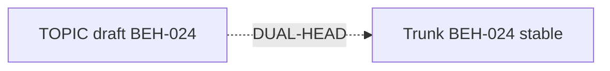
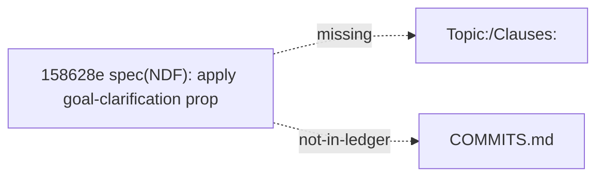
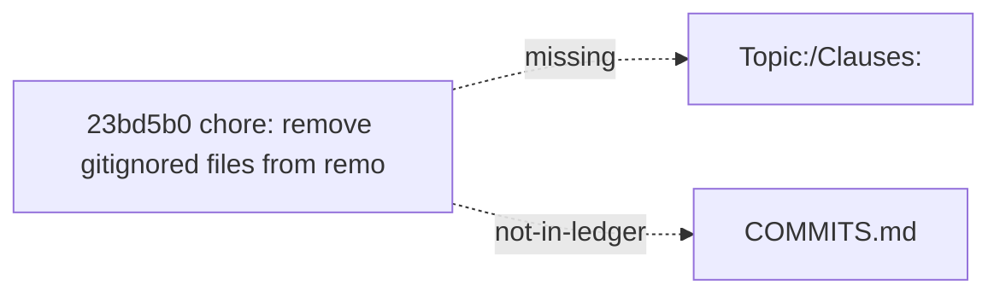
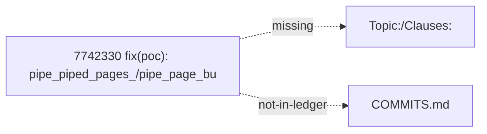
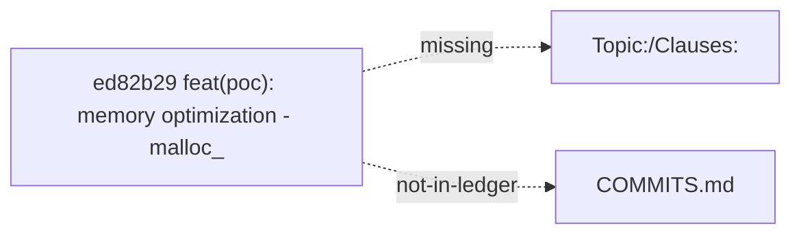
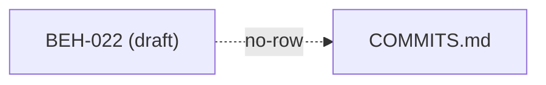
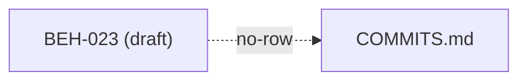

# NDF advise report (bind surface)

> Generated by `spec/meta/tools/ndf_advise.py --surface bind` at 2026-08-04T15:49:19Z

- advised_issues: 8
- low_hanging_fruit: True
- surface: bind (v2)
- sandbox: virtual TOPIC.md + COMMITS.md only (never writes git/SoT)

## Summary by kind

| kind | count |
|------|------:|
| `draft_vs_stable` | 1 |
| `missing_trailer` | 5 |
| `clause_unbound` | 2 |

## Low-hanging fruit (high confidence)

### `dual-001` — draft_vs_stable (l4-cache-mgmt)

**error** `DEF-NDF-BINDER-DUAL-HEAD`: BEH-024: TOPIC still draft registration but Trunk status=stable
  loc: `poc/l4-cache-mgmt/ndf/TOPIC.md ↔ spec/20-behavior/search.md:156`

#### evidence

- TOPIC topic_status: exploring (R5b Selective DONTNEED still POC; R4 flat_vec_cache + R5a WILLNEED promoted to Trunk as BEH-024 stable)
- TOPIC Draft clauses row still registers BEH-024 as draft
- Trunk BEH-024: status=stable file=`spec/20-behavior/search.md` line=156
- Trunk title: L4 Page Cache 主动管理



#### RefactorOptions (best first)

- **`O1`** (high): Update TOPIC draft table: mark BEH-024 as promoted/stable
  - Impact_Delta: topic=l4-cache-mgmt sev=error
  - rationale: Binder dual-head: Trunk already stable; TOPIC must stop claiming draft.
  - patch: `{"op": "update_topic_draft_table", "topic": "l4-cache-mgmt", "note": "status=stable (promoted)", "clause_id": "BEH-024"}`
  - step: Edit poc/l4-cache-mgmt/ndf/TOPIC.md Draft clauses row for BEH-024
  - step: Replace `status=draft` with promoted/stable note or move to Promoted section
  - step: Re-run ndf_bindcheck
  - simulate: `python3 spec/meta/tools/ndf_advise.py simulate --surface bind --issue dual-001 --option O1`

#### AI prompt stub

```
NDF bind-advise dual-001 topic=l4-cache-mgmt: pick O1 unless unsafe. Do not amend git; only edit poc/l4-cache-mgmt/ndf/ after sandbox pass.
```

### `bind-001` — missing_trailer (io-pipelining)

**error** `DEF-NDF-REPRO-BIND-GAP`: code commit 158628e missing trailers: Topic:, Clauses:
  loc: `poc/io-pipelining/Makefile`

#### evidence

- sha: `158628e418396a1c6f24c116a5224e982206277a`
- date: 2026-08-01
- subject: spec(NDF): apply goal-clarification proposal — Buffered as primary optimization target
- missing: Topic:, Clauses:
- in COMMITS.md ledger: no
- files touched:
-   - `poc/io-pipelining/Makefile`
-   - `poc/io-pipelining/NOTES.md`
-   - `poc/io-pipelining/apply_patches.py`
-   - `poc/io-pipelining/benchmark_pipe.cpp`
-   - `poc/io-pipelining/disk_hnsw_pipe.cpp`
-   - `poc/io-pipelining/disk_hnsw_pipe.h`



#### RefactorOptions (best first)

- **`O1`** (high): Append COMMITS.md row documenting 158628e (historical / no rewrite)
  - Impact_Delta: topic=io-pipelining sev=error
  - rationale: Ledger SoT records the gap without rewriting git history.
  - patch: `{"op": "append_ledger_row", "topic": "io-pipelining", "sha": "158628e", "clauses": "(see note)", "protocol": "(n/a)", "note": "historical code commit 158628e; trailers absent; not rewritten"}`
  - step: Append row to poc/io-pipelining/ndf/COMMITS.md
  - step: Prefer --since on future bindcheck to shrink window
  - simulate: `python3 spec/meta/tools/ndf_advise.py simulate --surface bind --issue bind-001 --option O1`
- **`O2`** (high): Ensure COMMITS.md has historical not-backfilled banner
  - Impact_Delta: topic=io-pipelining sev=error
  - rationale: Exempts clause_unbound warnings; documents trailer history debt.
  - patch: `{"op": "add_not_backfilled_banner", "topic": "io-pipelining", "banner": "> Historical commits before binder adoption are not backfilled."}`
  - simulate: `python3 spec/meta/tools/ndf_advise.py simulate --surface bind --issue bind-001 --option O2`

#### AI prompt stub

```
NDF bind-advise bind-001 topic=io-pipelining: pick O1 unless unsafe. Do not amend git; only edit poc/io-pipelining/ndf/ after sandbox pass.
```

### `bind-002` — missing_trailer (io-pipelining)

**error** `DEF-NDF-REPRO-BIND-GAP`: code commit 23bd5b0 missing trailers: Topic:, Clauses:
  loc: `poc/io-pipelining/Makefile`

#### evidence

- sha: `23bd5b0fac9a5cb0495d404e684bea9a16861f57`
- date: 2026-08-04
- subject: chore: remove gitignored files from remote tracking
- missing: Topic:, Clauses:
- in COMMITS.md ledger: no
- files touched:
-   - `poc/io-pipelining/Makefile`
-   - `poc/io-pipelining/NOTES.md`
-   - `poc/io-pipelining/apply_patches.py`
-   - `poc/io-pipelining/benchmark_pipe.cpp`
-   - `poc/io-pipelining/disk_hnsw_pipe.cpp`
-   - `poc/io-pipelining/disk_hnsw_pipe.h`



#### RefactorOptions (best first)

- **`O1`** (high): Append COMMITS.md row documenting 23bd5b0 (historical / no rewrite)
  - Impact_Delta: topic=io-pipelining sev=error
  - rationale: Ledger SoT records the gap without rewriting git history.
  - patch: `{"op": "append_ledger_row", "topic": "io-pipelining", "sha": "23bd5b0", "clauses": "(see note)", "protocol": "(n/a)", "note": "historical code commit 23bd5b0; trailers absent; not rewritten"}`
  - step: Append row to poc/io-pipelining/ndf/COMMITS.md
  - step: Prefer --since on future bindcheck to shrink window
  - simulate: `python3 spec/meta/tools/ndf_advise.py simulate --surface bind --issue bind-002 --option O1`
- **`O2`** (high): Ensure COMMITS.md has historical not-backfilled banner
  - Impact_Delta: topic=io-pipelining sev=error
  - rationale: Exempts clause_unbound warnings; documents trailer history debt.
  - patch: `{"op": "add_not_backfilled_banner", "topic": "io-pipelining", "banner": "> Historical commits before binder adoption are not backfilled."}`
  - simulate: `python3 spec/meta/tools/ndf_advise.py simulate --surface bind --issue bind-002 --option O2`

#### AI prompt stub

```
NDF bind-advise bind-002 topic=io-pipelining: pick O1 unless unsafe. Do not amend git; only edit poc/io-pipelining/ndf/ after sandbox pass.
```

### `bind-003` — missing_trailer (io-pipelining)

**error** `DEF-NDF-REPRO-BIND-GAP`: code commit 7742330 missing trailers: Topic:, Clauses:
  loc: `poc/io-pipelining/disk_hnsw_pipe.cpp`

#### evidence

- sha: `7742330ea959bb8098b0ed671541226cc577741d`
- date: 2026-08-02
- subject: fix(poc): pipe_piped_pages_/pipe_page_bufidx_ -> thread_local (DEC-063 4T bug)
- missing: Topic:, Clauses:
- in COMMITS.md ledger: no
- files touched:
-   - `poc/io-pipelining/disk_hnsw_pipe.cpp`
-   - `poc/io-pipelining/disk_hnsw_pipe.h`



#### RefactorOptions (best first)

- **`O1`** (high): Append COMMITS.md row documenting 7742330 (historical / no rewrite)
  - Impact_Delta: topic=io-pipelining sev=error
  - rationale: Ledger SoT records the gap without rewriting git history.
  - patch: `{"op": "append_ledger_row", "topic": "io-pipelining", "sha": "7742330", "clauses": "(see note)", "protocol": "(n/a)", "note": "historical code commit 7742330; trailers absent; not rewritten"}`
  - step: Append row to poc/io-pipelining/ndf/COMMITS.md
  - step: Prefer --since on future bindcheck to shrink window
  - simulate: `python3 spec/meta/tools/ndf_advise.py simulate --surface bind --issue bind-003 --option O1`
- **`O2`** (high): Ensure COMMITS.md has historical not-backfilled banner
  - Impact_Delta: topic=io-pipelining sev=error
  - rationale: Exempts clause_unbound warnings; documents trailer history debt.
  - patch: `{"op": "add_not_backfilled_banner", "topic": "io-pipelining", "banner": "> Historical commits before binder adoption are not backfilled."}`
  - simulate: `python3 spec/meta/tools/ndf_advise.py simulate --surface bind --issue bind-003 --option O2`

#### AI prompt stub

```
NDF bind-advise bind-003 topic=io-pipelining: pick O1 unless unsafe. Do not amend git; only edit poc/io-pipelining/ndf/ after sandbox pass.
```

### `bind-004` — missing_trailer (io-pipelining)

**error** `DEF-NDF-REPRO-BIND-GAP`: code commit ed82b29 missing trailers: Topic:, Clauses:
  loc: `poc/io-pipelining/disk_hnsw_pipe.cpp`

#### evidence

- sha: `ed82b298e59e18c457742ac65639ebe3d1ef394f`
- date: 2026-08-02
- subject: feat(poc): memory optimization - malloc_trim + VisitedList uint8 + streaming adjacency0 free
- missing: Topic:, Clauses:
- in COMMITS.md ledger: no
- files touched:
-   - `poc/io-pipelining/disk_hnsw_pipe.cpp`
-   - `poc/io-pipelining/disk_hnsw_pipe.h`



#### RefactorOptions (best first)

- **`O1`** (high): Append COMMITS.md row documenting ed82b29 (historical / no rewrite)
  - Impact_Delta: topic=io-pipelining sev=error
  - rationale: Ledger SoT records the gap without rewriting git history.
  - patch: `{"op": "append_ledger_row", "topic": "io-pipelining", "sha": "ed82b29", "clauses": "(see note)", "protocol": "(n/a)", "note": "historical code commit ed82b29; trailers absent; not rewritten"}`
  - step: Append row to poc/io-pipelining/ndf/COMMITS.md
  - step: Prefer --since on future bindcheck to shrink window
  - simulate: `python3 spec/meta/tools/ndf_advise.py simulate --surface bind --issue bind-004 --option O1`
- **`O2`** (high): Ensure COMMITS.md has historical not-backfilled banner
  - Impact_Delta: topic=io-pipelining sev=error
  - rationale: Exempts clause_unbound warnings; documents trailer history debt.
  - patch: `{"op": "add_not_backfilled_banner", "topic": "io-pipelining", "banner": "> Historical commits before binder adoption are not backfilled."}`
  - simulate: `python3 spec/meta/tools/ndf_advise.py simulate --surface bind --issue bind-004 --option O2`

#### AI prompt stub

```
NDF bind-advise bind-004 topic=io-pipelining: pick O1 unless unsafe. Do not amend git; only edit poc/io-pipelining/ndf/ after sandbox pass.
```

### `bind-005` — missing_trailer (l4-cache-mgmt)

**error** `DEF-NDF-REPRO-BIND-GAP`: code commit 23bd5b0 missing trailers: Topic:, Clauses:
  loc: `poc/l4-cache-mgmt/Makefile`

#### evidence

- sha: `23bd5b0fac9a5cb0495d404e684bea9a16861f57`
- date: 2026-08-04
- subject: chore: remove gitignored files from remote tracking
- missing: Topic:, Clauses:
- in COMMITS.md ledger: no
- files touched:
-   - `poc/l4-cache-mgmt/Makefile`
-   - `poc/l4-cache-mgmt/NOTES.md`
-   - `poc/l4-cache-mgmt/apply_patches.py`
-   - `poc/l4-cache-mgmt/benchmark_l4.cpp`
-   - `poc/l4-cache-mgmt/block_cache.cpp`
-   - `poc/l4-cache-mgmt/disk_hnsw_l4.cpp`


#### RefactorOptions (best first)

- **`O1`** (high): Append COMMITS.md row documenting 23bd5b0 (historical / no rewrite)
  - Impact_Delta: topic=l4-cache-mgmt sev=error
  - rationale: Ledger SoT records the gap without rewriting git history.
  - patch: `{"op": "append_ledger_row", "topic": "l4-cache-mgmt", "sha": "23bd5b0", "clauses": "(see note)", "protocol": "(n/a)", "note": "historical code commit 23bd5b0; trailers absent; not rewritten"}`
  - step: Append row to poc/l4-cache-mgmt/ndf/COMMITS.md
  - step: Prefer --since on future bindcheck to shrink window
  - simulate: `python3 spec/meta/tools/ndf_advise.py simulate --surface bind --issue bind-005 --option O1`
- **`O2`** (high): Ensure COMMITS.md has historical not-backfilled banner
  - Impact_Delta: topic=l4-cache-mgmt sev=error
  - rationale: Exempts clause_unbound warnings; documents trailer history debt.
  - patch: `{"op": "add_not_backfilled_banner", "topic": "l4-cache-mgmt", "banner": "> Historical commits before binder adoption are not backfilled."}`
  - simulate: `python3 spec/meta/tools/ndf_advise.py simulate --surface bind --issue bind-005 --option O2`

#### AI prompt stub

```
NDF bind-advise bind-005 topic=l4-cache-mgmt: pick O1 unless unsafe. Do not amend git; only edit poc/l4-cache-mgmt/ndf/ after sandbox pass.
```

### `bind-006` — clause_unbound (io-pipelining)

**warning** `DEF-NDF-REPRO-BIND-GAP`: draft clause BEH-022 never appears in ledger clauses column
  loc: `poc/io-pipelining/ndf/TOPIC.md`

#### evidence

- TOPIC draft_clauses includes BEH-022
- TOPIC has promote-related notes
- no COMMITS.md row lists BEH-022 under clauses
- ledger header has no “not backfilled” exemption



#### RefactorOptions (best first)

- **`O1`** (high): Append ledger row binding BEH-022
  - Impact_Delta: topic=io-pipelining sev=warning
  - rationale: Promote notes exist but clauses column never listed the ID.
  - patch: `{"op": "append_ledger_row", "topic": "io-pipelining", "sha": "-", "clauses": "BEH-022", "protocol": "(fill)", "note": "backfill bind for BEH-022"}`
  - simulate: `python3 spec/meta/tools/ndf_advise.py simulate --surface bind --issue bind-006 --option O1`

#### AI prompt stub

```
NDF bind-advise bind-006 topic=io-pipelining: pick O1 unless unsafe. Do not amend git; only edit poc/io-pipelining/ndf/ after sandbox pass.
```

### `bind-007` — clause_unbound (io-pipelining)

**warning** `DEF-NDF-REPRO-BIND-GAP`: draft clause BEH-023 never appears in ledger clauses column
  loc: `poc/io-pipelining/ndf/TOPIC.md`

#### evidence

- TOPIC draft_clauses includes BEH-023
- TOPIC has promote-related notes
- no COMMITS.md row lists BEH-023 under clauses
- ledger header has no “not backfilled” exemption



#### RefactorOptions (best first)

- **`O1`** (high): Append ledger row binding BEH-023
  - Impact_Delta: topic=io-pipelining sev=warning
  - rationale: Promote notes exist but clauses column never listed the ID.
  - patch: `{"op": "append_ledger_row", "topic": "io-pipelining", "sha": "-", "clauses": "BEH-023", "protocol": "(fill)", "note": "backfill bind for BEH-023"}`
  - simulate: `python3 spec/meta/tools/ndf_advise.py simulate --surface bind --issue bind-007 --option O1`

#### AI prompt stub

```
NDF bind-advise bind-007 topic=io-pipelining: pick O1 unless unsafe. Do not amend git; only edit poc/io-pipelining/ndf/ after sandbox pass.
```

## Next

1. `simulate --surface bind` on chosen option.
2. If pass, manually edit TOPIC/COMMITS (never auto).
3. Re-run `ndf_bindcheck`.
