# NDF advise report (bind surface)

> Generated by `spec/meta/tools/ndf_advise.py --surface bind` at 2026-08-06T17:17:21Z

- advised_issues: 25
- low_hanging_fruit: True
- surface: bind (v2)
- sandbox: virtual TOPIC.md + COMMITS.md only (never writes git/SoT)

## Summary by kind

| kind | count |
|------|------:|
| `draft_vs_stable` | 3 |
| `missing_trailer` | 18 |
| `clause_unbound` | 4 |

## Low-hanging fruit (high confidence)

### `dual-001` — draft_vs_stable (cgroup-v1-support)

**error** `DEF-NDF-BINDER-DUAL-HEAD`: API-016: TOPIC still draft registration but Trunk status=stable
  loc: `poc/cgroup-v1-support/ndf/TOPIC.md ↔ spec/30-interfaces/cli.md:142`

#### evidence

- TOPIC topic_status: promoted
- TOPIC Draft clauses row still registers API-016 as draft
- Trunk API-016: status=stable file=`spec/30-interfaces/cli.md` line=142
- Trunk title: cgroup 测试脚本接口

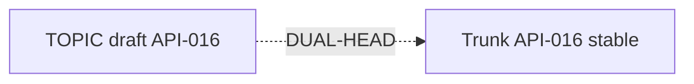

#### RefactorOptions (best first)

- **`O1`** (high): Update TOPIC draft table: mark API-016 as promoted/stable
  - Impact_Delta: topic=cgroup-v1-support sev=error
  - rationale: Binder dual-head: Trunk already stable; TOPIC must stop claiming draft.
  - patch: `{"op": "update_topic_draft_table", "topic": "cgroup-v1-support", "note": "status=stable (promoted)", "clause_id": "API-016"}`
  - step: Edit poc/cgroup-v1-support/ndf/TOPIC.md Draft clauses row for API-016
  - step: Replace `status=draft` with promoted/stable note or move to Promoted section
  - step: Re-run ndf_bindcheck
  - simulate: `python3 spec/meta/tools/ndf_advise.py simulate --surface bind --issue dual-001 --option O1`

#### AI prompt stub

```
NDF bind-advise dual-001 topic=cgroup-v1-support: pick O1 unless unsafe. Do not amend git; only edit poc/cgroup-v1-support/ndf/ after sandbox pass.
```

### `dual-002` — draft_vs_stable (cgroup-v1-support)

**error** `DEF-NDF-BINDER-DUAL-HEAD`: BEH-032: TOPIC still draft registration but Trunk status=stable
  loc: `poc/cgroup-v1-support/ndf/TOPIC.md ↔ spec/20-behavior/test-infra.md:5`

#### evidence

- TOPIC topic_status: promoted
- TOPIC Draft clauses row still registers BEH-032 as draft
- Trunk BEH-032: status=stable file=`spec/20-behavior/test-infra.md` line=5
- Trunk title: cgroup v1/v2 自动检测与严格隔离

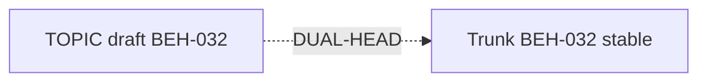

#### RefactorOptions (best first)

- **`O1`** (high): Update TOPIC draft table: mark BEH-032 as promoted/stable
  - Impact_Delta: topic=cgroup-v1-support sev=error
  - rationale: Binder dual-head: Trunk already stable; TOPIC must stop claiming draft.
  - patch: `{"op": "update_topic_draft_table", "topic": "cgroup-v1-support", "note": "status=stable (promoted)", "clause_id": "BEH-032"}`
  - step: Edit poc/cgroup-v1-support/ndf/TOPIC.md Draft clauses row for BEH-032
  - step: Replace `status=draft` with promoted/stable note or move to Promoted section
  - step: Re-run ndf_bindcheck
  - simulate: `python3 spec/meta/tools/ndf_advise.py simulate --surface bind --issue dual-002 --option O1`

#### AI prompt stub

```
NDF bind-advise dual-002 topic=cgroup-v1-support: pick O1 unless unsafe. Do not amend git; only edit poc/cgroup-v1-support/ndf/ after sandbox pass.
```

### `dual-003` — draft_vs_stable (l4-cache-mgmt)

**error** `DEF-NDF-BINDER-DUAL-HEAD`: BEH-024: TOPIC still draft registration but Trunk status=stable
  loc: `poc/l4-cache-mgmt/ndf/TOPIC.md ↔ spec/20-behavior/search.md:156`

#### evidence

- TOPIC topic_status: closed (all directions explored; R4 FVC + R5a WILLNEED + R2 D2 BG-merge promoted to Trunk; R5c confirms Pareto frontier)
- TOPIC Draft clauses row still registers BEH-024 as draft
- Trunk BEH-024: status=stable file=`spec/20-behavior/search.md` line=156
- Trunk title: L4 Page Cache 主动管理

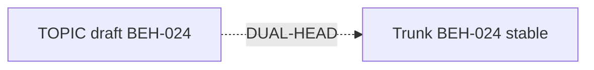

#### RefactorOptions (best first)

- **`O1`** (high): Update TOPIC draft table: mark BEH-024 as promoted/stable
  - Impact_Delta: topic=l4-cache-mgmt sev=error
  - rationale: Binder dual-head: Trunk already stable; TOPIC must stop claiming draft.
  - patch: `{"op": "update_topic_draft_table", "topic": "l4-cache-mgmt", "note": "status=stable (promoted)", "clause_id": "BEH-024"}`
  - step: Edit poc/l4-cache-mgmt/ndf/TOPIC.md Draft clauses row for BEH-024
  - step: Replace `status=draft` with promoted/stable note or move to Promoted section
  - step: Re-run ndf_bindcheck
  - simulate: `python3 spec/meta/tools/ndf_advise.py simulate --surface bind --issue dual-003 --option O1`

#### AI prompt stub

```
NDF bind-advise dual-003 topic=l4-cache-mgmt: pick O1 unless unsafe. Do not amend git; only edit poc/l4-cache-mgmt/ndf/ after sandbox pass.
```

### `bind-001` — missing_trailer (io-pipelining)

**error** `DEF-NDF-REPRO-BIND-GAP`: code commit 158628e missing trailers: Topic:, Clauses:
  loc: `poc/io-pipelining/Makefile`

#### evidence

- sha: `158628e418396a1c6f24c116a5224e982206277a`
- date: 2026-08-01
- subject: spec(NDF): apply goal-clarification proposal — Buffered as primary optimization target
- missing: Topic:, Clauses:
- in COMMITS.md ledger: no
- files touched:
-   - `poc/io-pipelining/Makefile`
-   - `poc/io-pipelining/NOTES.md`
-   - `poc/io-pipelining/apply_patches.py`
-   - `poc/io-pipelining/benchmark_pipe.cpp`
-   - `poc/io-pipelining/disk_hnsw_pipe.cpp`
-   - `poc/io-pipelining/disk_hnsw_pipe.h`

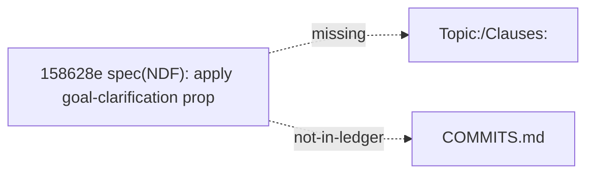

#### RefactorOptions (best first)

- **`O1`** (high): Append COMMITS.md row documenting 158628e (historical / no rewrite)
  - Impact_Delta: topic=io-pipelining sev=error
  - rationale: Ledger SoT records the gap without rewriting git history.
  - patch: `{"op": "append_ledger_row", "topic": "io-pipelining", "sha": "158628e", "clauses": "(see note)", "protocol": "(n/a)", "note": "historical code commit 158628e; trailers absent; not rewritten"}`
  - step: Append row to poc/io-pipelining/ndf/COMMITS.md
  - step: Prefer --since on future bindcheck to shrink window
  - simulate: `python3 spec/meta/tools/ndf_advise.py simulate --surface bind --issue bind-001 --option O1`
- **`O2`** (high): Ensure COMMITS.md has historical not-backfilled banner
  - Impact_Delta: topic=io-pipelining sev=error
  - rationale: Exempts clause_unbound warnings; documents trailer history debt.
  - patch: `{"op": "add_not_backfilled_banner", "topic": "io-pipelining", "banner": "> Historical commits before binder adoption are not backfilled."}`
  - simulate: `python3 spec/meta/tools/ndf_advise.py simulate --surface bind --issue bind-001 --option O2`

#### AI prompt stub

```
NDF bind-advise bind-001 topic=io-pipelining: pick O1 unless unsafe. Do not amend git; only edit poc/io-pipelining/ndf/ after sandbox pass.
```

### `bind-002` — missing_trailer (io-pipelining)

**error** `DEF-NDF-REPRO-BIND-GAP`: code commit 23bd5b0 missing trailers: Topic:, Clauses:
  loc: `poc/io-pipelining/Makefile`

#### evidence

- sha: `23bd5b0fac9a5cb0495d404e684bea9a16861f57`
- date: 2026-08-04
- subject: chore: remove gitignored files from remote tracking
- missing: Topic:, Clauses:
- in COMMITS.md ledger: no
- files touched:
-   - `poc/io-pipelining/Makefile`
-   - `poc/io-pipelining/NOTES.md`
-   - `poc/io-pipelining/apply_patches.py`
-   - `poc/io-pipelining/benchmark_pipe.cpp`
-   - `poc/io-pipelining/disk_hnsw_pipe.cpp`
-   - `poc/io-pipelining/disk_hnsw_pipe.h`

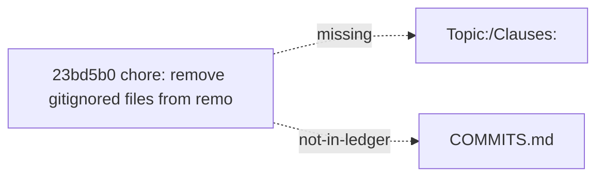

#### RefactorOptions (best first)

- **`O1`** (high): Append COMMITS.md row documenting 23bd5b0 (historical / no rewrite)
  - Impact_Delta: topic=io-pipelining sev=error
  - rationale: Ledger SoT records the gap without rewriting git history.
  - patch: `{"op": "append_ledger_row", "topic": "io-pipelining", "sha": "23bd5b0", "clauses": "(see note)", "protocol": "(n/a)", "note": "historical code commit 23bd5b0; trailers absent; not rewritten"}`
  - step: Append row to poc/io-pipelining/ndf/COMMITS.md
  - step: Prefer --since on future bindcheck to shrink window
  - simulate: `python3 spec/meta/tools/ndf_advise.py simulate --surface bind --issue bind-002 --option O1`
- **`O2`** (high): Ensure COMMITS.md has historical not-backfilled banner
  - Impact_Delta: topic=io-pipelining sev=error
  - rationale: Exempts clause_unbound warnings; documents trailer history debt.
  - patch: `{"op": "add_not_backfilled_banner", "topic": "io-pipelining", "banner": "> Historical commits before binder adoption are not backfilled."}`
  - simulate: `python3 spec/meta/tools/ndf_advise.py simulate --surface bind --issue bind-002 --option O2`

#### AI prompt stub

```
NDF bind-advise bind-002 topic=io-pipelining: pick O1 unless unsafe. Do not amend git; only edit poc/io-pipelining/ndf/ after sandbox pass.
```

### `bind-003` — missing_trailer (io-pipelining)

**error** `DEF-NDF-REPRO-BIND-GAP`: code commit 7742330 missing trailers: Topic:, Clauses:
  loc: `poc/io-pipelining/disk_hnsw_pipe.cpp`

#### evidence

- sha: `7742330ea959bb8098b0ed671541226cc577741d`
- date: 2026-08-02
- subject: fix(poc): pipe_piped_pages_/pipe_page_bufidx_ -> thread_local (DEC-063 4T bug)
- missing: Topic:, Clauses:
- in COMMITS.md ledger: no
- files touched:
-   - `poc/io-pipelining/disk_hnsw_pipe.cpp`
-   - `poc/io-pipelining/disk_hnsw_pipe.h`

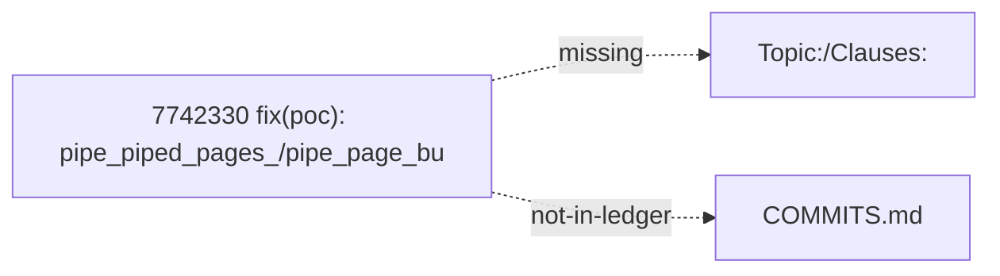

#### RefactorOptions (best first)

- **`O1`** (high): Append COMMITS.md row documenting 7742330 (historical / no rewrite)
  - Impact_Delta: topic=io-pipelining sev=error
  - rationale: Ledger SoT records the gap without rewriting git history.
  - patch: `{"op": "append_ledger_row", "topic": "io-pipelining", "sha": "7742330", "clauses": "(see note)", "protocol": "(n/a)", "note": "historical code commit 7742330; trailers absent; not rewritten"}`
  - step: Append row to poc/io-pipelining/ndf/COMMITS.md
  - step: Prefer --since on future bindcheck to shrink window
  - simulate: `python3 spec/meta/tools/ndf_advise.py simulate --surface bind --issue bind-003 --option O1`
- **`O2`** (high): Ensure COMMITS.md has historical not-backfilled banner
  - Impact_Delta: topic=io-pipelining sev=error
  - rationale: Exempts clause_unbound warnings; documents trailer history debt.
  - patch: `{"op": "add_not_backfilled_banner", "topic": "io-pipelining", "banner": "> Historical commits before binder adoption are not backfilled."}`
  - simulate: `python3 spec/meta/tools/ndf_advise.py simulate --surface bind --issue bind-003 --option O2`

#### AI prompt stub

```
NDF bind-advise bind-003 topic=io-pipelining: pick O1 unless unsafe. Do not amend git; only edit poc/io-pipelining/ndf/ after sandbox pass.
```

### `bind-004` — missing_trailer (io-pipelining)

**error** `DEF-NDF-REPRO-BIND-GAP`: code commit ed82b29 missing trailers: Topic:, Clauses:
  loc: `poc/io-pipelining/disk_hnsw_pipe.cpp`

#### evidence

- sha: `ed82b298e59e18c457742ac65639ebe3d1ef394f`
- date: 2026-08-02
- subject: feat(poc): memory optimization - malloc_trim + VisitedList uint8 + streaming adjacency0 free
- missing: Topic:, Clauses:
- in COMMITS.md ledger: no
- files touched:
-   - `poc/io-pipelining/disk_hnsw_pipe.cpp`
-   - `poc/io-pipelining/disk_hnsw_pipe.h`

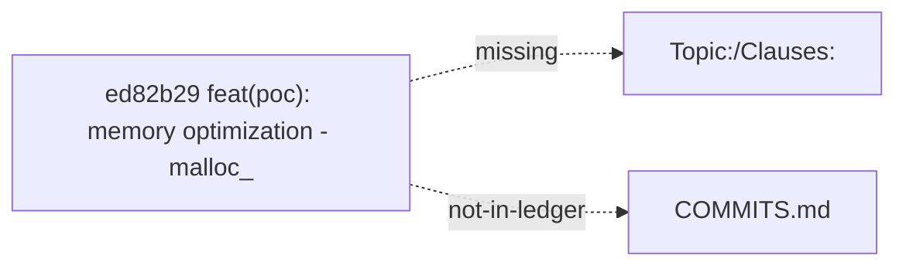

#### RefactorOptions (best first)

- **`O1`** (high): Append COMMITS.md row documenting ed82b29 (historical / no rewrite)
  - Impact_Delta: topic=io-pipelining sev=error
  - rationale: Ledger SoT records the gap without rewriting git history.
  - patch: `{"op": "append_ledger_row", "topic": "io-pipelining", "sha": "ed82b29", "clauses": "(see note)", "protocol": "(n/a)", "note": "historical code commit ed82b29; trailers absent; not rewritten"}`
  - step: Append row to poc/io-pipelining/ndf/COMMITS.md
  - step: Prefer --since on future bindcheck to shrink window
  - simulate: `python3 spec/meta/tools/ndf_advise.py simulate --surface bind --issue bind-004 --option O1`
- **`O2`** (high): Ensure COMMITS.md has historical not-backfilled banner
  - Impact_Delta: topic=io-pipelining sev=error
  - rationale: Exempts clause_unbound warnings; documents trailer history debt.
  - patch: `{"op": "add_not_backfilled_banner", "topic": "io-pipelining", "banner": "> Historical commits before binder adoption are not backfilled."}`
  - simulate: `python3 spec/meta/tools/ndf_advise.py simulate --surface bind --issue bind-004 --option O2`

#### AI prompt stub

```
NDF bind-advise bind-004 topic=io-pipelining: pick O1 unless unsafe. Do not amend git; only edit poc/io-pipelining/ndf/ after sandbox pass.
```

### `bind-005` — missing_trailer (l4-cache-mgmt)

**error** `DEF-NDF-REPRO-BIND-GAP`: code commit 23bd5b0 missing trailers: Topic:, Clauses:
  loc: `poc/l4-cache-mgmt/Makefile`

#### evidence

- sha: `23bd5b0fac9a5cb0495d404e684bea9a16861f57`
- date: 2026-08-04
- subject: chore: remove gitignored files from remote tracking
- missing: Topic:, Clauses:
- in COMMITS.md ledger: no
- files touched:
-   - `poc/l4-cache-mgmt/Makefile`
-   - `poc/l4-cache-mgmt/NOTES.md`
-   - `poc/l4-cache-mgmt/apply_patches.py`
-   - `poc/l4-cache-mgmt/benchmark_l4.cpp`
-   - `poc/l4-cache-mgmt/block_cache.cpp`
-   - `poc/l4-cache-mgmt/disk_hnsw_l4.cpp`


#### RefactorOptions (best first)

- **`O1`** (high): Append COMMITS.md row documenting 23bd5b0 (historical / no rewrite)
  - Impact_Delta: topic=l4-cache-mgmt sev=error
  - rationale: Ledger SoT records the gap without rewriting git history.
  - patch: `{"op": "append_ledger_row", "topic": "l4-cache-mgmt", "sha": "23bd5b0", "clauses": "(see note)", "protocol": "(n/a)", "note": "historical code commit 23bd5b0; trailers absent; not rewritten"}`
  - step: Append row to poc/l4-cache-mgmt/ndf/COMMITS.md
  - step: Prefer --since on future bindcheck to shrink window
  - simulate: `python3 spec/meta/tools/ndf_advise.py simulate --surface bind --issue bind-005 --option O1`
- **`O2`** (high): Ensure COMMITS.md has historical not-backfilled banner
  - Impact_Delta: topic=l4-cache-mgmt sev=error
  - rationale: Exempts clause_unbound warnings; documents trailer history debt.
  - patch: `{"op": "add_not_backfilled_banner", "topic": "l4-cache-mgmt", "banner": "> Historical commits before binder adoption are not backfilled."}`
  - simulate: `python3 spec/meta/tools/ndf_advise.py simulate --surface bind --issue bind-005 --option O2`

#### AI prompt stub

```
NDF bind-advise bind-005 topic=l4-cache-mgmt: pick O1 unless unsafe. Do not amend git; only edit poc/l4-cache-mgmt/ndf/ after sandbox pass.
```

### `bind-006` — missing_trailer (l4-cache-mgmt)

**error** `DEF-NDF-REPRO-BIND-GAP`: code commit 571a531 missing trailers: Clauses:
  loc: `poc/l4-cache-mgmt/build/benchmark_l4`

#### evidence

- sha: `571a531b2ae2408a48986871dcc19649257103a4`
- date: 2026-08-06
- subject: poc(l4-cache-mgmt): D6 readahead window + D5 perf + D9 DEEP10M skipped
- missing: Clauses:
- in COMMITS.md ledger: no
- files touched:
-   - `poc/l4-cache-mgmt/build/benchmark_l4`
-   - `poc/l4-cache-mgmt/disk_hnsw_l4.cpp`
-   - `poc/l4-cache-mgmt/ndf/evidence/d6-d9-20260805.md`

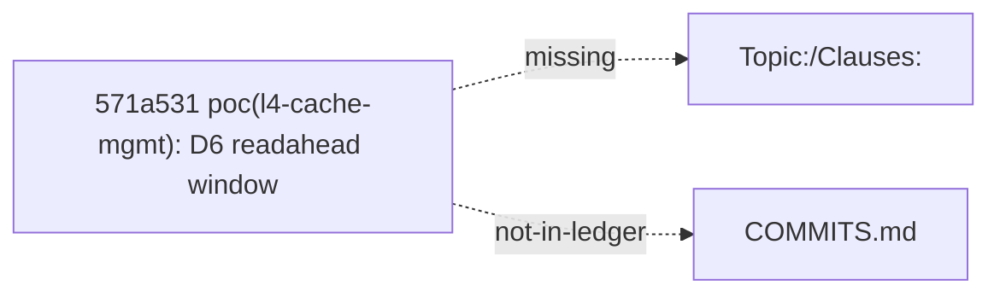

#### RefactorOptions (best first)

- **`O1`** (high): Append COMMITS.md row documenting 571a531 (historical / no rewrite)
  - Impact_Delta: topic=l4-cache-mgmt sev=error
  - rationale: Ledger SoT records the gap without rewriting git history.
  - patch: `{"op": "append_ledger_row", "topic": "l4-cache-mgmt", "sha": "571a531", "clauses": "(see note)", "protocol": "(n/a)", "note": "historical code commit 571a531; trailers absent; not rewritten"}`
  - step: Append row to poc/l4-cache-mgmt/ndf/COMMITS.md
  - step: Prefer --since on future bindcheck to shrink window
  - simulate: `python3 spec/meta/tools/ndf_advise.py simulate --surface bind --issue bind-006 --option O1`
- **`O2`** (high): Ensure COMMITS.md has historical not-backfilled banner
  - Impact_Delta: topic=l4-cache-mgmt sev=error
  - rationale: Exempts clause_unbound warnings; documents trailer history debt.
  - patch: `{"op": "add_not_backfilled_banner", "topic": "l4-cache-mgmt", "banner": "> Historical commits before binder adoption are not backfilled."}`
  - simulate: `python3 spec/meta/tools/ndf_advise.py simulate --surface bind --issue bind-006 --option O2`

#### AI prompt stub

```
NDF bind-advise bind-006 topic=l4-cache-mgmt: pick O1 unless unsafe. Do not amend git; only edit poc/l4-cache-mgmt/ndf/ after sandbox pass.
```

### `bind-007` — missing_trailer (l4-cache-mgmt)

**error** `DEF-NDF-REPRO-BIND-GAP`: code commit 7110c40 missing trailers: Clauses:
  loc: `poc/l4-cache-mgmt/build/benchmark_l4`

#### evidence

- sha: `7110c40d49fd4de40a069ad005a53020aaf71fcf`
- date: 2026-08-06
- subject: poc(l4-cache-mgmt): D2 BG merge + D3 DONTNEED + D4 CACHE_MB
- missing: Clauses:
- in COMMITS.md ledger: no
- files touched:
-   - `poc/l4-cache-mgmt/build/benchmark_l4`
-   - `poc/l4-cache-mgmt/disk_hnsw_l4.cpp`
-   - `poc/l4-cache-mgmt/ndf/evidence/d2-bg-page-merge-20260805.md`
-   - `poc/l4-cache-mgmt/ndf/evidence/d2-d3-d4-20260805.md`

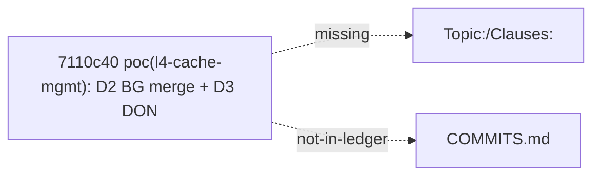

#### RefactorOptions (best first)

- **`O1`** (high): Append COMMITS.md row documenting 7110c40 (historical / no rewrite)
  - Impact_Delta: topic=l4-cache-mgmt sev=error
  - rationale: Ledger SoT records the gap without rewriting git history.
  - patch: `{"op": "append_ledger_row", "topic": "l4-cache-mgmt", "sha": "7110c40", "clauses": "(see note)", "protocol": "(n/a)", "note": "historical code commit 7110c40; trailers absent; not rewritten"}`
  - step: Append row to poc/l4-cache-mgmt/ndf/COMMITS.md
  - step: Prefer --since on future bindcheck to shrink window
  - simulate: `python3 spec/meta/tools/ndf_advise.py simulate --surface bind --issue bind-007 --option O1`
- **`O2`** (high): Ensure COMMITS.md has historical not-backfilled banner
  - Impact_Delta: topic=l4-cache-mgmt sev=error
  - rationale: Exempts clause_unbound warnings; documents trailer history debt.
  - patch: `{"op": "add_not_backfilled_banner", "topic": "l4-cache-mgmt", "banner": "> Historical commits before binder adoption are not backfilled."}`
  - simulate: `python3 spec/meta/tools/ndf_advise.py simulate --surface bind --issue bind-007 --option O2`

#### AI prompt stub

```
NDF bind-advise bind-007 topic=l4-cache-mgmt: pick O1 unless unsafe. Do not amend git; only edit poc/l4-cache-mgmt/ndf/ after sandbox pass.
```

### `bind-008` — missing_trailer (l4-cache-mgmt)

**error** `DEF-NDF-REPRO-BIND-GAP`: code commit 892355c missing trailers: Topic:, Clauses:
  loc: `poc/l4-cache-mgmt/benchmark_l4.cpp`

#### evidence

- sha: `892355ce8dcdce2386e573aaf58989c76f63ea5a`
- date: 2026-08-06
- subject: poc(l4-cache-mgmt): R5c mincore diagnostic + close POC
- missing: Topic:, Clauses:
- in COMMITS.md ledger: no
- files touched:
-   - `poc/l4-cache-mgmt/benchmark_l4.cpp`
-   - `poc/l4-cache-mgmt/build/benchmark_l4`
-   - `poc/l4-cache-mgmt/ndf/TOPIC.md`
-   - `poc/l4-cache-mgmt/run_r5c.sh`
-   - `poc/l4-cache-mgmt/run_r5c_512.sh`


#### RefactorOptions (best first)

- **`O1`** (high): Append COMMITS.md row documenting 892355c (historical / no rewrite)
  - Impact_Delta: topic=l4-cache-mgmt sev=error
  - rationale: Ledger SoT records the gap without rewriting git history.
  - patch: `{"op": "append_ledger_row", "topic": "l4-cache-mgmt", "sha": "892355c", "clauses": "(see note)", "protocol": "(n/a)", "note": "historical code commit 892355c; trailers absent; not rewritten"}`
  - step: Append row to poc/l4-cache-mgmt/ndf/COMMITS.md
  - step: Prefer --since on future bindcheck to shrink window
  - simulate: `python3 spec/meta/tools/ndf_advise.py simulate --surface bind --issue bind-008 --option O1`
- **`O2`** (high): Ensure COMMITS.md has historical not-backfilled banner
  - Impact_Delta: topic=l4-cache-mgmt sev=error
  - rationale: Exempts clause_unbound warnings; documents trailer history debt.
  - patch: `{"op": "add_not_backfilled_banner", "topic": "l4-cache-mgmt", "banner": "> Historical commits before binder adoption are not backfilled."}`
  - simulate: `python3 spec/meta/tools/ndf_advise.py simulate --surface bind --issue bind-008 --option O2`

#### AI prompt stub

```
NDF bind-advise bind-008 topic=l4-cache-mgmt: pick O1 unless unsafe. Do not amend git; only edit poc/l4-cache-mgmt/ndf/ after sandbox pass.
```

### `bind-009` — missing_trailer (l4-cache-mgmt)

**error** `DEF-NDF-REPRO-BIND-GAP`: code commit d808533 missing trailers: Clauses:
  loc: `poc/l4-cache-mgmt/Makefile`

#### evidence

- sha: `d808533aa5e77c2a81f59bdead8f7c4e525f6179`
- date: 2026-08-06
- subject: poc(l4-cache-mgmt): D1 FVC hit rate diagnosis - 45-49% ceiling
- missing: Clauses:
- in COMMITS.md ledger: no
- files touched:
-   - `poc/l4-cache-mgmt/Makefile`
-   - `poc/l4-cache-mgmt/NOTES.md`
-   - `poc/l4-cache-mgmt/apply_patches.py`
-   - `poc/l4-cache-mgmt/benchmark_l4.cpp`
-   - `poc/l4-cache-mgmt/block_cache.cpp`
-   - `poc/l4-cache-mgmt/build/benchmark_l4`

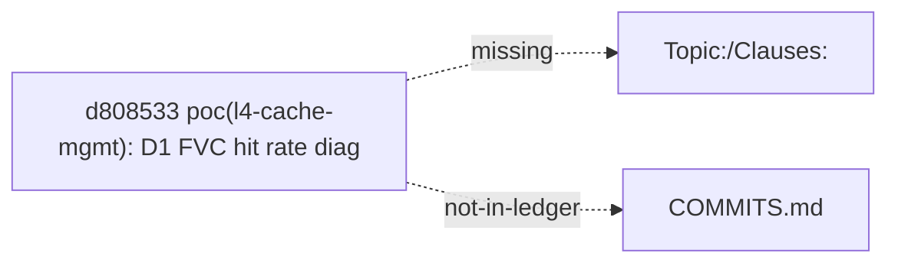

#### RefactorOptions (best first)

- **`O1`** (high): Append COMMITS.md row documenting d808533 (historical / no rewrite)
  - Impact_Delta: topic=l4-cache-mgmt sev=error
  - rationale: Ledger SoT records the gap without rewriting git history.
  - patch: `{"op": "append_ledger_row", "topic": "l4-cache-mgmt", "sha": "d808533", "clauses": "(see note)", "protocol": "(n/a)", "note": "historical code commit d808533; trailers absent; not rewritten"}`
  - step: Append row to poc/l4-cache-mgmt/ndf/COMMITS.md
  - step: Prefer --since on future bindcheck to shrink window
  - simulate: `python3 spec/meta/tools/ndf_advise.py simulate --surface bind --issue bind-009 --option O1`
- **`O2`** (high): Ensure COMMITS.md has historical not-backfilled banner
  - Impact_Delta: topic=l4-cache-mgmt sev=error
  - rationale: Exempts clause_unbound warnings; documents trailer history debt.
  - patch: `{"op": "add_not_backfilled_banner", "topic": "l4-cache-mgmt", "banner": "> Historical commits before binder adoption are not backfilled."}`
  - simulate: `python3 spec/meta/tools/ndf_advise.py simulate --surface bind --issue bind-009 --option O2`

#### AI prompt stub

```
NDF bind-advise bind-009 topic=l4-cache-mgmt: pick O1 unless unsafe. Do not amend git; only edit poc/l4-cache-mgmt/ndf/ after sandbox pass.
```

### `bind-010` — missing_trailer (l4-cache-mgmt)

**error** `DEF-NDF-REPRO-BIND-GAP`: code commit efe6ca8 missing trailers: Topic:, Clauses:
  loc: `poc/l4-cache-mgmt/Makefile`

#### evidence

- sha: `efe6ca879335162ed6aaa56d4af7043879ba24d9`
- date: 2026-08-06
- subject: docs: refresh README + detailed-design v2.0; clean gitignored files from remote
- missing: Topic:, Clauses:
- in COMMITS.md ledger: no
- files touched:
-   - `poc/l4-cache-mgmt/Makefile`
-   - `poc/l4-cache-mgmt/NOTES.md`
-   - `poc/l4-cache-mgmt/apply_patches.py`
-   - `poc/l4-cache-mgmt/benchmark_l4.cpp`
-   - `poc/l4-cache-mgmt/block_cache.cpp`
-   - `poc/l4-cache-mgmt/build/benchmark_l4`

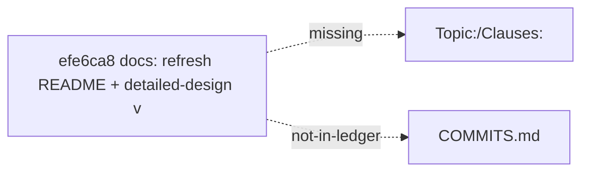

#### RefactorOptions (best first)

- **`O1`** (high): Append COMMITS.md row documenting efe6ca8 (historical / no rewrite)
  - Impact_Delta: topic=l4-cache-mgmt sev=error
  - rationale: Ledger SoT records the gap without rewriting git history.
  - patch: `{"op": "append_ledger_row", "topic": "l4-cache-mgmt", "sha": "efe6ca8", "clauses": "(see note)", "protocol": "(n/a)", "note": "historical code commit efe6ca8; trailers absent; not rewritten"}`
  - step: Append row to poc/l4-cache-mgmt/ndf/COMMITS.md
  - step: Prefer --since on future bindcheck to shrink window
  - simulate: `python3 spec/meta/tools/ndf_advise.py simulate --surface bind --issue bind-010 --option O1`
- **`O2`** (high): Ensure COMMITS.md has historical not-backfilled banner
  - Impact_Delta: topic=l4-cache-mgmt sev=error
  - rationale: Exempts clause_unbound warnings; documents trailer history debt.
  - patch: `{"op": "add_not_backfilled_banner", "topic": "l4-cache-mgmt", "banner": "> Historical commits before binder adoption are not backfilled."}`
  - simulate: `python3 spec/meta/tools/ndf_advise.py simulate --surface bind --issue bind-010 --option O2`

#### AI prompt stub

```
NDF bind-advise bind-010 topic=l4-cache-mgmt: pick O1 unless unsafe. Do not amend git; only edit poc/l4-cache-mgmt/ndf/ after sandbox pass.
```

### `bind-011` — missing_trailer (multi-thread-scaling)

**error** `DEF-NDF-REPRO-BIND-GAP`: code commit 5b03634 missing trailers: Clauses:
  loc: `poc/multi-thread-scaling/build/benchmark_diskhnsw_mt`

#### evidence

- sha: `5b036343a2fe8ac6900e81bb27ac8cd6ec24a7b3`
- date: 2026-08-05
- subject: poc(multi-thread-scaling): Dir C VisitedList pool - +45% at 16T, +13% at 24T
- missing: Clauses:
- in COMMITS.md ledger: no
- files touched:
-   - `poc/multi-thread-scaling/build/benchmark_diskhnsw_mt`
-   - `poc/multi-thread-scaling/disk_hnsw_mt.cpp`
-   - `poc/multi-thread-scaling/ndf/evidence/dirC-visitedlist-pool-20260805.md`

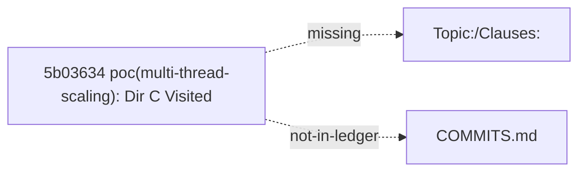

#### RefactorOptions (best first)

- **`O1`** (high): Append COMMITS.md row documenting 5b03634 (historical / no rewrite)
  - Impact_Delta: topic=multi-thread-scaling sev=error
  - rationale: Ledger SoT records the gap without rewriting git history.
  - patch: `{"op": "append_ledger_row", "topic": "multi-thread-scaling", "sha": "5b03634", "clauses": "(see note)", "protocol": "(n/a)", "note": "historical code commit 5b03634; trailers absent; not rewritten"}`
  - step: Append row to poc/multi-thread-scaling/ndf/COMMITS.md
  - step: Prefer --since on future bindcheck to shrink window
  - simulate: `python3 spec/meta/tools/ndf_advise.py simulate --surface bind --issue bind-011 --option O1`
- **`O2`** (high): Ensure COMMITS.md has historical not-backfilled banner
  - Impact_Delta: topic=multi-thread-scaling sev=error
  - rationale: Exempts clause_unbound warnings; documents trailer history debt.
  - patch: `{"op": "add_not_backfilled_banner", "topic": "multi-thread-scaling", "banner": "> Historical commits before binder adoption are not backfilled."}`
  - simulate: `python3 spec/meta/tools/ndf_advise.py simulate --surface bind --issue bind-011 --option O2`

#### AI prompt stub

```
NDF bind-advise bind-011 topic=multi-thread-scaling: pick O1 unless unsafe. Do not amend git; only edit poc/multi-thread-scaling/ndf/ after sandbox pass.
```

### `bind-012` — missing_trailer (multi-thread-scaling)

**error** `DEF-NDF-REPRO-BIND-GAP`: code commit 62b0c9c missing trailers: Clauses:
  loc: `poc/multi-thread-scaling/build/benchmark_diskhnsw_mt`

#### evidence

- sha: `62b0c9c19978346478f3c9d76e91a9d2577e06c4`
- date: 2026-08-05
- subject: poc(multi-thread-scaling): Dir B WILLNEED adaptive disable - narrow 12T gain only
- missing: Clauses:
- in COMMITS.md ledger: no
- files touched:
-   - `poc/multi-thread-scaling/build/benchmark_diskhnsw_mt`
-   - `poc/multi-thread-scaling/disk_hnsw_mt.cpp`
-   - `poc/multi-thread-scaling/ndf/evidence/dirB-willneed-disable-20260805.md`
-   - `poc/multi-thread-scaling/run_dirB_willneed.sh`

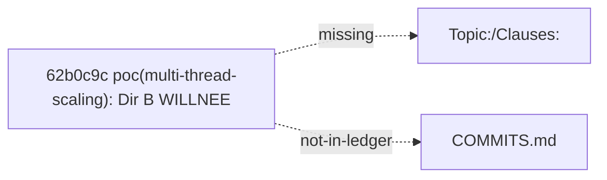

#### RefactorOptions (best first)

- **`O1`** (high): Append COMMITS.md row documenting 62b0c9c (historical / no rewrite)
  - Impact_Delta: topic=multi-thread-scaling sev=error
  - rationale: Ledger SoT records the gap without rewriting git history.
  - patch: `{"op": "append_ledger_row", "topic": "multi-thread-scaling", "sha": "62b0c9c", "clauses": "(see note)", "protocol": "(n/a)", "note": "historical code commit 62b0c9c; trailers absent; not rewritten"}`
  - step: Append row to poc/multi-thread-scaling/ndf/COMMITS.md
  - step: Prefer --since on future bindcheck to shrink window
  - simulate: `python3 spec/meta/tools/ndf_advise.py simulate --surface bind --issue bind-012 --option O1`
- **`O2`** (high): Ensure COMMITS.md has historical not-backfilled banner
  - Impact_Delta: topic=multi-thread-scaling sev=error
  - rationale: Exempts clause_unbound warnings; documents trailer history debt.
  - patch: `{"op": "add_not_backfilled_banner", "topic": "multi-thread-scaling", "banner": "> Historical commits before binder adoption are not backfilled."}`
  - simulate: `python3 spec/meta/tools/ndf_advise.py simulate --surface bind --issue bind-012 --option O2`

#### AI prompt stub

```
NDF bind-advise bind-012 topic=multi-thread-scaling: pick O1 unless unsafe. Do not amend git; only edit poc/multi-thread-scaling/ndf/ after sandbox pass.
```

### `bind-013` — missing_trailer (multi-thread-scaling)

**error** `DEF-NDF-REPRO-BIND-GAP`: code commit 750f9bd missing trailers: Clauses:
  loc: `poc/multi-thread-scaling/build/benchmark_diskhnsw_mt`

#### evidence

- sha: `750f9bdd6ce0ba8185a473ab2b68af11e718a917`
- date: 2026-08-05
- subject: poc(multi-thread-scaling): A2 lockless BG thread - +72.8% at 16T! New peak 29304
- missing: Clauses:
- in COMMITS.md ledger: no
- files touched:
-   - `poc/multi-thread-scaling/build/benchmark_diskhnsw_mt`
-   - `poc/multi-thread-scaling/disk_hnsw_mt.cpp`
-   - `poc/multi-thread-scaling/ndf/evidence/a2-lockless-bg-20260805.md`

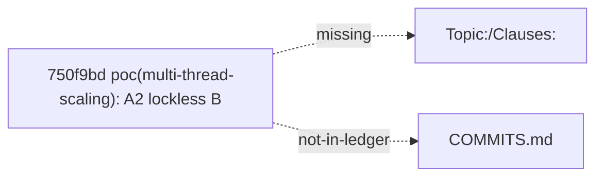

#### RefactorOptions (best first)

- **`O1`** (high): Append COMMITS.md row documenting 750f9bd (historical / no rewrite)
  - Impact_Delta: topic=multi-thread-scaling sev=error
  - rationale: Ledger SoT records the gap without rewriting git history.
  - patch: `{"op": "append_ledger_row", "topic": "multi-thread-scaling", "sha": "750f9bd", "clauses": "(see note)", "protocol": "(n/a)", "note": "historical code commit 750f9bd; trailers absent; not rewritten"}`
  - step: Append row to poc/multi-thread-scaling/ndf/COMMITS.md
  - step: Prefer --since on future bindcheck to shrink window
  - simulate: `python3 spec/meta/tools/ndf_advise.py simulate --surface bind --issue bind-013 --option O1`
- **`O2`** (high): Ensure COMMITS.md has historical not-backfilled banner
  - Impact_Delta: topic=multi-thread-scaling sev=error
  - rationale: Exempts clause_unbound warnings; documents trailer history debt.
  - patch: `{"op": "add_not_backfilled_banner", "topic": "multi-thread-scaling", "banner": "> Historical commits before binder adoption are not backfilled."}`
  - simulate: `python3 spec/meta/tools/ndf_advise.py simulate --surface bind --issue bind-013 --option O2`

#### AI prompt stub

```
NDF bind-advise bind-013 topic=multi-thread-scaling: pick O1 unless unsafe. Do not amend git; only edit poc/multi-thread-scaling/ndf/ after sandbox pass.
```

### `bind-014` — missing_trailer (multi-thread-scaling)

**error** `DEF-NDF-REPRO-BIND-GAP`: code commit 9bfe551 missing trailers: Clauses:
  loc: `poc/multi-thread-scaling/build/benchmark_diskhnsw_mt`

#### evidence

- sha: `9bfe55183da1ee25078602ef9d292f94bad6a528`
- date: 2026-08-05
- subject: poc(multi-thread-scaling): Dir A WILLNEED background thread - 256MB +14%, 512MB mixed
- missing: Clauses:
- in COMMITS.md ledger: no
- files touched:
-   - `poc/multi-thread-scaling/build/benchmark_diskhnsw_mt`
-   - `poc/multi-thread-scaling/disk_hnsw_mt.cpp`
-   - `poc/multi-thread-scaling/ndf/evidence/dirA-willneed-bg-20260805.md`


#### RefactorOptions (best first)

- **`O1`** (high): Append COMMITS.md row documenting 9bfe551 (historical / no rewrite)
  - Impact_Delta: topic=multi-thread-scaling sev=error
  - rationale: Ledger SoT records the gap without rewriting git history.
  - patch: `{"op": "append_ledger_row", "topic": "multi-thread-scaling", "sha": "9bfe551", "clauses": "(see note)", "protocol": "(n/a)", "note": "historical code commit 9bfe551; trailers absent; not rewritten"}`
  - step: Append row to poc/multi-thread-scaling/ndf/COMMITS.md
  - step: Prefer --since on future bindcheck to shrink window
  - simulate: `python3 spec/meta/tools/ndf_advise.py simulate --surface bind --issue bind-014 --option O1`
- **`O2`** (high): Ensure COMMITS.md has historical not-backfilled banner
  - Impact_Delta: topic=multi-thread-scaling sev=error
  - rationale: Exempts clause_unbound warnings; documents trailer history debt.
  - patch: `{"op": "add_not_backfilled_banner", "topic": "multi-thread-scaling", "banner": "> Historical commits before binder adoption are not backfilled."}`
  - simulate: `python3 spec/meta/tools/ndf_advise.py simulate --surface bind --issue bind-014 --option O2`

#### AI prompt stub

```
NDF bind-advise bind-014 topic=multi-thread-scaling: pick O1 unless unsafe. Do not amend git; only edit poc/multi-thread-scaling/ndf/ after sandbox pass.
```

### `bind-015` — missing_trailer (multi-thread-scaling)

**error** `DEF-NDF-REPRO-BIND-GAP`: code commit da2d8cb missing trailers: Clauses:
  loc: `poc/multi-thread-scaling/ndf/evidence/comprehensive-sweep-20260805.md`

#### evidence

- sha: `da2d8cbfad05d90261cb4e4a6315cddb21d24e52`
- date: 2026-08-05
- subject: poc(multi-thread-scaling): comprehensive sweep 1-24T x 3 configs vs hnswlib
- missing: Clauses:
- in COMMITS.md ledger: no
- files touched:
-   - `poc/multi-thread-scaling/ndf/evidence/comprehensive-sweep-20260805.md`
-   - `poc/multi-thread-scaling/results_comprehensive.txt`
-   - `poc/multi-thread-scaling/run_comprehensive.sh`


#### RefactorOptions (best first)

- **`O1`** (high): Append COMMITS.md row documenting da2d8cb (historical / no rewrite)
  - Impact_Delta: topic=multi-thread-scaling sev=error
  - rationale: Ledger SoT records the gap without rewriting git history.
  - patch: `{"op": "append_ledger_row", "topic": "multi-thread-scaling", "sha": "da2d8cb", "clauses": "(see note)", "protocol": "(n/a)", "note": "historical code commit da2d8cb; trailers absent; not rewritten"}`
  - step: Append row to poc/multi-thread-scaling/ndf/COMMITS.md
  - step: Prefer --since on future bindcheck to shrink window
  - simulate: `python3 spec/meta/tools/ndf_advise.py simulate --surface bind --issue bind-015 --option O1`
- **`O2`** (high): Ensure COMMITS.md has historical not-backfilled banner
  - Impact_Delta: topic=multi-thread-scaling sev=error
  - rationale: Exempts clause_unbound warnings; documents trailer history debt.
  - patch: `{"op": "add_not_backfilled_banner", "topic": "multi-thread-scaling", "banner": "> Historical commits before binder adoption are not backfilled."}`
  - simulate: `python3 spec/meta/tools/ndf_advise.py simulate --surface bind --issue bind-015 --option O2`

#### AI prompt stub

```
NDF bind-advise bind-015 topic=multi-thread-scaling: pick O1 unless unsafe. Do not amend git; only edit poc/multi-thread-scaling/ndf/ after sandbox pass.
```

### `bind-016` — missing_trailer (multi-thread-scaling)

**error** `DEF-NDF-REPRO-BIND-GAP`: code commit e5a1155 missing trailers: Clauses:
  loc: `poc/multi-thread-scaling/build/benchmark_diskhnsw_mt`

#### evidence

- sha: `e5a1155e7cd3f342603a44e0f8a9c94576d72180`
- date: 2026-08-05
- subject: poc(multi-thread-scaling): C2 adaptive VL_POOL + A3 page merge
- missing: Clauses:
- in COMMITS.md ledger: no
- files touched:
-   - `poc/multi-thread-scaling/build/benchmark_diskhnsw_mt`
-   - `poc/multi-thread-scaling/disk_hnsw_mt.cpp`
-   - `poc/multi-thread-scaling/ndf/evidence/c2-a3-adaptive-merge-20260805.md`


#### RefactorOptions (best first)

- **`O1`** (high): Append COMMITS.md row documenting e5a1155 (historical / no rewrite)
  - Impact_Delta: topic=multi-thread-scaling sev=error
  - rationale: Ledger SoT records the gap without rewriting git history.
  - patch: `{"op": "append_ledger_row", "topic": "multi-thread-scaling", "sha": "e5a1155", "clauses": "(see note)", "protocol": "(n/a)", "note": "historical code commit e5a1155; trailers absent; not rewritten"}`
  - step: Append row to poc/multi-thread-scaling/ndf/COMMITS.md
  - step: Prefer --since on future bindcheck to shrink window
  - simulate: `python3 spec/meta/tools/ndf_advise.py simulate --surface bind --issue bind-016 --option O1`
- **`O2`** (high): Ensure COMMITS.md has historical not-backfilled banner
  - Impact_Delta: topic=multi-thread-scaling sev=error
  - rationale: Exempts clause_unbound warnings; documents trailer history debt.
  - patch: `{"op": "add_not_backfilled_banner", "topic": "multi-thread-scaling", "banner": "> Historical commits before binder adoption are not backfilled."}`
  - simulate: `python3 spec/meta/tools/ndf_advise.py simulate --surface bind --issue bind-016 --option O2`

#### AI prompt stub

```
NDF bind-advise bind-016 topic=multi-thread-scaling: pick O1 unless unsafe. Do not amend git; only edit poc/multi-thread-scaling/ndf/ after sandbox pass.
```

### `bind-017` — missing_trailer (multi-thread-scaling)

**error** `DEF-NDF-REPRO-BIND-GAP`: code commit efe6ca8 missing trailers: Topic:, Clauses:
  loc: `poc/multi-thread-scaling/Makefile`

#### evidence

- sha: `efe6ca879335162ed6aaa56d4af7043879ba24d9`
- date: 2026-08-06
- subject: docs: refresh README + detailed-design v2.0; clean gitignored files from remote
- missing: Topic:, Clauses:
- in COMMITS.md ledger: no
- files touched:
-   - `poc/multi-thread-scaling/Makefile`
-   - `poc/multi-thread-scaling/benchmark_diskhnsw_mt.cpp`
-   - `poc/multi-thread-scaling/benchmark_hnswlib_native_mt.cpp`
-   - `poc/multi-thread-scaling/build/benchmark_diskhnsw_mt`
-   - `poc/multi-thread-scaling/build/benchmark_hnswlib_native_mt`
-   - `poc/multi-thread-scaling/disk_hnsw_mt.cpp`


#### RefactorOptions (best first)

- **`O1`** (high): Append COMMITS.md row documenting efe6ca8 (historical / no rewrite)
  - Impact_Delta: topic=multi-thread-scaling sev=error
  - rationale: Ledger SoT records the gap without rewriting git history.
  - patch: `{"op": "append_ledger_row", "topic": "multi-thread-scaling", "sha": "efe6ca8", "clauses": "(see note)", "protocol": "(n/a)", "note": "historical code commit efe6ca8; trailers absent; not rewritten"}`
  - step: Append row to poc/multi-thread-scaling/ndf/COMMITS.md
  - step: Prefer --since on future bindcheck to shrink window
  - simulate: `python3 spec/meta/tools/ndf_advise.py simulate --surface bind --issue bind-017 --option O1`
- **`O2`** (high): Ensure COMMITS.md has historical not-backfilled banner
  - Impact_Delta: topic=multi-thread-scaling sev=error
  - rationale: Exempts clause_unbound warnings; documents trailer history debt.
  - patch: `{"op": "add_not_backfilled_banner", "topic": "multi-thread-scaling", "banner": "> Historical commits before binder adoption are not backfilled."}`
  - simulate: `python3 spec/meta/tools/ndf_advise.py simulate --surface bind --issue bind-017 --option O2`

#### AI prompt stub

```
NDF bind-advise bind-017 topic=multi-thread-scaling: pick O1 unless unsafe. Do not amend git; only edit poc/multi-thread-scaling/ndf/ after sandbox pass.
```

### `bind-018` — missing_trailer (perf-gap-4t)

**error** `DEF-NDF-REPRO-BIND-GAP`: code commit efe6ca8 missing trailers: Topic:, Clauses:
  loc: `poc/perf-gap-4t/Makefile`

#### evidence

- sha: `efe6ca879335162ed6aaa56d4af7043879ba24d9`
- date: 2026-08-06
- subject: docs: refresh README + detailed-design v2.0; clean gitignored files from remote
- missing: Topic:, Clauses:
- in COMMITS.md ledger: no
- files touched:
-   - `poc/perf-gap-4t/Makefile`
-   - `poc/perf-gap-4t/benchmark_poc.cpp`
-   - `poc/perf-gap-4t/build/benchmark_poc`
-   - `poc/perf-gap-4t/disk_hnsw_poc.cpp`
-   - `poc/perf-gap-4t/disk_hnsw_poc.h`
-   - `poc/perf-gap-4t/ndf/COMMITS.md`

```mermaid
flowchart LR
  efe6ca8["efe6ca8 docs: refresh README + detailed-design v"]
  TRAILER["Topic:/Clauses:"]
  LEDGER["COMMITS.md"]
  efe6ca8 -.->|missing|TRAILER
  efe6ca8 -.->|not-in-ledger|LEDGER
```

#### RefactorOptions (best first)

- **`O1`** (high): Append COMMITS.md row documenting efe6ca8 (historical / no rewrite)
  - Impact_Delta: topic=perf-gap-4t sev=error
  - rationale: Ledger SoT records the gap without rewriting git history.
  - patch: `{"op": "append_ledger_row", "topic": "perf-gap-4t", "sha": "efe6ca8", "clauses": "(see note)", "protocol": "(n/a)", "note": "historical code commit efe6ca8; trailers absent; not rewritten"}`
  - step: Append row to poc/perf-gap-4t/ndf/COMMITS.md
  - step: Prefer --since on future bindcheck to shrink window
  - simulate: `python3 spec/meta/tools/ndf_advise.py simulate --surface bind --issue bind-018 --option O1`
- **`O2`** (high): Ensure COMMITS.md has historical not-backfilled banner
  - Impact_Delta: topic=perf-gap-4t sev=error
  - rationale: Exempts clause_unbound warnings; documents trailer history debt.
  - patch: `{"op": "add_not_backfilled_banner", "topic": "perf-gap-4t", "banner": "> Historical commits before binder adoption are not backfilled."}`
  - simulate: `python3 spec/meta/tools/ndf_advise.py simulate --surface bind --issue bind-018 --option O2`

#### AI prompt stub

```
NDF bind-advise bind-018 topic=perf-gap-4t: pick O1 unless unsafe. Do not amend git; only edit poc/perf-gap-4t/ndf/ after sandbox pass.
```

### `bind-019` — clause_unbound (cgroup-v1-support)

**warning** `DEF-NDF-REPRO-BIND-GAP`: draft clause API-016 never appears in ledger clauses column
  loc: `poc/cgroup-v1-support/ndf/TOPIC.md`

#### evidence

- TOPIC draft_clauses includes API-016
- TOPIC has promote-related notes
- no COMMITS.md row lists API-016 under clauses
- ledger header has no “not backfilled” exemption

```mermaid
flowchart LR
  API_016["API-016 (draft)"]
  LEDGER["COMMITS.md"]
  API_016 -.->|no-row|LEDGER
```

#### RefactorOptions (best first)

- **`O1`** (high): Append ledger row binding API-016
  - Impact_Delta: topic=cgroup-v1-support sev=warning
  - rationale: Promote notes exist but clauses column never listed the ID.
  - patch: `{"op": "append_ledger_row", "topic": "cgroup-v1-support", "sha": "-", "clauses": "API-016", "protocol": "(fill)", "note": "backfill bind for API-016"}`
  - simulate: `python3 spec/meta/tools/ndf_advise.py simulate --surface bind --issue bind-019 --option O1`

#### AI prompt stub

```
NDF bind-advise bind-019 topic=cgroup-v1-support: pick O1 unless unsafe. Do not amend git; only edit poc/cgroup-v1-support/ndf/ after sandbox pass.
```

### `bind-020` — clause_unbound (cgroup-v1-support)

**warning** `DEF-NDF-REPRO-BIND-GAP`: draft clause BEH-032 never appears in ledger clauses column
  loc: `poc/cgroup-v1-support/ndf/TOPIC.md`

#### evidence

- TOPIC draft_clauses includes BEH-032
- TOPIC has promote-related notes
- no COMMITS.md row lists BEH-032 under clauses
- ledger header has no “not backfilled” exemption

```mermaid
flowchart LR
  BEH_032["BEH-032 (draft)"]
  LEDGER["COMMITS.md"]
  BEH_032 -.->|no-row|LEDGER
```

#### RefactorOptions (best first)

- **`O1`** (high): Append ledger row binding BEH-032
  - Impact_Delta: topic=cgroup-v1-support sev=warning
  - rationale: Promote notes exist but clauses column never listed the ID.
  - patch: `{"op": "append_ledger_row", "topic": "cgroup-v1-support", "sha": "-", "clauses": "BEH-032", "protocol": "(fill)", "note": "backfill bind for BEH-032"}`
  - simulate: `python3 spec/meta/tools/ndf_advise.py simulate --surface bind --issue bind-020 --option O1`

#### AI prompt stub

```
NDF bind-advise bind-020 topic=cgroup-v1-support: pick O1 unless unsafe. Do not amend git; only edit poc/cgroup-v1-support/ndf/ after sandbox pass.
```

### `bind-021` — clause_unbound (io-pipelining)

**warning** `DEF-NDF-REPRO-BIND-GAP`: draft clause BEH-022 never appears in ledger clauses column
  loc: `poc/io-pipelining/ndf/TOPIC.md`

#### evidence

- TOPIC draft_clauses includes BEH-022
- TOPIC has promote-related notes
- no COMMITS.md row lists BEH-022 under clauses
- ledger header has no “not backfilled” exemption

```mermaid
flowchart LR
  BEH_022["BEH-022 (draft)"]
  LEDGER["COMMITS.md"]
  BEH_022 -.->|no-row|LEDGER
```

#### RefactorOptions (best first)

- **`O1`** (high): Append ledger row binding BEH-022
  - Impact_Delta: topic=io-pipelining sev=warning
  - rationale: Promote notes exist but clauses column never listed the ID.
  - patch: `{"op": "append_ledger_row", "topic": "io-pipelining", "sha": "-", "clauses": "BEH-022", "protocol": "(fill)", "note": "backfill bind for BEH-022"}`
  - simulate: `python3 spec/meta/tools/ndf_advise.py simulate --surface bind --issue bind-021 --option O1`

#### AI prompt stub

```
NDF bind-advise bind-021 topic=io-pipelining: pick O1 unless unsafe. Do not amend git; only edit poc/io-pipelining/ndf/ after sandbox pass.
```

### `bind-022` — clause_unbound (io-pipelining)

**warning** `DEF-NDF-REPRO-BIND-GAP`: draft clause BEH-023 never appears in ledger clauses column
  loc: `poc/io-pipelining/ndf/TOPIC.md`

#### evidence

- TOPIC draft_clauses includes BEH-023
- TOPIC has promote-related notes
- no COMMITS.md row lists BEH-023 under clauses
- ledger header has no “not backfilled” exemption

```mermaid
flowchart LR
  BEH_023["BEH-023 (draft)"]
  LEDGER["COMMITS.md"]
  BEH_023 -.->|no-row|LEDGER
```

#### RefactorOptions (best first)

- **`O1`** (high): Append ledger row binding BEH-023
  - Impact_Delta: topic=io-pipelining sev=warning
  - rationale: Promote notes exist but clauses column never listed the ID.
  - patch: `{"op": "append_ledger_row", "topic": "io-pipelining", "sha": "-", "clauses": "BEH-023", "protocol": "(fill)", "note": "backfill bind for BEH-023"}`
  - simulate: `python3 spec/meta/tools/ndf_advise.py simulate --surface bind --issue bind-022 --option O1`

#### AI prompt stub

```
NDF bind-advise bind-022 topic=io-pipelining: pick O1 unless unsafe. Do not amend git; only edit poc/io-pipelining/ndf/ after sandbox pass.
```

## Next

1. `simulate --surface bind` on chosen option.
2. If pass, manually edit TOPIC/COMMITS (never auto).
3. Re-run `ndf_bindcheck`.
