# NDF advise report (graph surface)

> Generated by `spec/meta/tools/ndf_advise.py` at 2026-08-06T17:05:15Z

- clauses: 213
- linter_errors: 23
- linter_warnings: 16
- advised_issues: 23
- low_hanging_fruit: True
- subgraph_hop: 0 (0 = seeds/bad-edges only)
- surface: graph (v1); bind surface = v2 pointer only
- options ranked by: confidence then Impact_Delta.reach

## Summary by kind (advised)

| kind | count |
|------|------:|
| stable_dep | 23 |

> v2 bind surface (DUAL-HEAD / BIND-GAP / …) is contracted in `proposal-meta-ndf-graph-advise` — not implemented in this binary yet.

## Low-hanging fruit (high confidence only)

Prefer these first (stable→DEC drops, 2–3 node cycle cuts, conflict mirror, dangling remove).

### `stable_dep-001` — stable_dep

**error**: BEH-024 (stable/must) -[depends-on]-> DEC-067 (status=(empty), level=—)

#### context

- dep_depth(src)=3 (deeper first in queue)
- `BEH-024` loc=`spec/20-behavior/search.md:156` status=stable level=must
-   source: deduced
-   dec_hit: `spec/decisions/06-strict-cgroup.md`
-   dec_hit: `spec/decisions/08-willneed-promote.md`
-   dec_hit: `spec/decisions/11-perf-gap-4t-promote.md`
-   dec_hit: `spec/decisions/12-mt-scaling-promote.md`
-   dec_hit: `spec/decisions/14-fine-rerank-iouring-reject.md`
- `DEC-067` loc=`spec/decisions/06-strict-cgroup.md:109` status=— level=—
-   source: observed
-   dec_hit: `spec/decisions/06-strict-cgroup.md`

### subgraph (seeds + bad edges)

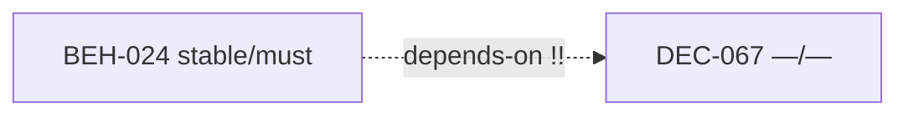


#### RefactorOptions (best first)

- **`O1`** (high): Remove edge BEH-024 -[depends-on]-> DEC-067 (keep body wiki if needed)
  - Impact_Delta: out=4 in=8 reach≤3=44
  - rationale: stable must MUST NOT structurally depend on non-stable. DEC/empty-status targets are usual false deps — demote to [[wiki]].
  - patch: `{"op": "remove_edge", "src": "BEH-024", "rel": "depends-on", "tgt": "DEC-067"}`
  - step: Edit `spec/20-behavior/search.md`: remove `depends-on=DEC-067` from ndf meta
  - step: Optionally keep `[[DEC-067]]` in body prose
  - step: Re-run ndf_graphcheck
  - simulate: `python3 spec/meta/tools/ndf_advise.py simulate --issue stable_dep-001 --option O1`

#### AI prompt stub

```
NDF advise stable_dep-001: pick RefactorOption O1 unless rationale conflicts. Allowed edge keys only: ('refines', 'depends-on', 'verifies', 'conflicts-with', 'affects', 'superseded-by', 'couples-with'). Seeds: BEH-024, DEC-067. Run simulate before any SoT edit.
```

### `stable_dep-002` — stable_dep

**error**: BEH-024 (stable/must) -[depends-on]-> DEC-068 (status=(empty), level=—)

#### context

- dep_depth(src)=3 (deeper first in queue)
- `BEH-024` loc=`spec/20-behavior/search.md:156` status=stable level=must
-   source: deduced
-   dec_hit: `spec/decisions/06-strict-cgroup.md`
-   dec_hit: `spec/decisions/08-willneed-promote.md`
-   dec_hit: `spec/decisions/11-perf-gap-4t-promote.md`
-   dec_hit: `spec/decisions/12-mt-scaling-promote.md`
-   dec_hit: `spec/decisions/14-fine-rerank-iouring-reject.md`
- `DEC-068` loc=`spec/decisions/06-strict-cgroup.md:143` status=— level=—
-   source: observed
-   dec_hit: `spec/decisions/06-strict-cgroup.md`
-   dec_hit: `spec/decisions/08-willneed-promote.md`
-   dec_hit: `spec/decisions/11-perf-gap-4t-promote.md`

### subgraph (seeds + bad edges)

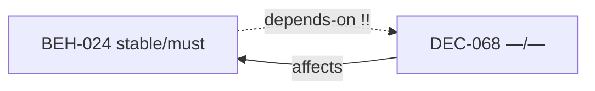


#### RefactorOptions (best first)

- **`O1`** (high): Remove edge BEH-024 -[depends-on]-> DEC-068 (keep body wiki if needed)
  - Impact_Delta: out=4 in=8 reach≤3=44
  - rationale: stable must MUST NOT structurally depend on non-stable. DEC/empty-status targets are usual false deps — demote to [[wiki]].
  - patch: `{"op": "remove_edge", "src": "BEH-024", "rel": "depends-on", "tgt": "DEC-068"}`
  - step: Edit `spec/20-behavior/search.md`: remove `depends-on=DEC-068` from ndf meta
  - step: Optionally keep `[[DEC-068]]` in body prose
  - step: Re-run ndf_graphcheck
  - simulate: `python3 spec/meta/tools/ndf_advise.py simulate --issue stable_dep-002 --option O1`

#### AI prompt stub

```
NDF advise stable_dep-002: pick RefactorOption O1 unless rationale conflicts. Allowed edge keys only: ('refines', 'depends-on', 'verifies', 'conflicts-with', 'affects', 'superseded-by', 'couples-with'). Seeds: BEH-024, DEC-068. Run simulate before any SoT edit.
```

### `stable_dep-003` — stable_dep

**error**: CON-HONEST-002 (stable/must) -[depends-on]-> DEC-057 (status=(empty), level=—)

#### context

- dep_depth(src)=3 (deeper first in queue)
- `CON-HONEST-002` loc=`spec/40-constraints/sla.md:49` status=stable level=must
-   source: deduced
-   dec_hit: `spec/decisions/04-p2.md`
-   dec_hit: `spec/decisions/05-odirect-floor.md`
-   dec_hit: `spec/decisions/06-io-pipelining-poc.md`
-   dec_hit: `spec/decisions/06-strict-cgroup.md`
- `DEC-057` loc=`spec/decisions/05-odirect-floor.md:5` status=— level=—
-   source: observed
-   dec_hit: `spec/decisions/03-scale-and-io.md`
-   dec_hit: `spec/decisions/04-p2.md`
-   dec_hit: `spec/decisions/05-odirect-floor.md`
-   dec_hit: `spec/decisions/06-strict-cgroup.md`

### subgraph (seeds + bad edges)


#### RefactorOptions (best first)

- **`O1`** (high): Remove edge CON-HONEST-002 -[depends-on]-> DEC-057 (keep body wiki if needed)
  - Impact_Delta: out=5 in=6 reach≤3=56
  - rationale: stable must MUST NOT structurally depend on non-stable. DEC/empty-status targets are usual false deps — demote to [[wiki]].
  - patch: `{"op": "remove_edge", "src": "CON-HONEST-002", "rel": "depends-on", "tgt": "DEC-057"}`
  - step: Edit `spec/40-constraints/sla.md`: remove `depends-on=DEC-057` from ndf meta
  - step: Optionally keep `[[DEC-057]]` in body prose
  - step: Re-run ndf_graphcheck
  - simulate: `python3 spec/meta/tools/ndf_advise.py simulate --issue stable_dep-003 --option O1`

#### AI prompt stub

```
NDF advise stable_dep-003: pick RefactorOption O1 unless rationale conflicts. Allowed edge keys only: ('refines', 'depends-on', 'verifies', 'conflicts-with', 'affects', 'superseded-by', 'couples-with'). Seeds: CON-HONEST-002, DEC-057. Run simulate before any SoT edit.
```

### `stable_dep-004` — stable_dep

**error**: CON-HONEST-002 (stable/must) -[depends-on]-> DEC-062 (status=(empty), level=—)

#### context

- dep_depth(src)=3 (deeper first in queue)
- `CON-HONEST-002` loc=`spec/40-constraints/sla.md:49` status=stable level=must
-   source: deduced
-   dec_hit: `spec/decisions/04-p2.md`
-   dec_hit: `spec/decisions/05-odirect-floor.md`
-   dec_hit: `spec/decisions/06-io-pipelining-poc.md`
-   dec_hit: `spec/decisions/06-strict-cgroup.md`
- `DEC-062` loc=`spec/decisions/05-odirect-floor.md:346` status=— level=—
-   source: deduced
-   dec_hit: `spec/decisions/05-odirect-floor.md`
-   dec_hit: `spec/decisions/06-io-pipelining-poc.md`
-   dec_hit: `spec/decisions/06-strict-cgroup.md`

### subgraph (seeds + bad edges)


#### RefactorOptions (best first)

- **`O1`** (high): Remove edge CON-HONEST-002 -[depends-on]-> DEC-062 (keep body wiki if needed)
  - Impact_Delta: out=5 in=10 reach≤3=56
  - rationale: stable must MUST NOT structurally depend on non-stable. DEC/empty-status targets are usual false deps — demote to [[wiki]].
  - patch: `{"op": "remove_edge", "src": "CON-HONEST-002", "rel": "depends-on", "tgt": "DEC-062"}`
  - step: Edit `spec/40-constraints/sla.md`: remove `depends-on=DEC-062` from ndf meta
  - step: Optionally keep `[[DEC-062]]` in body prose
  - step: Re-run ndf_graphcheck
  - simulate: `python3 spec/meta/tools/ndf_advise.py simulate --issue stable_dep-004 --option O1`

#### AI prompt stub

```
NDF advise stable_dep-004: pick RefactorOption O1 unless rationale conflicts. Allowed edge keys only: ('refines', 'depends-on', 'verifies', 'conflicts-with', 'affects', 'superseded-by', 'couples-with'). Seeds: CON-HONEST-002, DEC-062. Run simulate before any SoT edit.
```

### `stable_dep-005` — stable_dep

**error**: CON-HONEST-002 (stable/must) -[depends-on]-> DEC-065 (status=(empty), level=—)

#### context

- dep_depth(src)=3 (deeper first in queue)
- `CON-HONEST-002` loc=`spec/40-constraints/sla.md:49` status=stable level=must
-   source: deduced
-   dec_hit: `spec/decisions/04-p2.md`
-   dec_hit: `spec/decisions/05-odirect-floor.md`
-   dec_hit: `spec/decisions/06-io-pipelining-poc.md`
-   dec_hit: `spec/decisions/06-strict-cgroup.md`
- `DEC-065` loc=`spec/decisions/06-strict-cgroup.md:5` status=— level=—
-   source: deduced
-   dec_hit: `spec/decisions/06-strict-cgroup.md`

### subgraph (seeds + bad edges)

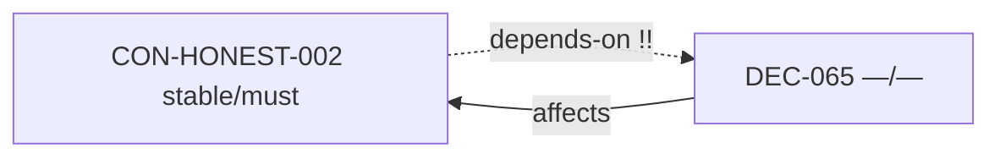


#### RefactorOptions (best first)

- **`O1`** (high): Remove edge CON-HONEST-002 -[depends-on]-> DEC-065 (keep body wiki if needed)
  - Impact_Delta: out=5 in=7 reach≤3=56
  - rationale: stable must MUST NOT structurally depend on non-stable. DEC/empty-status targets are usual false deps — demote to [[wiki]].
  - patch: `{"op": "remove_edge", "src": "CON-HONEST-002", "rel": "depends-on", "tgt": "DEC-065"}`
  - step: Edit `spec/40-constraints/sla.md`: remove `depends-on=DEC-065` from ndf meta
  - step: Optionally keep `[[DEC-065]]` in body prose
  - step: Re-run ndf_graphcheck
  - simulate: `python3 spec/meta/tools/ndf_advise.py simulate --issue stable_dep-005 --option O1`

#### AI prompt stub

```
NDF advise stable_dep-005: pick RefactorOption O1 unless rationale conflicts. Allowed edge keys only: ('refines', 'depends-on', 'verifies', 'conflicts-with', 'affects', 'superseded-by', 'couples-with'). Seeds: CON-HONEST-002, DEC-065. Run simulate before any SoT edit.
```

### `stable_dep-006` — stable_dep

**error**: CON-HONEST-002 (stable/must) -[refines]-> DEC-059 (status=(empty), level=—)

#### context

- dep_depth(src)=3 (deeper first in queue)
- `CON-HONEST-002` loc=`spec/40-constraints/sla.md:49` status=stable level=must
-   source: deduced
-   dec_hit: `spec/decisions/04-p2.md`
-   dec_hit: `spec/decisions/05-odirect-floor.md`
-   dec_hit: `spec/decisions/06-io-pipelining-poc.md`
-   dec_hit: `spec/decisions/06-strict-cgroup.md`
- `DEC-059` loc=`spec/decisions/05-odirect-floor.md:86` status=— level=—
-   source: deduced
-   dec_hit: `spec/decisions/03-scale-and-io.md`
-   dec_hit: `spec/decisions/04-p2.md`
-   dec_hit: `spec/decisions/05-odirect-floor.md`
-   dec_hit: `spec/decisions/06-strict-cgroup.md`

### subgraph (seeds + bad edges)

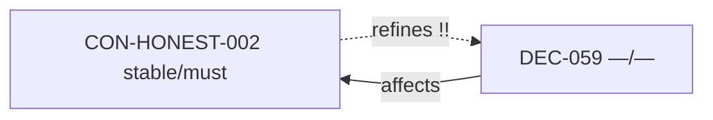


#### RefactorOptions (best first)

- **`O1`** (high): Remove edge CON-HONEST-002 -[refines]-> DEC-059 (keep body wiki if needed)
  - Impact_Delta: out=5 in=8 reach≤3=56
  - rationale: stable must MUST NOT structurally depend on non-stable. DEC/empty-status targets are usual false deps — demote to [[wiki]].
  - patch: `{"op": "remove_edge", "src": "CON-HONEST-002", "rel": "refines", "tgt": "DEC-059"}`
  - step: Edit `spec/40-constraints/sla.md`: remove `refines=DEC-059` from ndf meta
  - step: Optionally keep `[[DEC-059]]` in body prose
  - step: Re-run ndf_graphcheck
  - simulate: `python3 spec/meta/tools/ndf_advise.py simulate --issue stable_dep-006 --option O1`

#### AI prompt stub

```
NDF advise stable_dep-006: pick RefactorOption O1 unless rationale conflicts. Allowed edge keys only: ('refines', 'depends-on', 'verifies', 'conflicts-with', 'affects', 'superseded-by', 'couples-with'). Seeds: CON-HONEST-002, DEC-059. Run simulate before any SoT edit.
```

### `stable_dep-007` — stable_dep

**error**: CON-SLA-011 (stable/must) -[depends-on]-> DEC-057 (status=(empty), level=—)

#### context

- dep_depth(src)=2 (deeper first in queue)
- `CON-SLA-011` loc=`spec/40-constraints/sla.md:88` status=stable level=must
-   source: deduced
-   dec_hit: `spec/decisions/05-odirect-floor.md`
-   dec_hit: `spec/decisions/06-strict-cgroup.md`
-   dec_hit: `spec/decisions/07-memory-optimization-promote.md`
- `DEC-057` loc=`spec/decisions/05-odirect-floor.md:5` status=— level=—
-   source: observed
-   dec_hit: `spec/decisions/03-scale-and-io.md`
-   dec_hit: `spec/decisions/04-p2.md`
-   dec_hit: `spec/decisions/05-odirect-floor.md`
-   dec_hit: `spec/decisions/06-strict-cgroup.md`

### subgraph (seeds + bad edges)

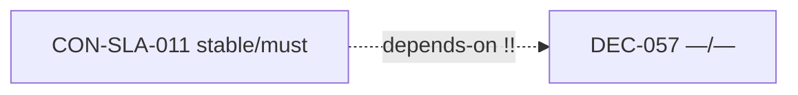


#### RefactorOptions (best first)

- **`O1`** (high): Remove edge CON-SLA-011 -[depends-on]-> DEC-057 (keep body wiki if needed)
  - Impact_Delta: out=5 in=5 reach≤3=56
  - rationale: stable must MUST NOT structurally depend on non-stable. DEC/empty-status targets are usual false deps — demote to [[wiki]].
  - patch: `{"op": "remove_edge", "src": "CON-SLA-011", "rel": "depends-on", "tgt": "DEC-057"}`
  - step: Edit `spec/40-constraints/sla.md`: remove `depends-on=DEC-057` from ndf meta
  - step: Optionally keep `[[DEC-057]]` in body prose
  - step: Re-run ndf_graphcheck
  - simulate: `python3 spec/meta/tools/ndf_advise.py simulate --issue stable_dep-007 --option O1`

#### AI prompt stub

```
NDF advise stable_dep-007: pick RefactorOption O1 unless rationale conflicts. Allowed edge keys only: ('refines', 'depends-on', 'verifies', 'conflicts-with', 'affects', 'superseded-by', 'couples-with'). Seeds: CON-SLA-011, DEC-057. Run simulate before any SoT edit.
```

### `stable_dep-008` — stable_dep

**error**: CON-SLA-011 (stable/must) -[depends-on]-> DEC-067 (status=(empty), level=—)

#### context

- dep_depth(src)=2 (deeper first in queue)
- `CON-SLA-011` loc=`spec/40-constraints/sla.md:88` status=stable level=must
-   source: deduced
-   dec_hit: `spec/decisions/05-odirect-floor.md`
-   dec_hit: `spec/decisions/06-strict-cgroup.md`
-   dec_hit: `spec/decisions/07-memory-optimization-promote.md`
- `DEC-067` loc=`spec/decisions/06-strict-cgroup.md:109` status=— level=—
-   source: observed
-   dec_hit: `spec/decisions/06-strict-cgroup.md`

### subgraph (seeds + bad edges)

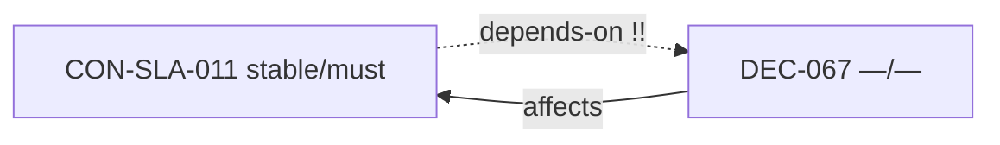


#### RefactorOptions (best first)

- **`O1`** (high): Remove edge CON-SLA-011 -[depends-on]-> DEC-067 (keep body wiki if needed)
  - Impact_Delta: out=5 in=6 reach≤3=56
  - rationale: stable must MUST NOT structurally depend on non-stable. DEC/empty-status targets are usual false deps — demote to [[wiki]].
  - patch: `{"op": "remove_edge", "src": "CON-SLA-011", "rel": "depends-on", "tgt": "DEC-067"}`
  - step: Edit `spec/40-constraints/sla.md`: remove `depends-on=DEC-067` from ndf meta
  - step: Optionally keep `[[DEC-067]]` in body prose
  - step: Re-run ndf_graphcheck
  - simulate: `python3 spec/meta/tools/ndf_advise.py simulate --issue stable_dep-008 --option O1`

#### AI prompt stub

```
NDF advise stable_dep-008: pick RefactorOption O1 unless rationale conflicts. Allowed edge keys only: ('refines', 'depends-on', 'verifies', 'conflicts-with', 'affects', 'superseded-by', 'couples-with'). Seeds: CON-SLA-011, DEC-067. Run simulate before any SoT edit.
```

### `stable_dep-009` — stable_dep

**error**: CON-SLA-014 (stable/must) -[depends-on]-> DEC-065 (status=(empty), level=—)

#### context

- dep_depth(src)=2 (deeper first in queue)
- `CON-SLA-014` loc=`spec/40-constraints/sla.md:170` status=stable level=must
-   source: deduced
-   dec_hit: `spec/decisions/06-strict-cgroup.md`
-   dec_hit: `spec/decisions/08-willneed-promote.md`
-   dec_hit: `spec/decisions/09-io-pipelining-reject.md`
-   dec_hit: `spec/decisions/10-refine-ef-pq-quality-boundary.md`
-   dec_hit: `spec/decisions/11-perf-gap-4t-promote.md`
- `DEC-065` loc=`spec/decisions/06-strict-cgroup.md:5` status=— level=—
-   source: deduced
-   dec_hit: `spec/decisions/06-strict-cgroup.md`

### subgraph (seeds + bad edges)


#### RefactorOptions (best first)

- **`O1`** (high): Remove edge CON-SLA-014 -[depends-on]-> DEC-065 (keep body wiki if needed)
  - Impact_Delta: out=2 in=22 reach≤3=58
  - rationale: stable must MUST NOT structurally depend on non-stable. DEC/empty-status targets are usual false deps — demote to [[wiki]].
  - patch: `{"op": "remove_edge", "src": "CON-SLA-014", "rel": "depends-on", "tgt": "DEC-065"}`
  - step: Edit `spec/40-constraints/sla.md`: remove `depends-on=DEC-065` from ndf meta
  - step: Optionally keep `[[DEC-065]]` in body prose
  - step: Re-run ndf_graphcheck
  - simulate: `python3 spec/meta/tools/ndf_advise.py simulate --issue stable_dep-009 --option O1`

#### AI prompt stub

```
NDF advise stable_dep-009: pick RefactorOption O1 unless rationale conflicts. Allowed edge keys only: ('refines', 'depends-on', 'verifies', 'conflicts-with', 'affects', 'superseded-by', 'couples-with'). Seeds: CON-SLA-014, DEC-065. Run simulate before any SoT edit.
```

### `stable_dep-010` — stable_dep

**error**: BEH-014 (stable/must) -[depends-on]-> DEC-017 (status=(empty), level=—)

#### context

- dep_depth(src)=1 (deeper first in queue)
- `BEH-014` loc=`spec/20-behavior/fine-rerank.md:30` status=stable level=must
-   source: deduced
- `DEC-017` loc=`spec/decisions/02-fine-rerank-experiments.md:5` status=— level=—
-   source: deduced
-   dec_hit: `spec/decisions/02-fine-rerank-experiments.md`
-   dec_hit: `spec/decisions/03-scale-and-io.md`
-   dec_hit: `spec/decisions/05-odirect-floor.md`

### subgraph (seeds + bad edges)

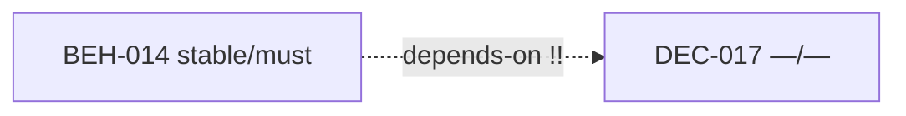


#### RefactorOptions (best first)

- **`O1`** (high): Remove edge BEH-014 -[depends-on]-> DEC-017 (keep body wiki if needed)
  - Impact_Delta: out=2 in=3 reach≤3=33
  - rationale: stable must MUST NOT structurally depend on non-stable. DEC/empty-status targets are usual false deps — demote to [[wiki]].
  - patch: `{"op": "remove_edge", "src": "BEH-014", "rel": "depends-on", "tgt": "DEC-017"}`
  - step: Edit `spec/20-behavior/fine-rerank.md`: remove `depends-on=DEC-017` from ndf meta
  - step: Optionally keep `[[DEC-017]]` in body prose
  - step: Re-run ndf_graphcheck
  - simulate: `python3 spec/meta/tools/ndf_advise.py simulate --issue stable_dep-010 --option O1`

#### AI prompt stub

```
NDF advise stable_dep-010: pick RefactorOption O1 unless rationale conflicts. Allowed edge keys only: ('refines', 'depends-on', 'verifies', 'conflicts-with', 'affects', 'superseded-by', 'couples-with'). Seeds: BEH-014, DEC-017. Run simulate before any SoT edit.
```

### `stable_dep-011` — stable_dep

**error**: BEH-016 (stable/must) -[depends-on]-> DEC-021 (status=(empty), level=—)

#### context

- dep_depth(src)=1 (deeper first in queue)
- `BEH-016` loc=`spec/20-behavior/io-modes.md:67` status=stable level=must
-   source: deduced
- `DEC-021` loc=`spec/decisions/02-fine-rerank-experiments.md:109` status=— level=—
-   source: deduced
-   dec_hit: `spec/decisions/02-fine-rerank-experiments.md`
-   dec_hit: `spec/decisions/04-p2.md`

### subgraph (seeds + bad edges)

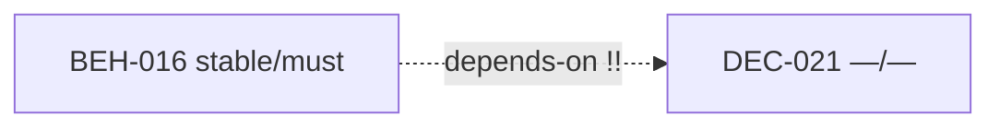


#### RefactorOptions (best first)

- **`O1`** (high): Remove edge BEH-016 -[depends-on]-> DEC-021 (keep body wiki if needed)
  - Impact_Delta: out=2 in=4 reach≤3=32
  - rationale: stable must MUST NOT structurally depend on non-stable. DEC/empty-status targets are usual false deps — demote to [[wiki]].
  - patch: `{"op": "remove_edge", "src": "BEH-016", "rel": "depends-on", "tgt": "DEC-021"}`
  - step: Edit `spec/20-behavior/io-modes.md`: remove `depends-on=DEC-021` from ndf meta
  - step: Optionally keep `[[DEC-021]]` in body prose
  - step: Re-run ndf_graphcheck
  - simulate: `python3 spec/meta/tools/ndf_advise.py simulate --issue stable_dep-011 --option O1`

#### AI prompt stub

```
NDF advise stable_dep-011: pick RefactorOption O1 unless rationale conflicts. Allowed edge keys only: ('refines', 'depends-on', 'verifies', 'conflicts-with', 'affects', 'superseded-by', 'couples-with'). Seeds: BEH-016, DEC-021. Run simulate before any SoT edit.
```

### `stable_dep-012` — stable_dep

**error**: CHR-006 (stable/must) -[depends-on]-> DEC-059 (status=(empty), level=—)

#### context

- dep_depth(src)=1 (deeper first in queue)
- `CHR-006` loc=`spec/00-charter/charter.md:56` status=stable level=must
-   source: deduced
-   dec_hit: `spec/decisions/01-foundation.md`
-   dec_hit: `spec/decisions/03-scale-and-io.md`
-   dec_hit: `spec/decisions/04-p2.md`
-   dec_hit: `spec/decisions/05-odirect-floor.md`
-   dec_hit: `spec/decisions/06-strict-cgroup.md`
- `DEC-059` loc=`spec/decisions/05-odirect-floor.md:86` status=— level=—
-   source: deduced
-   dec_hit: `spec/decisions/03-scale-and-io.md`
-   dec_hit: `spec/decisions/04-p2.md`
-   dec_hit: `spec/decisions/05-odirect-floor.md`
-   dec_hit: `spec/decisions/06-strict-cgroup.md`

### subgraph (seeds + bad edges)


#### RefactorOptions (best first)

- **`O1`** (high): Remove edge CHR-006 -[depends-on]-> DEC-059 (keep body wiki if needed)
  - Impact_Delta: out=6 in=5 reach≤3=52
  - rationale: stable must MUST NOT structurally depend on non-stable. DEC/empty-status targets are usual false deps — demote to [[wiki]].
  - patch: `{"op": "remove_edge", "src": "CHR-006", "rel": "depends-on", "tgt": "DEC-059"}`
  - step: Edit `spec/00-charter/charter.md`: remove `depends-on=DEC-059` from ndf meta
  - step: Optionally keep `[[DEC-059]]` in body prose
  - step: Re-run ndf_graphcheck
  - simulate: `python3 spec/meta/tools/ndf_advise.py simulate --issue stable_dep-012 --option O1`

#### AI prompt stub

```
NDF advise stable_dep-012: pick RefactorOption O1 unless rationale conflicts. Allowed edge keys only: ('refines', 'depends-on', 'verifies', 'conflicts-with', 'affects', 'superseded-by', 'couples-with'). Seeds: CHR-006, DEC-059. Run simulate before any SoT edit.
```

### `stable_dep-013` — stable_dep

**error**: CHR-006 (stable/must) -[depends-on]-> DEC-062 (status=(empty), level=—)

#### context

- dep_depth(src)=1 (deeper first in queue)
- `CHR-006` loc=`spec/00-charter/charter.md:56` status=stable level=must
-   source: deduced
-   dec_hit: `spec/decisions/01-foundation.md`
-   dec_hit: `spec/decisions/03-scale-and-io.md`
-   dec_hit: `spec/decisions/04-p2.md`
-   dec_hit: `spec/decisions/05-odirect-floor.md`
-   dec_hit: `spec/decisions/06-strict-cgroup.md`
- `DEC-062` loc=`spec/decisions/05-odirect-floor.md:346` status=— level=—
-   source: deduced
-   dec_hit: `spec/decisions/05-odirect-floor.md`
-   dec_hit: `spec/decisions/06-io-pipelining-poc.md`
-   dec_hit: `spec/decisions/06-strict-cgroup.md`

### subgraph (seeds + bad edges)

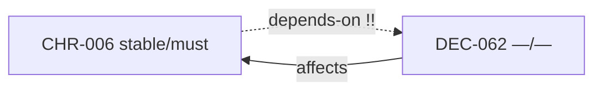


#### RefactorOptions (best first)

- **`O1`** (high): Remove edge CHR-006 -[depends-on]-> DEC-062 (keep body wiki if needed)
  - Impact_Delta: out=6 in=7 reach≤3=52
  - rationale: stable must MUST NOT structurally depend on non-stable. DEC/empty-status targets are usual false deps — demote to [[wiki]].
  - patch: `{"op": "remove_edge", "src": "CHR-006", "rel": "depends-on", "tgt": "DEC-062"}`
  - step: Edit `spec/00-charter/charter.md`: remove `depends-on=DEC-062` from ndf meta
  - step: Optionally keep `[[DEC-062]]` in body prose
  - step: Re-run ndf_graphcheck
  - simulate: `python3 spec/meta/tools/ndf_advise.py simulate --issue stable_dep-013 --option O1`

#### AI prompt stub

```
NDF advise stable_dep-013: pick RefactorOption O1 unless rationale conflicts. Allowed edge keys only: ('refines', 'depends-on', 'verifies', 'conflicts-with', 'affects', 'superseded-by', 'couples-with'). Seeds: CHR-006, DEC-062. Run simulate before any SoT edit.
```

### `stable_dep-014` — stable_dep

**error**: CHR-006 (stable/must) -[depends-on]-> DEC-067 (status=(empty), level=—)

#### context

- dep_depth(src)=1 (deeper first in queue)
- `CHR-006` loc=`spec/00-charter/charter.md:56` status=stable level=must
-   source: deduced
-   dec_hit: `spec/decisions/01-foundation.md`
-   dec_hit: `spec/decisions/03-scale-and-io.md`
-   dec_hit: `spec/decisions/04-p2.md`
-   dec_hit: `spec/decisions/05-odirect-floor.md`
-   dec_hit: `spec/decisions/06-strict-cgroup.md`
- `DEC-067` loc=`spec/decisions/06-strict-cgroup.md:109` status=— level=—
-   source: observed
-   dec_hit: `spec/decisions/06-strict-cgroup.md`

### subgraph (seeds + bad edges)


#### RefactorOptions (best first)

- **`O1`** (high): Remove edge CHR-006 -[depends-on]-> DEC-067 (keep body wiki if needed)
  - Impact_Delta: out=6 in=4 reach≤3=52
  - rationale: stable must MUST NOT structurally depend on non-stable. DEC/empty-status targets are usual false deps — demote to [[wiki]].
  - patch: `{"op": "remove_edge", "src": "CHR-006", "rel": "depends-on", "tgt": "DEC-067"}`
  - step: Edit `spec/00-charter/charter.md`: remove `depends-on=DEC-067` from ndf meta
  - step: Optionally keep `[[DEC-067]]` in body prose
  - step: Re-run ndf_graphcheck
  - simulate: `python3 spec/meta/tools/ndf_advise.py simulate --issue stable_dep-014 --option O1`

#### AI prompt stub

```
NDF advise stable_dep-014: pick RefactorOption O1 unless rationale conflicts. Allowed edge keys only: ('refines', 'depends-on', 'verifies', 'conflicts-with', 'affects', 'superseded-by', 'couples-with'). Seeds: CHR-006, DEC-067. Run simulate before any SoT edit.
```

### `stable_dep-015` — stable_dep

**error**: CHR-001 (stable/must) -[depends-on]-> DEC-059 (status=(empty), level=—)

#### context

- dep_depth(src)=0 (deeper first in queue)
- `CHR-001` loc=`spec/00-charter/charter.md:3` status=stable level=must
-   source: observed
-   dec_hit: `spec/decisions/05-odirect-floor.md`
-   dec_hit: `spec/decisions/06-strict-cgroup.md`
- `DEC-059` loc=`spec/decisions/05-odirect-floor.md:86` status=— level=—
-   source: deduced
-   dec_hit: `spec/decisions/03-scale-and-io.md`
-   dec_hit: `spec/decisions/04-p2.md`
-   dec_hit: `spec/decisions/05-odirect-floor.md`
-   dec_hit: `spec/decisions/06-strict-cgroup.md`

### subgraph (seeds + bad edges)

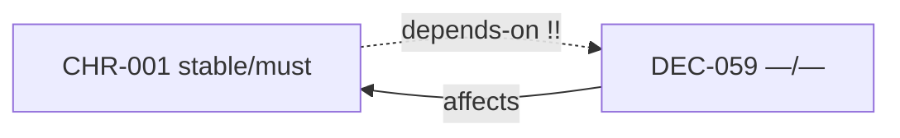


#### RefactorOptions (best first)

- **`O1`** (high): Remove edge CHR-001 -[depends-on]-> DEC-059 (keep body wiki if needed)
  - Impact_Delta: out=2 in=4 reach≤3=22
  - rationale: stable must MUST NOT structurally depend on non-stable. DEC/empty-status targets are usual false deps — demote to [[wiki]].
  - patch: `{"op": "remove_edge", "src": "CHR-001", "rel": "depends-on", "tgt": "DEC-059"}`
  - step: Edit `spec/00-charter/charter.md`: remove `depends-on=DEC-059` from ndf meta
  - step: Optionally keep `[[DEC-059]]` in body prose
  - step: Re-run ndf_graphcheck
  - simulate: `python3 spec/meta/tools/ndf_advise.py simulate --issue stable_dep-015 --option O1`

#### AI prompt stub

```
NDF advise stable_dep-015: pick RefactorOption O1 unless rationale conflicts. Allowed edge keys only: ('refines', 'depends-on', 'verifies', 'conflicts-with', 'affects', 'superseded-by', 'couples-with'). Seeds: CHR-001, DEC-059. Run simulate before any SoT edit.
```

### `stable_dep-016` — stable_dep

**error**: CHR-001 (stable/must) -[depends-on]-> DEC-062 (status=(empty), level=—)

#### context

- dep_depth(src)=0 (deeper first in queue)
- `CHR-001` loc=`spec/00-charter/charter.md:3` status=stable level=must
-   source: observed
-   dec_hit: `spec/decisions/05-odirect-floor.md`
-   dec_hit: `spec/decisions/06-strict-cgroup.md`
- `DEC-062` loc=`spec/decisions/05-odirect-floor.md:346` status=— level=—
-   source: deduced
-   dec_hit: `spec/decisions/05-odirect-floor.md`
-   dec_hit: `spec/decisions/06-io-pipelining-poc.md`
-   dec_hit: `spec/decisions/06-strict-cgroup.md`

### subgraph (seeds + bad edges)


#### RefactorOptions (best first)

- **`O1`** (high): Remove edge CHR-001 -[depends-on]-> DEC-062 (keep body wiki if needed)
  - Impact_Delta: out=2 in=6 reach≤3=22
  - rationale: stable must MUST NOT structurally depend on non-stable. DEC/empty-status targets are usual false deps — demote to [[wiki]].
  - patch: `{"op": "remove_edge", "src": "CHR-001", "rel": "depends-on", "tgt": "DEC-062"}`
  - step: Edit `spec/00-charter/charter.md`: remove `depends-on=DEC-062` from ndf meta
  - step: Optionally keep `[[DEC-062]]` in body prose
  - step: Re-run ndf_graphcheck
  - simulate: `python3 spec/meta/tools/ndf_advise.py simulate --issue stable_dep-016 --option O1`

#### AI prompt stub

```
NDF advise stable_dep-016: pick RefactorOption O1 unless rationale conflicts. Allowed edge keys only: ('refines', 'depends-on', 'verifies', 'conflicts-with', 'affects', 'superseded-by', 'couples-with'). Seeds: CHR-001, DEC-062. Run simulate before any SoT edit.
```

### `stable_dep-017` — stable_dep

**error**: CON-SLA-008 (stable/must) -[refines]-> DEC-017 (status=(empty), level=—)

#### context

- dep_depth(src)=0 (deeper first in queue)
- `CON-SLA-008` loc=`spec/40-constraints/sla.md:6` status=stable level=must
-   source: deduced
-   dec_hit: `spec/decisions/06-strict-cgroup.md`
- `DEC-017` loc=`spec/decisions/02-fine-rerank-experiments.md:5` status=— level=—
-   source: deduced
-   dec_hit: `spec/decisions/02-fine-rerank-experiments.md`
-   dec_hit: `spec/decisions/03-scale-and-io.md`
-   dec_hit: `spec/decisions/05-odirect-floor.md`

### subgraph (seeds + bad edges)

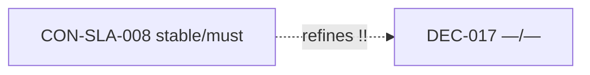


#### RefactorOptions (best first)

- **`O1`** (high): Remove edge CON-SLA-008 -[refines]-> DEC-017 (keep body wiki if needed)
  - Impact_Delta: out=2 in=2 reach≤3=8
  - rationale: stable must MUST NOT structurally depend on non-stable. DEC/empty-status targets are usual false deps — demote to [[wiki]].
  - patch: `{"op": "remove_edge", "src": "CON-SLA-008", "rel": "refines", "tgt": "DEC-017"}`
  - step: Edit `spec/40-constraints/sla.md`: remove `refines=DEC-017` from ndf meta
  - step: Optionally keep `[[DEC-017]]` in body prose
  - step: Re-run ndf_graphcheck
  - simulate: `python3 spec/meta/tools/ndf_advise.py simulate --issue stable_dep-017 --option O1`

#### AI prompt stub

```
NDF advise stable_dep-017: pick RefactorOption O1 unless rationale conflicts. Allowed edge keys only: ('refines', 'depends-on', 'verifies', 'conflicts-with', 'affects', 'superseded-by', 'couples-with'). Seeds: CON-SLA-008, DEC-017. Run simulate before any SoT edit.
```

### `stable_dep-018` — stable_dep

**error**: CON-SLA-010 (stable/must) -[refines]-> DEC-021 (status=(empty), level=—)

#### context

- dep_depth(src)=0 (deeper first in queue)
- `CON-SLA-010` loc=`spec/40-constraints/sla.md:32` status=stable level=must
-   source: deduced
- `DEC-021` loc=`spec/decisions/02-fine-rerank-experiments.md:109` status=— level=—
-   source: deduced
-   dec_hit: `spec/decisions/02-fine-rerank-experiments.md`
-   dec_hit: `spec/decisions/04-p2.md`

### subgraph (seeds + bad edges)

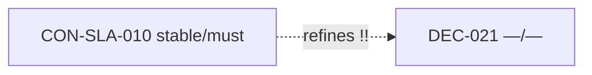


#### RefactorOptions (best first)

- **`O1`** (high): Remove edge CON-SLA-010 -[refines]-> DEC-021 (keep body wiki if needed)
  - Impact_Delta: out=1 in=3 reach≤3=4
  - rationale: stable must MUST NOT structurally depend on non-stable. DEC/empty-status targets are usual false deps — demote to [[wiki]].
  - patch: `{"op": "remove_edge", "src": "CON-SLA-010", "rel": "refines", "tgt": "DEC-021"}`
  - step: Edit `spec/40-constraints/sla.md`: remove `refines=DEC-021` from ndf meta
  - step: Optionally keep `[[DEC-021]]` in body prose
  - step: Re-run ndf_graphcheck
  - simulate: `python3 spec/meta/tools/ndf_advise.py simulate --issue stable_dep-018 --option O1`

#### AI prompt stub

```
NDF advise stable_dep-018: pick RefactorOption O1 unless rationale conflicts. Allowed edge keys only: ('refines', 'depends-on', 'verifies', 'conflicts-with', 'affects', 'superseded-by', 'couples-with'). Seeds: CON-SLA-010, DEC-021. Run simulate before any SoT edit.
```

### `stable_dep-019` — stable_dep

**error**: VER-030 (stable/must) -[verifies]-> DEC-059 (status=(empty), level=—)

#### context

- dep_depth(src)=0 (deeper first in queue)
- `VER-030` loc=`spec/50-verification/acceptance.md:214` status=stable level=must
-   dec_hit: `spec/decisions/03-scale-and-io.md`
- `DEC-059` loc=`spec/decisions/05-odirect-floor.md:86` status=— level=—
-   source: deduced
-   dec_hit: `spec/decisions/03-scale-and-io.md`
-   dec_hit: `spec/decisions/04-p2.md`
-   dec_hit: `spec/decisions/05-odirect-floor.md`
-   dec_hit: `spec/decisions/06-strict-cgroup.md`

### subgraph (seeds + bad edges)


#### RefactorOptions (best first)

- **`O1`** (high): Remove edge VER-030 -[verifies]-> DEC-059 (keep body wiki if needed)
  - Impact_Delta: out=0 in=4 reach≤3=35
  - rationale: stable must MUST NOT structurally depend on non-stable. DEC/empty-status targets are usual false deps — demote to [[wiki]].
  - patch: `{"op": "remove_edge", "src": "VER-030", "rel": "verifies", "tgt": "DEC-059"}`
  - step: Edit `spec/50-verification/acceptance.md`: remove `verifies=DEC-059` from ndf meta
  - step: Optionally keep `[[DEC-059]]` in body prose
  - step: Re-run ndf_graphcheck
  - simulate: `python3 spec/meta/tools/ndf_advise.py simulate --issue stable_dep-019 --option O1`

#### AI prompt stub

```
NDF advise stable_dep-019: pick RefactorOption O1 unless rationale conflicts. Allowed edge keys only: ('refines', 'depends-on', 'verifies', 'conflicts-with', 'affects', 'superseded-by', 'couples-with'). Seeds: VER-030, DEC-059. Run simulate before any SoT edit.
```

### `stable_dep-020` — stable_dep

**error**: VER-034 (stable/must) -[verifies]-> DEC-034 (status=(empty), level=—)

#### context

- dep_depth(src)=0 (deeper first in queue)
- `VER-034` loc=`spec/50-verification/acceptance-p2.md:5` status=stable level=must
-   source: observed
- `DEC-034` loc=`spec/decisions/04-p2.md:5` status=— level=—
-   source: observed
-   dec_hit: `spec/decisions/04-p2.md`
-   dec_hit: `spec/decisions/07-memory-optimization-promote.md`

### subgraph (seeds + bad edges)

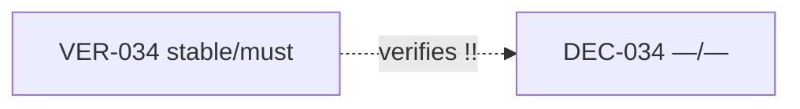


#### RefactorOptions (best first)

- **`O1`** (high): Remove edge VER-034 -[verifies]-> DEC-034 (keep body wiki if needed)
  - Impact_Delta: out=0 in=0 reach≤3=0
  - rationale: stable must MUST NOT structurally depend on non-stable. DEC/empty-status targets are usual false deps — demote to [[wiki]].
  - patch: `{"op": "remove_edge", "src": "VER-034", "rel": "verifies", "tgt": "DEC-034"}`
  - step: Edit `spec/50-verification/acceptance-p2.md`: remove `verifies=DEC-034` from ndf meta
  - step: Optionally keep `[[DEC-034]]` in body prose
  - step: Re-run ndf_graphcheck
  - simulate: `python3 spec/meta/tools/ndf_advise.py simulate --issue stable_dep-020 --option O1`

#### AI prompt stub

```
NDF advise stable_dep-020: pick RefactorOption O1 unless rationale conflicts. Allowed edge keys only: ('refines', 'depends-on', 'verifies', 'conflicts-with', 'affects', 'superseded-by', 'couples-with'). Seeds: VER-034, DEC-034. Run simulate before any SoT edit.
```

### `stable_dep-021` — stable_dep

**error**: VER-035 (stable/must) -[verifies]-> DEC-035 (status=(empty), level=—)

#### context

- dep_depth(src)=0 (deeper first in queue)
- `VER-035` loc=`spec/50-verification/acceptance-p2.md:16` status=stable level=must
-   source: observed
-   dec_hit: `spec/decisions/06-strict-cgroup.md`
- `DEC-035` loc=`spec/decisions/04-p2.md:48` status=— level=—
-   source: observed
-   dec_hit: `spec/decisions/04-p2.md`

### subgraph (seeds + bad edges)

```mermaid
flowchart LR
  DEC_035["DEC-035 —/—"]
  VER_035["VER-035 stable/must"]
  VER_035 -.->|verifies !!|DEC_035
```


#### RefactorOptions (best first)

- **`O1`** (high): Remove edge VER-035 -[verifies]-> DEC-035 (keep body wiki if needed)
  - Impact_Delta: out=0 in=0 reach≤3=0
  - rationale: stable must MUST NOT structurally depend on non-stable. DEC/empty-status targets are usual false deps — demote to [[wiki]].
  - patch: `{"op": "remove_edge", "src": "VER-035", "rel": "verifies", "tgt": "DEC-035"}`
  - step: Edit `spec/50-verification/acceptance-p2.md`: remove `verifies=DEC-035` from ndf meta
  - step: Optionally keep `[[DEC-035]]` in body prose
  - step: Re-run ndf_graphcheck
  - simulate: `python3 spec/meta/tools/ndf_advise.py simulate --issue stable_dep-021 --option O1`

#### AI prompt stub

```
NDF advise stable_dep-021: pick RefactorOption O1 unless rationale conflicts. Allowed edge keys only: ('refines', 'depends-on', 'verifies', 'conflicts-with', 'affects', 'superseded-by', 'couples-with'). Seeds: VER-035, DEC-035. Run simulate before any SoT edit.
```

### `stable_dep-022` — stable_dep

**error**: VER-037 (stable/must) -[verifies]-> DEC-037 (status=(empty), level=—)

#### context

- dep_depth(src)=0 (deeper first in queue)
- `VER-037` loc=`spec/50-verification/acceptance-p2.md:38` status=stable level=must
-   source: observed
- `DEC-037` loc=`spec/decisions/04-p2.md:96` status=— level=—
-   source: observed
-   dec_hit: `spec/decisions/04-p2.md`

### subgraph (seeds + bad edges)

```mermaid
flowchart LR
  DEC_037["DEC-037 —/—"]
  VER_037["VER-037 stable/must"]
  VER_037 -.->|verifies !!|DEC_037
```


#### RefactorOptions (best first)

- **`O1`** (high): Remove edge VER-037 -[verifies]-> DEC-037 (keep body wiki if needed)
  - Impact_Delta: out=0 in=0 reach≤3=0
  - rationale: stable must MUST NOT structurally depend on non-stable. DEC/empty-status targets are usual false deps — demote to [[wiki]].
  - patch: `{"op": "remove_edge", "src": "VER-037", "rel": "verifies", "tgt": "DEC-037"}`
  - step: Edit `spec/50-verification/acceptance-p2.md`: remove `verifies=DEC-037` from ndf meta
  - step: Optionally keep `[[DEC-037]]` in body prose
  - step: Re-run ndf_graphcheck
  - simulate: `python3 spec/meta/tools/ndf_advise.py simulate --issue stable_dep-022 --option O1`

#### AI prompt stub

```
NDF advise stable_dep-022: pick RefactorOption O1 unless rationale conflicts. Allowed edge keys only: ('refines', 'depends-on', 'verifies', 'conflicts-with', 'affects', 'superseded-by', 'couples-with'). Seeds: VER-037, DEC-037. Run simulate before any SoT edit.
```

### `stable_dep-023` — stable_dep

**error**: VER-039 (stable/must) -[depends-on]-> DEC-065 (status=(empty), level=—)

#### context

- dep_depth(src)=0 (deeper first in queue)
- `VER-039` loc=`spec/50-verification/acceptance-p2.md:66` status=stable level=must
-   source: deduced
-   dec_hit: `spec/decisions/06-strict-cgroup.md`
- `DEC-065` loc=`spec/decisions/06-strict-cgroup.md:5` status=— level=—
-   source: deduced
-   dec_hit: `spec/decisions/06-strict-cgroup.md`

### subgraph (seeds + bad edges)

```mermaid
flowchart LR
  DEC_065["DEC-065 —/—"]
  VER_039["VER-039 stable/must"]
  DEC_065 -->|affects|VER_039
  VER_039 -.->|depends-on !!|DEC_065
```


#### RefactorOptions (best first)

- **`O1`** (high): Remove edge VER-039 -[depends-on]-> DEC-065 (keep body wiki if needed)
  - Impact_Delta: out=1 in=3 reach≤3=27
  - rationale: stable must MUST NOT structurally depend on non-stable. DEC/empty-status targets are usual false deps — demote to [[wiki]].
  - patch: `{"op": "remove_edge", "src": "VER-039", "rel": "depends-on", "tgt": "DEC-065"}`
  - step: Edit `spec/50-verification/acceptance-p2.md`: remove `depends-on=DEC-065` from ndf meta
  - step: Optionally keep `[[DEC-065]]` in body prose
  - step: Re-run ndf_graphcheck
  - simulate: `python3 spec/meta/tools/ndf_advise.py simulate --issue stable_dep-023 --option O1`

#### AI prompt stub

```
NDF advise stable_dep-023: pick RefactorOption O1 unless rationale conflicts. Allowed edge keys only: ('refines', 'depends-on', 'verifies', 'conflicts-with', 'affects', 'superseded-by', 'couples-with'). Seeds: VER-039, DEC-065. Run simulate before any SoT edit.
```

## Next

1. Pick an option and run `simulate`.
2. If sandbox: pass, edit SoT manually (or open a proposal).
3. Re-run `ndf_graphcheck` then `ndf_advise.py plan` again.
4. Never apply patches automatically from this tool (v1).
