# NDF bindcheck report

> Generated by `spec/meta/tools/ndf_bindcheck.py` at 2026-08-16T14:39:38Z

- topics: 28 (bfs-cluster, bg-thread-futex, block-size-tuning, cgroup-v1-support, cluster-gbdt, csr-on-disk, data-layout-optimization, fine-rerank-incremental, fine-rerank-iouring, framework-driven-optimization, gbdt-learned-pruning, gbdt-retrain, helmsman-adaptive, io-pipelining, l4-cache-mgmt, mmap-budget-shift, multi-thread-scaling, page-packer, param-expansion-sweep, perf-gap-4t, pipeline-param-retuning, pq-quality, refine-ef-tuning, speculative-prefetch, ssd-parallelism-io, sustained-param-retuning, sustained-query-benchmark, vecblock-cluster-reorder)
- checks: bind,dual,grain
- hard_errors: 30
- warnings: 69

## Summary by kind

| kind | def | count | severity |
|------|-----|------:|----------|
| `draft_vs_stable` | BINDER-DUAL-HEAD | 15 | error |
| `missing_ledger` | REPRO-BIND-GAP | 11 | error |
| `missing_trailer` | REPRO-BIND-GAP | 4 | error |
| `clause_unbound` | REPRO-BIND-GAP | 12 | warning |
| `missing_design` | BEH-025 | 27 | warning |
| `missing_interface` | BEH-025 | 27 | warning |
| `orphan_draft_id` | BINDER-DUAL-HEAD | 3 | warning |

## Issue index

| # | sev | kind | topic | message | loc |
|--:|-----|------|-------|---------|-----|
| 1 | warning | `missing_design` | `bfs-cluster` | binder missing DESIGN.md (design surface; required before new code) | `poc/bfs-cluster/ndf/DESIGN.md` |
| 2 | warning | `missing_interface` | `bfs-cluster` | binder missing INTERFACE.md (design surface; required before new code) | `poc/bfs-cluster/ndf/INTERFACE.md` |
| 3 | error | `missing_ledger` | `bfs-cluster` | missing Commit Ledger COMMITS.md | `poc/bfs-cluster/ndf/COMMITS.md` |
| 4 | warning | `missing_design` | `bg-thread-futex` | binder missing DESIGN.md (design surface; required before new code) | `poc/bg-thread-futex/ndf/DESIGN.md` |
| 5 | warning | `missing_interface` | `bg-thread-futex` | binder missing INTERFACE.md (design surface; required before new code) | `poc/bg-thread-futex/ndf/INTERFACE.md` |
| 6 | error | `missing_ledger` | `bg-thread-futex` | missing Commit Ledger COMMITS.md | `poc/bg-thread-futex/ndf/COMMITS.md` |
| 7 | warning | `missing_design` | `block-size-tuning` | binder missing DESIGN.md (design surface; required before new code) | `poc/block-size-tuning/ndf/DESIGN.md` |
| 8 | warning | `missing_interface` | `block-size-tuning` | binder missing INTERFACE.md (design surface; required before new code) | `poc/block-size-tuning/ndf/INTERFACE.md` |
| 9 | error | `missing_ledger` | `block-size-tuning` | missing Commit Ledger COMMITS.md | `poc/block-size-tuning/ndf/COMMITS.md` |
| 10 | warning | `missing_design` | `cgroup-v1-support` | binder missing DESIGN.md (design surface; required before new code) | `poc/cgroup-v1-support/ndf/DESIGN.md` |
| 11 | warning | `missing_interface` | `cgroup-v1-support` | binder missing INTERFACE.md (design surface; required before new code) | `poc/cgroup-v1-support/ndf/INTERFACE.md` |
| 12 | warning | `missing_design` | `csr-on-disk` | binder missing DESIGN.md (design surface; required before new code) | `poc/csr-on-disk/ndf/DESIGN.md` |
| 13 | warning | `missing_interface` | `csr-on-disk` | binder missing INTERFACE.md (design surface; required before new code) | `poc/csr-on-disk/ndf/INTERFACE.md` |
| 14 | warning | `orphan_draft_id` | `csr-on-disk` | TOPIC draft_clauses lists BEH-036 but ID absent from Trunk graph | `poc/csr-on-disk/ndf/TOPIC.md` |
| 15 | warning | `orphan_draft_id` | `csr-on-disk` | TOPIC draft_clauses lists API-020 but ID absent from Trunk graph | `poc/csr-on-disk/ndf/TOPIC.md` |
| 16 | warning | `missing_design` | `data-layout-optimization` | binder missing DESIGN.md (design surface; required before new code) | `poc/data-layout-optimization/ndf/DESIGN.md` |
| 17 | warning | `missing_interface` | `data-layout-optimization` | binder missing INTERFACE.md (design surface; required before new code) | `poc/data-layout-optimization/ndf/INTERFACE.md` |
| 18 | error | `missing_ledger` | `data-layout-optimization` | missing Commit Ledger COMMITS.md | `poc/data-layout-optimization/ndf/COMMITS.md` |
| 19 | warning | `missing_design` | `fine-rerank-incremental` | binder missing DESIGN.md (design surface; required before new code) | `poc/fine-rerank-incremental/ndf/DESIGN.md` |
| 20 | warning | `missing_interface` | `fine-rerank-incremental` | binder missing INTERFACE.md (design surface; required before new code) | `poc/fine-rerank-incremental/ndf/INTERFACE.md` |
| 21 | error | `missing_ledger` | `fine-rerank-incremental` | missing Commit Ledger COMMITS.md | `poc/fine-rerank-incremental/ndf/COMMITS.md` |
| 22 | warning | `missing_design` | `fine-rerank-iouring` | binder missing DESIGN.md (design surface; required before new code) | `poc/fine-rerank-iouring/ndf/DESIGN.md` |
| 23 | warning | `missing_interface` | `fine-rerank-iouring` | binder missing INTERFACE.md (design surface; required before new code) | `poc/fine-rerank-iouring/ndf/INTERFACE.md` |
| 24 | warning | `missing_design` | `framework-driven-optimization` | binder missing DESIGN.md (design surface; required before new code) | `poc/framework-driven-optimization/ndf/DESIGN.md` |
| 25 | warning | `missing_interface` | `framework-driven-optimization` | binder missing INTERFACE.md (design surface; required before new code) | `poc/framework-driven-optimization/ndf/INTERFACE.md` |
| 26 | error | `missing_ledger` | `framework-driven-optimization` | missing Commit Ledger COMMITS.md | `poc/framework-driven-optimization/ndf/COMMITS.md` |
| 27 | warning | `missing_design` | `gbdt-learned-pruning` | binder missing DESIGN.md (design surface; required before new code) | `poc/gbdt-learned-pruning/ndf/DESIGN.md` |
| 28 | warning | `missing_interface` | `gbdt-learned-pruning` | binder missing INTERFACE.md (design surface; required before new code) | `poc/gbdt-learned-pruning/ndf/INTERFACE.md` |
| 29 | warning | `clause_unbound` | `gbdt-learned-pruning` | draft clause BEH-034 never appears in ledger clauses column | `poc/gbdt-learned-pruning/ndf/TOPIC.md` |
| 30 | warning | `clause_unbound` | `gbdt-learned-pruning` | draft clause API-018 never appears in ledger clauses column | `poc/gbdt-learned-pruning/ndf/TOPIC.md` |
| 31 | error | `draft_vs_stable` | `gbdt-learned-pruning` | BEH-034: TOPIC still draft registration but Trunk status=stable | `poc/gbdt-learned-pruning/ndf/TOPIC.md ↔ spec/20-behavior/search.md:273` |
| 32 | error | `draft_vs_stable` | `gbdt-learned-pruning` | API-018: TOPIC still draft registration but Trunk status=stable | `poc/gbdt-learned-pruning/ndf/TOPIC.md ↔ spec/30-interfaces/env.md:189` |
| 33 | warning | `missing_design` | `gbdt-retrain` | binder missing DESIGN.md (design surface; required before new code) | `poc/gbdt-retrain/ndf/DESIGN.md` |
| 34 | warning | `missing_interface` | `gbdt-retrain` | binder missing INTERFACE.md (design surface; required before new code) | `poc/gbdt-retrain/ndf/INTERFACE.md` |
| 35 | error | `missing_ledger` | `gbdt-retrain` | missing Commit Ledger COMMITS.md | `poc/gbdt-retrain/ndf/COMMITS.md` |
| 36 | error | `draft_vs_stable` | `gbdt-retrain` | BEH-034: TOPIC still draft registration but Trunk status=stable | `poc/gbdt-retrain/ndf/TOPIC.md ↔ spec/20-behavior/search.md:273` |
| 37 | error | `draft_vs_stable` | `gbdt-retrain` | API-018: TOPIC still draft registration but Trunk status=stable | `poc/gbdt-retrain/ndf/TOPIC.md ↔ spec/30-interfaces/env.md:189` |
| 38 | error | `draft_vs_stable` | `gbdt-retrain` | DEC-084: TOPIC still draft registration but Trunk status=stable | `poc/gbdt-retrain/ndf/TOPIC.md ↔ spec/decisions/20-sustained-benchmark-methodology.md:9` |
| 39 | warning | `orphan_draft_id` | `gbdt-retrain` | TOPIC draft_clauses lists DEC-0XX but ID absent from Trunk graph | `poc/gbdt-retrain/ndf/TOPIC.md` |
| 40 | warning | `missing_design` | `helmsman-adaptive` | binder missing DESIGN.md (design surface; required before new code) | `poc/helmsman-adaptive/ndf/DESIGN.md` |
| 41 | warning | `missing_interface` | `helmsman-adaptive` | binder missing INTERFACE.md (design surface; required before new code) | `poc/helmsman-adaptive/ndf/INTERFACE.md` |
| 42 | warning | `clause_unbound` | `helmsman-adaptive` | draft clause BEH-033 never appears in ledger clauses column | `poc/helmsman-adaptive/ndf/TOPIC.md` |
| 43 | warning | `clause_unbound` | `helmsman-adaptive` | draft clause API-017 never appears in ledger clauses column | `poc/helmsman-adaptive/ndf/TOPIC.md` |
| 44 | error | `draft_vs_stable` | `helmsman-adaptive` | BEH-033: TOPIC still draft registration but Trunk status=stable | `poc/helmsman-adaptive/ndf/TOPIC.md ↔ spec/20-behavior/search.md:233` |
| 45 | error | `draft_vs_stable` | `helmsman-adaptive` | API-017: TOPIC still draft registration but Trunk status=stable | `poc/helmsman-adaptive/ndf/TOPIC.md ↔ spec/30-interfaces/env.md:158` |
| 46 | warning | `missing_design` | `io-pipelining` | binder missing DESIGN.md (design surface; required before new code) | `poc/io-pipelining/ndf/DESIGN.md` |
| 47 | warning | `missing_interface` | `io-pipelining` | binder missing INTERFACE.md (design surface; required before new code) | `poc/io-pipelining/ndf/INTERFACE.md` |
| 48 | warning | `missing_design` | `l4-cache-mgmt` | binder missing DESIGN.md (design surface; required before new code) | `poc/l4-cache-mgmt/ndf/DESIGN.md` |
| 49 | warning | `missing_interface` | `l4-cache-mgmt` | binder missing INTERFACE.md (design surface; required before new code) | `poc/l4-cache-mgmt/ndf/INTERFACE.md` |
| 50 | warning | `missing_design` | `mmap-budget-shift` | binder missing DESIGN.md (design surface; required before new code) | `poc/mmap-budget-shift/ndf/DESIGN.md` |
| 51 | warning | `missing_interface` | `mmap-budget-shift` | binder missing INTERFACE.md (design surface; required before new code) | `poc/mmap-budget-shift/ndf/INTERFACE.md` |
| 52 | error | `missing_ledger` | `mmap-budget-shift` | missing Commit Ledger COMMITS.md | `poc/mmap-budget-shift/ndf/COMMITS.md` |
| 53 | warning | `missing_design` | `multi-thread-scaling` | binder missing DESIGN.md (design surface; required before new code) | `poc/multi-thread-scaling/ndf/DESIGN.md` |
| 54 | warning | `missing_interface` | `multi-thread-scaling` | binder missing INTERFACE.md (design surface; required before new code) | `poc/multi-thread-scaling/ndf/INTERFACE.md` |
| 55 | warning | `missing_design` | `page-packer` | binder missing DESIGN.md (design surface; required before new code) | `poc/page-packer/ndf/DESIGN.md` |
| 56 | warning | `missing_interface` | `page-packer` | binder missing INTERFACE.md (design surface; required before new code) | `poc/page-packer/ndf/INTERFACE.md` |
| 57 | error | `missing_ledger` | `page-packer` | missing Commit Ledger COMMITS.md | `poc/page-packer/ndf/COMMITS.md` |
| 58 | warning | `missing_design` | `param-expansion-sweep` | binder missing DESIGN.md (design surface; required before new code) | `poc/param-expansion-sweep/ndf/DESIGN.md` |
| 59 | warning | `missing_interface` | `param-expansion-sweep` | binder missing INTERFACE.md (design surface; required before new code) | `poc/param-expansion-sweep/ndf/INTERFACE.md` |
| 60 | error | `missing_ledger` | `param-expansion-sweep` | missing Commit Ledger COMMITS.md | `poc/param-expansion-sweep/ndf/COMMITS.md` |
| 61 | warning | `missing_design` | `perf-gap-4t` | binder missing DESIGN.md (design surface; required before new code) | `poc/perf-gap-4t/ndf/DESIGN.md` |
| 62 | warning | `missing_interface` | `perf-gap-4t` | binder missing INTERFACE.md (design surface; required before new code) | `poc/perf-gap-4t/ndf/INTERFACE.md` |
| 63 | warning | `missing_design` | `pipeline-param-retuning` | binder missing DESIGN.md (design surface; required before new code) | `poc/pipeline-param-retuning/ndf/DESIGN.md` |
| 64 | warning | `missing_interface` | `pipeline-param-retuning` | binder missing INTERFACE.md (design surface; required before new code) | `poc/pipeline-param-retuning/ndf/INTERFACE.md` |
| 65 | error | `missing_trailer` | `pipeline-param-retuning` | code commit a60d763 missing trailers: Topic:, Clauses: | `poc/pipeline-param-retuning/ndf/evidence/r5-strict-cgroup-256mb-20260808.md` |
| 66 | warning | `missing_design` | `pq-quality` | binder missing DESIGN.md (design surface; required before new code) | `poc/pq-quality/ndf/DESIGN.md` |
| 67 | warning | `missing_interface` | `pq-quality` | binder missing INTERFACE.md (design surface; required before new code) | `poc/pq-quality/ndf/INTERFACE.md` |
| 68 | warning | `missing_design` | `refine-ef-tuning` | binder missing DESIGN.md (design surface; required before new code) | `poc/refine-ef-tuning/ndf/DESIGN.md` |
| 69 | warning | `missing_interface` | `refine-ef-tuning` | binder missing INTERFACE.md (design surface; required before new code) | `poc/refine-ef-tuning/ndf/INTERFACE.md` |
| 70 | warning | `missing_design` | `speculative-prefetch` | binder missing DESIGN.md (design surface; required before new code) | `poc/speculative-prefetch/ndf/DESIGN.md` |
| 71 | warning | `missing_interface` | `speculative-prefetch` | binder missing INTERFACE.md (design surface; required before new code) | `poc/speculative-prefetch/ndf/INTERFACE.md` |
| 72 | error | `missing_ledger` | `speculative-prefetch` | missing Commit Ledger COMMITS.md | `poc/speculative-prefetch/ndf/COMMITS.md` |
| 73 | warning | `missing_design` | `ssd-parallelism-io` | binder missing DESIGN.md (design surface; required before new code) | `poc/ssd-parallelism-io/ndf/DESIGN.md` |
| 74 | warning | `missing_interface` | `ssd-parallelism-io` | binder missing INTERFACE.md (design surface; required before new code) | `poc/ssd-parallelism-io/ndf/INTERFACE.md` |
| 75 | warning | `missing_design` | `sustained-param-retuning` | binder missing DESIGN.md (design surface; required before new code) | `poc/sustained-param-retuning/ndf/DESIGN.md` |
| 76 | warning | `missing_interface` | `sustained-param-retuning` | binder missing INTERFACE.md (design surface; required before new code) | `poc/sustained-param-retuning/ndf/INTERFACE.md` |
| 77 | warning | `missing_design` | `sustained-query-benchmark` | binder missing DESIGN.md (design surface; required before new code) | `poc/sustained-query-benchmark/ndf/DESIGN.md` |
| 78 | warning | `missing_interface` | `sustained-query-benchmark` | binder missing INTERFACE.md (design surface; required before new code) | `poc/sustained-query-benchmark/ndf/INTERFACE.md` |
| 79 | warning | `clause_unbound` | `sustained-query-benchmark` | draft clause DEC-084 never appears in ledger clauses column | `poc/sustained-query-benchmark/ndf/TOPIC.md` |
| 80 | warning | `clause_unbound` | `sustained-query-benchmark` | draft clause BEH-035 never appears in ledger clauses column | `poc/sustained-query-benchmark/ndf/TOPIC.md` |
| 81 | warning | `clause_unbound` | `sustained-query-benchmark` | draft clause API-019 never appears in ledger clauses column | `poc/sustained-query-benchmark/ndf/TOPIC.md` |
| 82 | warning | `clause_unbound` | `sustained-query-benchmark` | draft clause CON-SLA-019 never appears in ledger clauses column | `poc/sustained-query-benchmark/ndf/TOPIC.md` |
| 83 | warning | `clause_unbound` | `sustained-query-benchmark` | draft clause CON-SLA-020 never appears in ledger clauses column | `poc/sustained-query-benchmark/ndf/TOPIC.md` |
| 84 | warning | `clause_unbound` | `sustained-query-benchmark` | draft clause MODEL-SUSTAINED-001 never appears in ledger clauses column | `poc/sustained-query-benchmark/ndf/TOPIC.md` |
| 85 | warning | `clause_unbound` | `sustained-query-benchmark` | draft clause VER-043 never appears in ledger clauses column | `poc/sustained-query-benchmark/ndf/TOPIC.md` |
| 86 | warning | `clause_unbound` | `sustained-query-benchmark` | draft clause VER-044 never appears in ledger clauses column | `poc/sustained-query-benchmark/ndf/TOPIC.md` |
| 87 | error | `draft_vs_stable` | `sustained-query-benchmark` | DEC-084: TOPIC still draft registration but Trunk status=stable | `poc/sustained-query-benchmark/ndf/TOPIC.md ↔ spec/decisions/20-sustained-benchmark-methodology.md:9` |
| 88 | error | `draft_vs_stable` | `sustained-query-benchmark` | BEH-035: TOPIC still draft registration but Trunk status=stable | `poc/sustained-query-benchmark/ndf/TOPIC.md ↔ spec/20-behavior/test-infra.md:40` |
| 89 | error | `draft_vs_stable` | `sustained-query-benchmark` | API-019: TOPIC still draft registration but Trunk status=stable | `poc/sustained-query-benchmark/ndf/TOPIC.md ↔ spec/30-interfaces/cli.md:197` |
| 90 | error | `draft_vs_stable` | `sustained-query-benchmark` | CON-SLA-019: TOPIC still draft registration but Trunk status=stable | `poc/sustained-query-benchmark/ndf/TOPIC.md ↔ spec/40-constraints/sla.md:316` |
| 91 | error | `draft_vs_stable` | `sustained-query-benchmark` | CON-SLA-020: TOPIC still draft registration but Trunk status=stable | `poc/sustained-query-benchmark/ndf/TOPIC.md ↔ spec/40-constraints/sla.md:354` |
| 92 | error | `draft_vs_stable` | `sustained-query-benchmark` | MODEL-SUSTAINED-001: TOPIC still draft registration but Trunk status=stable | `poc/sustained-query-benchmark/ndf/TOPIC.md ↔ spec/models/sustained-query-measurement.md:8` |
| 93 | error | `draft_vs_stable` | `sustained-query-benchmark` | VER-043: TOPIC still draft registration but Trunk status=stable | `poc/sustained-query-benchmark/ndf/TOPIC.md ↔ spec/50-verification/acceptance-p2.md:145` |
| 94 | error | `draft_vs_stable` | `sustained-query-benchmark` | VER-044: TOPIC still draft registration but Trunk status=stable | `poc/sustained-query-benchmark/ndf/TOPIC.md ↔ spec/50-verification/acceptance-p2.md:181` |
| 95 | warning | `missing_design` | `vecblock-cluster-reorder` | binder missing DESIGN.md (design surface; required before new code) | `poc/vecblock-cluster-reorder/ndf/DESIGN.md` |
| 96 | warning | `missing_interface` | `vecblock-cluster-reorder` | binder missing INTERFACE.md (design surface; required before new code) | `poc/vecblock-cluster-reorder/ndf/INTERFACE.md` |
| 97 | error | `missing_trailer` | `vecblock-cluster-reorder` | code commit 3b6284b missing trailers: Clauses: | `poc/vecblock-cluster-reorder/NOTES.md` |
| 98 | error | `missing_trailer` | `vecblock-cluster-reorder` | code commit 3baa360 missing trailers: Clauses: | `poc/vecblock-cluster-reorder/NOTES.md` |
| 99 | error | `missing_trailer` | `vecblock-cluster-reorder` | code commit a40afd2 missing trailers: Clauses: | `poc/vecblock-cluster-reorder/NOTES.md` |

## Figures by topic

### topic `bfs-cluster`

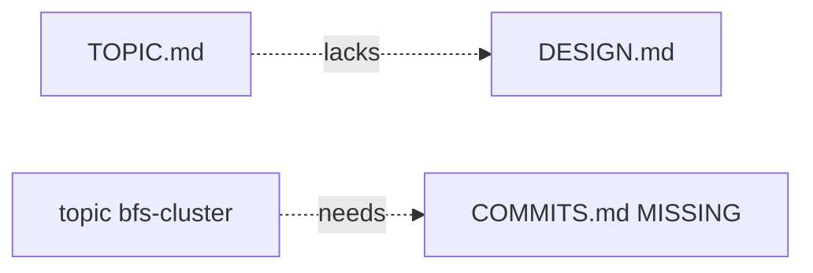

### topic `bg-thread-futex`

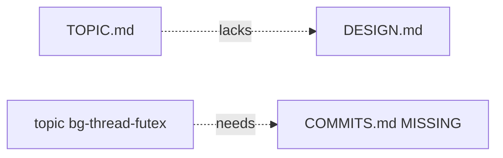

### topic `block-size-tuning`

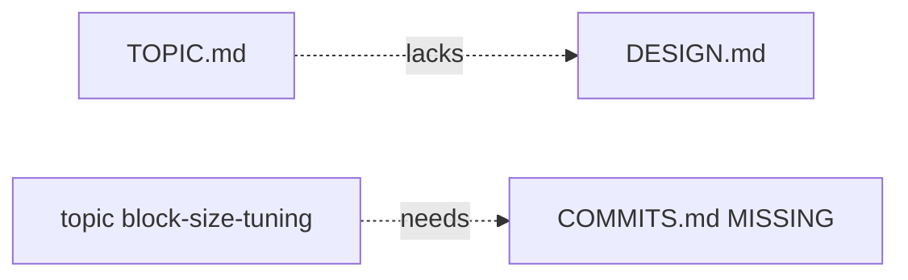

### topic `cgroup-v1-support`


### topic `csr-on-disk`

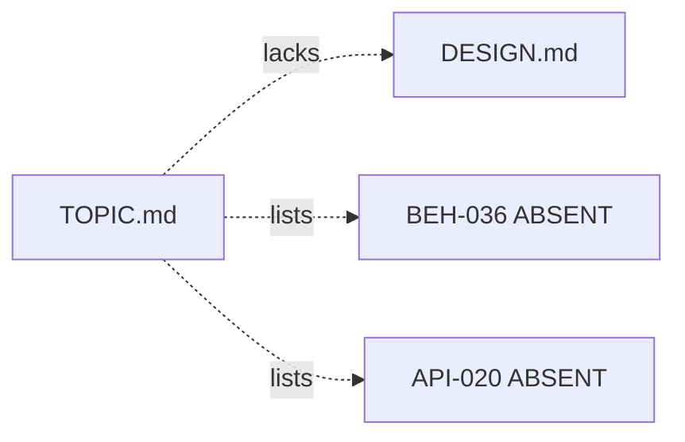

### topic `data-layout-optimization`

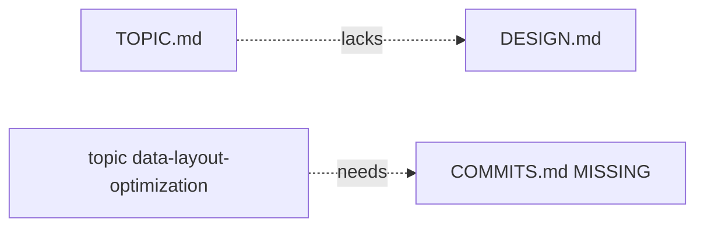

### topic `fine-rerank-incremental`


### topic `fine-rerank-iouring`


### topic `framework-driven-optimization`

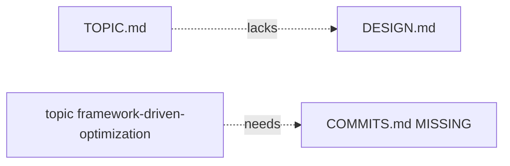

### topic `gbdt-learned-pruning`


### topic `gbdt-retrain`

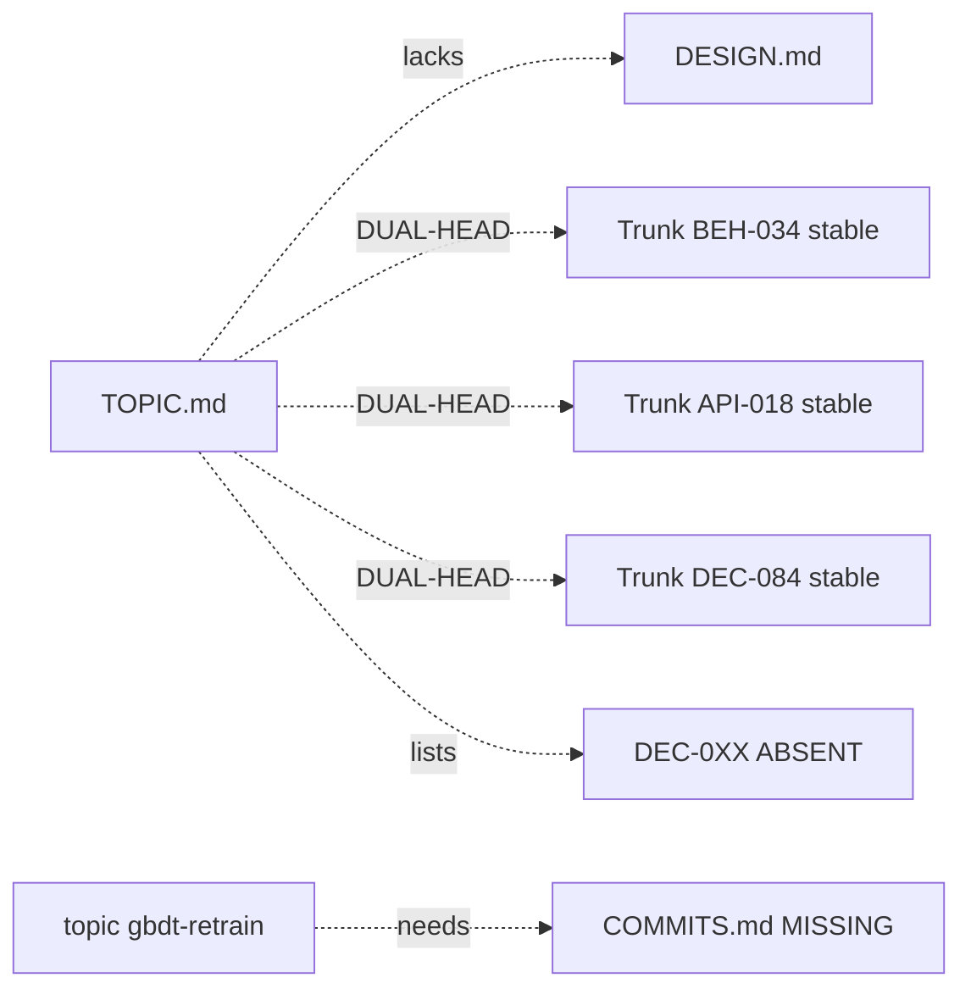

### topic `helmsman-adaptive`

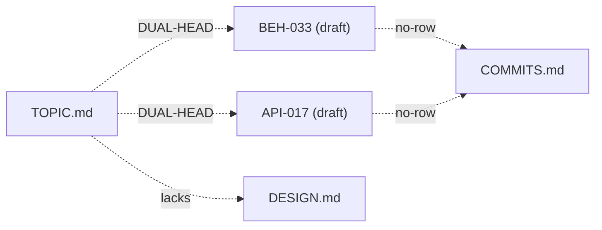

### topic `io-pipelining`


### topic `l4-cache-mgmt`


### topic `mmap-budget-shift`

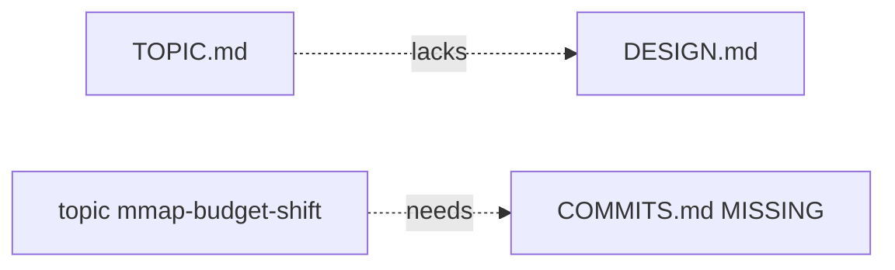

### topic `multi-thread-scaling`


### topic `page-packer`

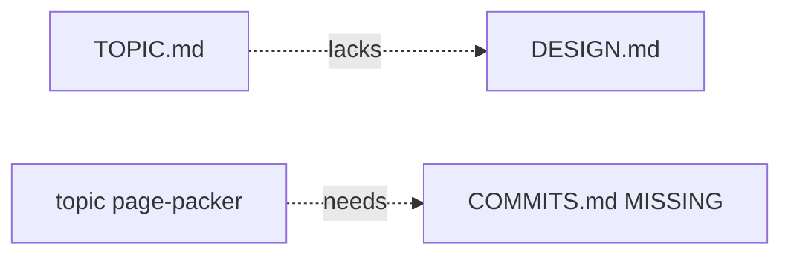

### topic `param-expansion-sweep`

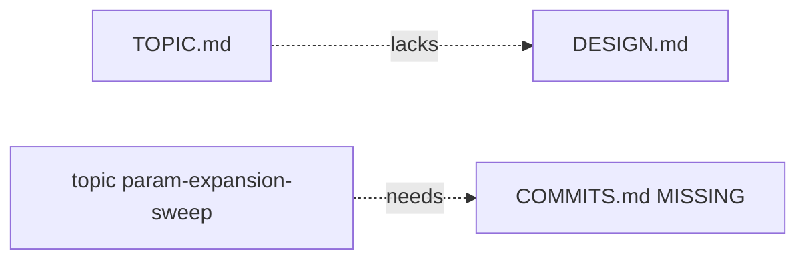

### topic `perf-gap-4t`


### topic `pipeline-param-retuning`

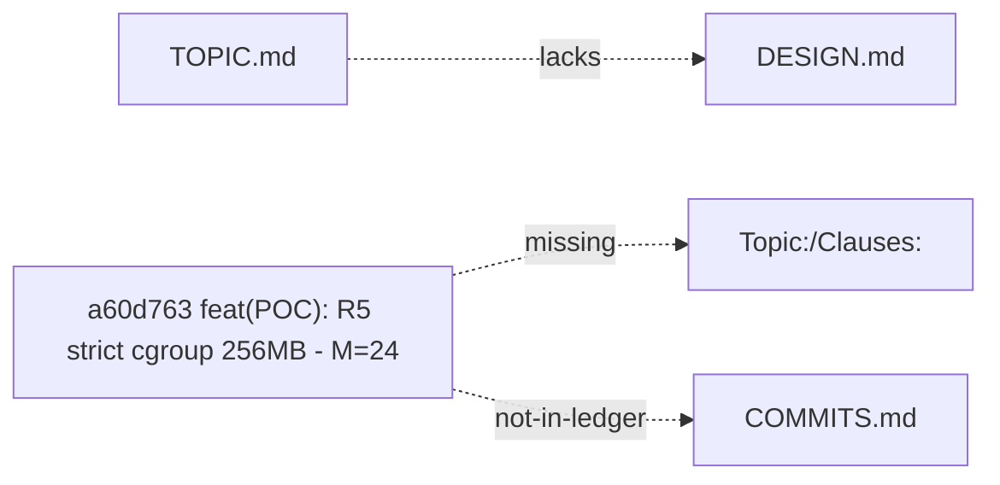

### topic `pq-quality`

```mermaid
flowchart LR
  MISS["DESIGN.md"]
  TOPIC["TOPIC.md"]
  TOPIC -.->|lacks|MISS
```

### topic `refine-ef-tuning`

```mermaid
flowchart LR
  MISS["DESIGN.md"]
  TOPIC["TOPIC.md"]
  TOPIC -.->|lacks|MISS
```

### topic `speculative-prefetch`

```mermaid
flowchart LR
  LEDGER["COMMITS.md MISSING"]
  MISS["DESIGN.md"]
  TOPIC["TOPIC.md"]
  speculative_prefetch["topic speculative-prefetch"]
  TOPIC -.->|lacks|MISS
  speculative_prefetch -.->|needs|LEDGER
```

### topic `ssd-parallelism-io`

```mermaid
flowchart LR
  MISS["DESIGN.md"]
  TOPIC["TOPIC.md"]
  TOPIC -.->|lacks|MISS
```

### topic `sustained-param-retuning`

```mermaid
flowchart LR
  MISS["DESIGN.md"]
  TOPIC["TOPIC.md"]
  TOPIC -.->|lacks|MISS
```

### topic `sustained-query-benchmark`

```mermaid
flowchart LR
  API_019["API-019 (draft)"]
  BEH_035["BEH-035 (draft)"]
  CON_SLA_019["CON-SLA-019 (draft)"]
  CON_SLA_020["CON-SLA-020 (draft)"]
  DEC_084["DEC-084 (draft)"]
  LEDGER["COMMITS.md"]
  MISS["DESIGN.md"]
  MODEL_SUSTAINED_001["MODEL-SUSTAINED-001 (draft)"]
  TOPIC["TOPIC.md"]
  VER_043["VER-043 (draft)"]
  VER_044["VER-044 (draft)"]
  TOPIC -.->|lacks|MISS
  DEC_084 -.->|no-row|LEDGER
  BEH_035 -.->|no-row|LEDGER
  API_019 -.->|no-row|LEDGER
  CON_SLA_019 -.->|no-row|LEDGER
  CON_SLA_020 -.->|no-row|LEDGER
  MODEL_SUSTAINED_001 -.->|no-row|LEDGER
  VER_043 -.->|no-row|LEDGER
  VER_044 -.->|no-row|LEDGER
  TOPIC -.->|DUAL-HEAD|DEC_084
  TOPIC -.->|DUAL-HEAD|BEH_035
  TOPIC -.->|DUAL-HEAD|API_019
  TOPIC -.->|DUAL-HEAD|CON_SLA_019
  TOPIC -.->|DUAL-HEAD|CON_SLA_020
  TOPIC -.->|DUAL-HEAD|MODEL_SUSTAINED_001
  TOPIC -.->|DUAL-HEAD|VER_043
  TOPIC -.->|DUAL-HEAD|VER_044
```

### topic `vecblock-cluster-reorder`

```mermaid
flowchart LR
  3b6284b["3b6284b poc/vecblock-cluster-reorder: R1 full cl"]
  3baa360["3baa360 poc/vecblock-cluster-reorder: R0 positiv"]
  LEDGER["COMMITS.md"]
  MISS["DESIGN.md"]
  TOPIC["TOPIC.md"]
  TRAILER["Topic:/Clauses:"]
  a40afd2["a40afd2 poc/vecblock-cluster-reorder: open topic"]
  TOPIC -.->|lacks|MISS
  3b6284b -.->|missing|TRAILER
  3b6284b -.->|not-in-ledger|LEDGER
  3baa360 -.->|missing|TRAILER
  3baa360 -.->|not-in-ledger|LEDGER
  a40afd2 -.->|missing|TRAILER
  a40afd2 -.->|not-in-ledger|LEDGER
```

## Appendix: ledger bipartite (clause↔sha)

### topic `bfs-cluster`

_no ledger clause↔sha edges_

### topic `bg-thread-futex`

_no ledger clause↔sha edges_

### topic `block-size-tuning`

_no ledger clause↔sha edges_

### topic `cgroup-v1-support`

```mermaid
flowchart LR
  BEH_032["BEH-032"]
  8b0679f["8b0679f"]
  BEH_032 -->|ledger|8b0679f
  API_016["API-016"]
  API_016 -->|ledger|8b0679f
  DEC_079["DEC-079"]
  DEC_079 -->|ledger|8b0679f
```

### topic `cluster-gbdt`

```mermaid
flowchart LR
  BEH_034["BEH-034"]
  a9c76de["a9c76de"]
  BEH_034 -->|ledger|a9c76de
  BEH_037["BEH-037"]
  BEH_037 -->|ledger|a9c76de
  a143392["a143392"]
  BEH_034 -->|ledger|a143392
  BEH_037 -->|ledger|a143392
  BEH_025["BEH-025"]
  BEH_025 -->|ledger|a143392
  BEH_037 -->|ledger|a143392
  CON_SLA_020["CON-SLA-020"]
  CON_SLA_020 -->|ledger|a143392
  BEH_025 -->|ledger|a143392
  BEH_034 -->|ledger|a143392
  BEH_037 -->|ledger|a143392
```

### topic `csr-on-disk`

```mermaid
flowchart LR
  BEH_036["BEH-036"]
  8520366["8520366"]
  BEH_036 -->|ledger|8520366
  API_020["API-020"]
  API_020 -->|ledger|8520366
```

### topic `data-layout-optimization`

_no ledger clause↔sha edges_

### topic `fine-rerank-incremental`

_no ledger clause↔sha edges_

### topic `fine-rerank-iouring`

_no ledger clause↔sha edges_

### topic `framework-driven-optimization`

_no ledger clause↔sha edges_

### topic `gbdt-learned-pruning`

_no ledger clause↔sha edges_

### topic `gbdt-retrain`

_no ledger clause↔sha edges_

### topic `helmsman-adaptive`

_no ledger clause↔sha edges_

### topic `io-pipelining`

_no ledger clause↔sha edges_

### topic `l4-cache-mgmt`

```mermaid
flowchart LR
  BEH_024["BEH-024"]
  7cdb399["7cdb399"]
  BEH_024 -->|ledger|7cdb399
  DEC_068["DEC-068"]
  DEC_068 -->|ledger|7cdb399
  2f008f7["2f008f7"]
  BEH_024 -->|ledger|2f008f7
  API_012["API-012"]
  API_012 -->|ledger|2f008f7
  DEC_070["DEC-070"]
  DEC_070 -->|ledger|2f008f7
  892355c["892355c"]
  BEH_024 -->|ledger|892355c
```

### topic `mmap-budget-shift`

_no ledger clause↔sha edges_

### topic `multi-thread-scaling`

```mermaid
flowchart LR
  BEH_001["BEH-001"]
  1d14de7["1d14de7"]
  BEH_001 -->|ledger|1d14de7
  BEH_007["BEH-007"]
  BEH_007 -->|ledger|1d14de7
  BEH_002["BEH-002"]
  BEH_002 -->|ledger|1d14de7
  BEH_027["BEH-027"]
  efa919b["efa919b"]
  BEH_027 -->|ledger|efa919b
  API_013["API-013"]
  API_013 -->|ledger|efa919b
  CON_SLA_017["CON-SLA-017"]
  CON_SLA_017 -->|ledger|efa919b
  DEC_074["DEC-074"]
  DEC_074 -->|ledger|efa919b
```

### topic `page-packer`

_no ledger clause↔sha edges_

### topic `param-expansion-sweep`

_no ledger clause↔sha edges_

### topic `perf-gap-4t`

```mermaid
flowchart LR
  DEC_073["DEC-073"]
  1868dc2["1868dc2"]
  DEC_073 -->|ledger|1868dc2
  CON_SLA_016["CON-SLA-016"]
  CON_SLA_016 -->|ledger|1868dc2
```

### topic `pipeline-param-retuning`

```mermaid
flowchart LR
  API_011["API-011"]
  29b0135["29b0135"]
  API_011 -->|ledger|29b0135
  API_017["API-017"]
  API_017 -->|ledger|29b0135
  DEC_087["DEC-087"]
  DEC_087 -->|ledger|29b0135
```

### topic `pq-quality`

_no ledger clause↔sha edges_

### topic `refine-ef-tuning`

_no ledger clause↔sha edges_

### topic `speculative-prefetch`

_no ledger clause↔sha edges_

### topic `ssd-parallelism-io`

_no ledger clause↔sha edges_

### topic `sustained-param-retuning`

_no ledger clause↔sha edges_

### topic `sustained-query-benchmark`

_no ledger clause↔sha edges_

### topic `vecblock-cluster-reorder`

_no ledger clause↔sha edges_
