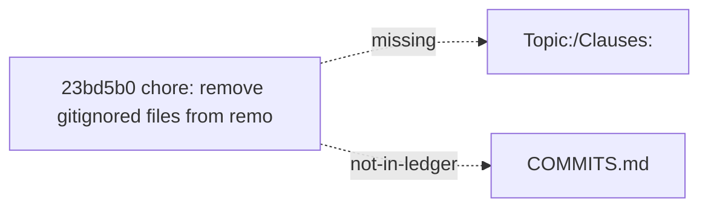
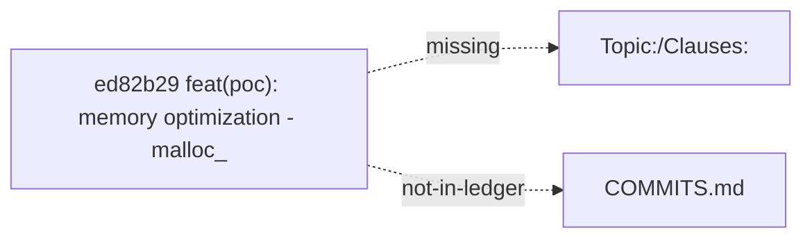
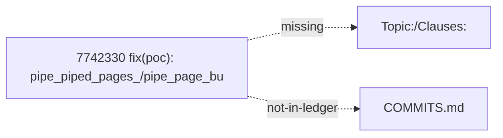
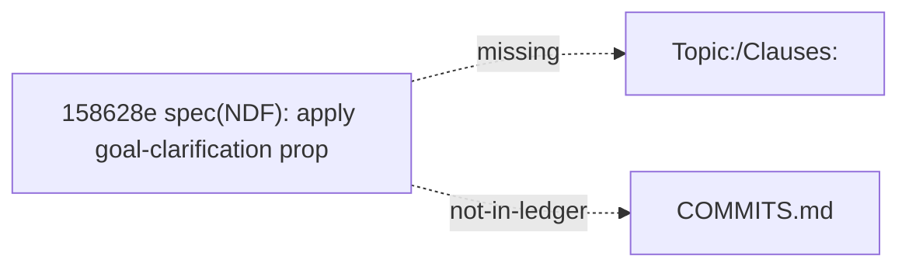
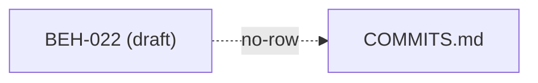
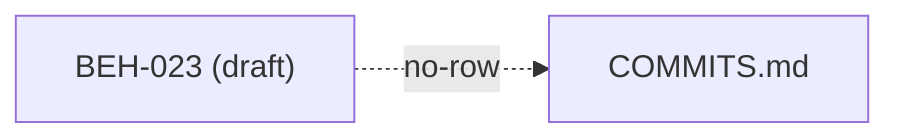
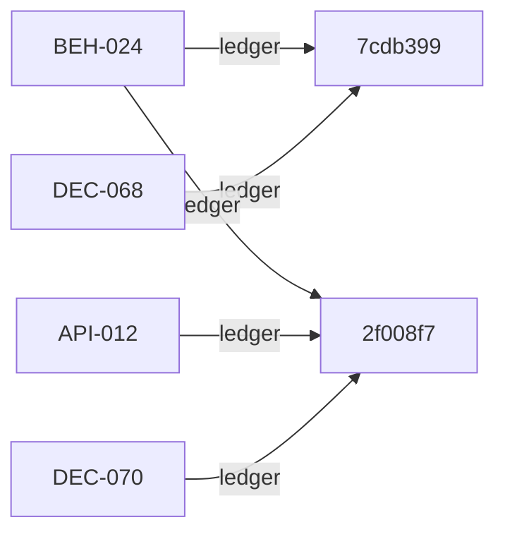

# NDF bindcheck report

> Generated by `spec/meta/tools/ndf_bindcheck.py` at 2026-08-04T13:38:25Z

- topics: 4 (io-pipelining, l4-cache-mgmt, pq-quality, refine-ef-tuning)
- checks: bind,dual,grain
- hard_errors: 6
- warnings: 2

## Summary by kind

| kind | def | count | severity |
|------|-----|------:|----------|
| `draft_vs_stable` | BINDER-DUAL-HEAD | 1 | error |
| `missing_trailer` | REPRO-BIND-GAP | 5 | error |
| `clause_unbound` | REPRO-BIND-GAP | 2 | warning |

## Hard errors

**error** `missing_trailer` (io-pipelining): code commit 23bd5b0 missing trailers: Topic:, Clauses:
  def: `DEF-NDF-REPRO-BIND-GAP`
  loc: `poc/io-pipelining/Makefile`
  note: BEH-025 requires Topic:/Clauses: on topic code commits

### evidence

- sha: `23bd5b0fac9a5cb0495d404e684bea9a16861f57`
- date: 2026-08-04
- subject: chore: remove gitignored files from remote tracking
- missing: Topic:, Clauses:
- in COMMITS.md ledger: no
- files touched:
  - `poc/io-pipelining/Makefile`
  - `poc/io-pipelining/NOTES.md`
  - `poc/io-pipelining/apply_patches.py`
  - `poc/io-pipelining/benchmark_pipe.cpp`
  - `poc/io-pipelining/disk_hnsw_pipe.cpp`
  - `poc/io-pipelining/disk_hnsw_pipe.h`
  - `poc/io-pipelining/ndf/COMMITS.md`
  - `poc/io-pipelining/ndf/TOPIC.md`
  - `poc/io-pipelining/ndf/evidence/README.md`
  - `poc/io-pipelining/ndf/proposals/proposal-io-behavior-correction.md`
  - `poc/io-pipelining/ndf/proposals/proposal-io-pipelining.md`
  - `poc/io-pipelining/run_bench.sh`

### fix

Re-commit or `git commit --amend` (if not pushed) with trailers:
  Topic: io-pipelining
  Clauses: <IDs>
Then append a row to `poc/io-pipelining/ndf/COMMITS.md`.

### missing_trailer #1

**error** `missing_trailer` (io-pipelining): code commit ed82b29 missing trailers: Topic:, Clauses:
  def: `DEF-NDF-REPRO-BIND-GAP`
  loc: `poc/io-pipelining/disk_hnsw_pipe.cpp`
  note: BEH-025 requires Topic:/Clauses: on topic code commits

### evidence

- sha: `ed82b298e59e18c457742ac65639ebe3d1ef394f`
- date: 2026-08-02
- subject: feat(poc): memory optimization - malloc_trim + VisitedList uint8 + streaming adjacency0 free
- missing: Topic:, Clauses:
- in COMMITS.md ledger: no
- files touched:
  - `poc/io-pipelining/disk_hnsw_pipe.cpp`
  - `poc/io-pipelining/disk_hnsw_pipe.h`

### fix

Re-commit or `git commit --amend` (if not pushed) with trailers:
  Topic: io-pipelining
  Clauses: <IDs>
Then append a row to `poc/io-pipelining/ndf/COMMITS.md`.

### missing_trailer #2

**error** `missing_trailer` (io-pipelining): code commit 7742330 missing trailers: Topic:, Clauses:
  def: `DEF-NDF-REPRO-BIND-GAP`
  loc: `poc/io-pipelining/disk_hnsw_pipe.cpp`
  note: BEH-025 requires Topic:/Clauses: on topic code commits

### evidence

- sha: `7742330ea959bb8098b0ed671541226cc577741d`
- date: 2026-08-02
- subject: fix(poc): pipe_piped_pages_/pipe_page_bufidx_ -> thread_local (DEC-063 4T bug)
- missing: Topic:, Clauses:
- in COMMITS.md ledger: no
- files touched:
  - `poc/io-pipelining/disk_hnsw_pipe.cpp`
  - `poc/io-pipelining/disk_hnsw_pipe.h`

### fix

Re-commit or `git commit --amend` (if not pushed) with trailers:
  Topic: io-pipelining
  Clauses: <IDs>
Then append a row to `poc/io-pipelining/ndf/COMMITS.md`.

### missing_trailer #3

**error** `missing_trailer` (io-pipelining): code commit 158628e missing trailers: Topic:, Clauses:
  def: `DEF-NDF-REPRO-BIND-GAP`
  loc: `poc/io-pipelining/Makefile`
  note: BEH-025 requires Topic:/Clauses: on topic code commits

### evidence

- sha: `158628e418396a1c6f24c116a5224e982206277a`
- date: 2026-08-01
- subject: spec(NDF): apply goal-clarification proposal — Buffered as primary optimization target
- missing: Topic:, Clauses:
- in COMMITS.md ledger: no
- files touched:
  - `poc/io-pipelining/Makefile`
  - `poc/io-pipelining/NOTES.md`
  - `poc/io-pipelining/apply_patches.py`
  - `poc/io-pipelining/benchmark_pipe.cpp`
  - `poc/io-pipelining/disk_hnsw_pipe.cpp`
  - `poc/io-pipelining/disk_hnsw_pipe.h`
  - `poc/io-pipelining/run_bench.sh`

### fix

Re-commit or `git commit --amend` (if not pushed) with trailers:
  Topic: io-pipelining
  Clauses: <IDs>
Then append a row to `poc/io-pipelining/ndf/COMMITS.md`.

### missing_trailer #4

**error** `missing_trailer` (l4-cache-mgmt): code commit 23bd5b0 missing trailers: Topic:, Clauses:
  def: `DEF-NDF-REPRO-BIND-GAP`
  loc: `poc/l4-cache-mgmt/Makefile`
  note: BEH-025 requires Topic:/Clauses: on topic code commits

### evidence

- sha: `23bd5b0fac9a5cb0495d404e684bea9a16861f57`
- date: 2026-08-04
- subject: chore: remove gitignored files from remote tracking
- missing: Topic:, Clauses:
- in COMMITS.md ledger: no
- files touched:
  - `poc/l4-cache-mgmt/Makefile`
  - `poc/l4-cache-mgmt/NOTES.md`
  - `poc/l4-cache-mgmt/apply_patches.py`
  - `poc/l4-cache-mgmt/benchmark_l4.cpp`
  - `poc/l4-cache-mgmt/block_cache.cpp`
  - `poc/l4-cache-mgmt/disk_hnsw_l4.cpp`
  - `poc/l4-cache-mgmt/disk_hnsw_l4.h`
  - `poc/l4-cache-mgmt/drop_file_cache`
  - `poc/l4-cache-mgmt/drop_file_cache.c`
  - `poc/l4-cache-mgmt/ndf/COMMITS.md`
  - `poc/l4-cache-mgmt/ndf/TOPIC.md`
  - `poc/l4-cache-mgmt/ndf/evidence/README.md`

### fix

Re-commit or `git commit --amend` (if not pushed) with trailers:
  Topic: l4-cache-mgmt
  Clauses: <IDs>
Then append a row to `poc/l4-cache-mgmt/ndf/COMMITS.md`.

### missing_trailer #5

**error** `draft_vs_stable` (l4-cache-mgmt): BEH-024: TOPIC still draft registration but Trunk status=stable
  def: `DEF-NDF-BINDER-DUAL-HEAD`
  loc: `poc/l4-cache-mgmt/ndf/TOPIC.md ↔ spec/20-behavior/search.md:156`

### evidence

- TOPIC topic_status: exploring (R5b Selective DONTNEED still POC; R4 flat_vec_cache + R5a WILLNEED promoted to Trunk as BEH-024 stable)
- TOPIC Draft clauses row still registers BEH-024 as draft
- Trunk BEH-024: status=stable file=`spec/20-behavior/search.md` line=156
- Trunk title: L4 Page Cache 主动管理

### fix

Update `poc/l4-cache-mgmt/ndf/TOPIC.md`: move BEH-024 out of Draft clauses (mark promoted / stable), or run close plan and set TOPIC status appropriately.

### draft_vs_stable #6

## Warnings

**warning** `clause_unbound` (io-pipelining): draft clause BEH-022 never appears in ledger clauses column
  def: `DEF-NDF-REPRO-BIND-GAP`
  loc: `poc/io-pipelining/ndf/TOPIC.md`

### evidence

- TOPIC draft_clauses includes BEH-022
- TOPIC has promote-related notes
- no COMMITS.md row lists BEH-022 under clauses
- ledger header has no “not backfilled” exemption

### fix

Add a COMMITS.md row with clauses containing BEH-022, or add a ledger header note that historical commits are not backfilled.

### clause_unbound #1

**warning** `clause_unbound` (io-pipelining): draft clause BEH-023 never appears in ledger clauses column
  def: `DEF-NDF-REPRO-BIND-GAP`
  loc: `poc/io-pipelining/ndf/TOPIC.md`

### evidence

- TOPIC draft_clauses includes BEH-023
- TOPIC has promote-related notes
- no COMMITS.md row lists BEH-023 under clauses
- ledger header has no “not backfilled” exemption

### fix

Add a COMMITS.md row with clauses containing BEH-023, or add a ledger header note that historical commits are not backfilled.

### clause_unbound #2

## Ledger bipartite (clause↔sha)

### topic `io-pipelining`

_no ledger clause↔sha edges_

### topic `l4-cache-mgmt`

### topic `pq-quality`

_no ledger clause↔sha edges_

### topic `refine-ef-tuning`

_no ledger clause↔sha edges_
